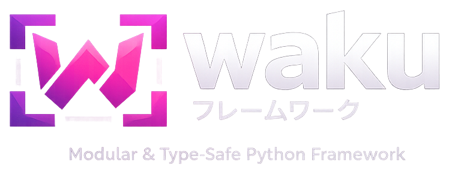

<p align="center">
    
</p>

<p align="center" markdown="1">
    <sup><i>waku</i> [<b>枠</b> or <b>わく</b>] <i>means framework in Japanese.</i></sup>
    <br/>
</p>

-----

<div align="center" markdown="1">

<!-- Project Status -->
[](https://github.com/waku-py/waku/actions?query=event%3Apush+branch%3Amaster+workflow%3ACI/CD)
[](https://codecov.io/gh/waku-py/waku)
[](https://github.com/waku-py/waku/issues)
[](https://github.com/waku-py/waku/graphs/contributors)
[](https://github.com/waku-py/waku/graphs/commit-activity)
[](https://github.com/waku-py/waku/blob/master/LICENSE)

<!-- Package Info -->
[](https://pypi.python.org/pypi/waku)
[](https://www.python.org/downloads/)
[](https://pepy.tech/projects/waku)

<!-- Tools -->
[](https://github.com/astral-sh/uv)
[](https://github.com/astral-sh/ruff/)
[](https://github.com/astral-sh/ty)
[](https://mypy-lang.org/)

<!-- Social -->
[](https://t.me/wakupy)
[](https://deepwiki.com/waku-py/waku)

</div>

-----

> **Python makes it easy to build a backend. waku makes it easy to keep growing one.**
>
> As your project scales, problems creep in: services import each other freely,
> swapping a database means editing dozens of files, and nobody can tell which module
> depends on what. waku gives you modules with explicit boundaries, type-safe DI
> powered by [dishka](https://github.com/reagento/dishka/), and integrated CQRS
> and event sourcing — so your codebase stays manageable as it scales.

> [!TIP]
> Check out the full [**documentation**](https://docs.wakupy.dev/) and our [**examples**](https://github.com/waku-py/waku/tree/master/examples) to get started.

## The Problem

Python has no built-in way to enforce component boundaries. Packages don't control visibility, imports aren't validated, and nothing stops module A from reaching into the internals of module B. As a project grows, what started as clean separation quietly becomes a web of implicit dependencies — where testing requires the whole system, onboarding means reading everything, and changing one module risks breaking three others.

## What waku gives you

### Structure

- 🧩 [**Package by component**](https://docs.wakupy.dev/fundamentals/modules/):
  Each module is a self-contained unit with its own providers.
  Explicit imports and exports control what crosses boundaries —
  validated at startup, not discovered in production.
- 💉 [**Dependency inversion**](https://docs.wakupy.dev/fundamentals/providers/):
  Define interfaces in your application core, bind adapters in infrastructure modules.
  Swap a database, a cache, or an API client by changing one provider —
  powered by [dishka](https://github.com/reagento/dishka/).
- 🔌 [**One core, any entrypoint**](https://docs.wakupy.dev/fundamentals/integrations/):
  Build your module tree once with `WakuFactory`.
  Plug it into FastAPI, Litestar, FastStream, Aiogram, CLI, or workers —
  same logic everywhere.

### Capabilities

- 📨 [**Messaging**](https://docs.wakupy.dev/features/messaging/):
  DI alone doesn't decouple components — you need events.
  The message bus dispatches commands, queries, and events so components
  never reference each other directly. Pipeline behaviors handle cross-cutting concerns.
- 📜 [**Event sourcing**](https://docs.wakupy.dev/features/eventsourcing/):
  Aggregates, projections, snapshots, upcasting, and the decider pattern
  with built-in SQLAlchemy adapters.
- 🧪 [**Testing**](https://docs.wakupy.dev/fundamentals/testing/):
  Override any provider in tests with `override()`,
  or spin up a minimal app with `create_test_app()`.
- 🧰 [**Lifecycle & extensions**](https://docs.wakupy.dev/advanced/extensions/):
  Hook into startup, shutdown, and module initialization.
  Add validation, logging, or custom behaviors —
  decoupled from your business logic.

## Quick Start

### Installation

```sh
uv add waku
```

### Minimal Example

Define a service, register it in a module, and resolve it from the container:

```python
import asyncio

from waku import WakuFactory, module
from waku.di import scoped


class GreetingService:
    async def greet(self, name: str) -> str:
        return f'Hello, {name}!'


@module(providers=[scoped(GreetingService)])
class GreetingModule:
    pass


@module(imports=[GreetingModule])
class AppModule:
    pass


async def main() -> None:
    app = WakuFactory(AppModule).create()

    async with app, app.container() as c:
        svc = await c.get(GreetingService)
        print(await svc.greet('waku'))


if __name__ == '__main__':
    asyncio.run(main())

```

### Module Boundaries in Action

Modules control visibility. `InfrastructureModule` exports `ILogger` — `UserModule` imports it. Dependencies are explicit, not implicit:

```python
import asyncio
from typing import Protocol

from waku import WakuFactory, module
from waku.di import scoped, singleton


class ILogger(Protocol):
    async def log(self, message: str) -> None: ...


class ConsoleLogger(ILogger):
    async def log(self, message: str) -> None:
        print(f'[LOG] {message}')


class UserService:
    def __init__(self, logger: ILogger) -> None:
        self.logger = logger

    async def create_user(self, username: str) -> str:
        user_id = f'user_{username}'
        await self.logger.log(f'Created user: {username}')
        return user_id


@module(
    providers=[singleton(ILogger, ConsoleLogger)],
    exports=[ILogger],
)
class InfrastructureModule:
    pass


@module(
    imports=[InfrastructureModule],
    providers=[scoped(UserService)],
)
class UserModule:
    pass


@module(imports=[UserModule])
class AppModule:
    pass


async def main() -> None:
    app = WakuFactory(AppModule).create()

    async with app, app.container() as c:
        user_service = await c.get(UserService)
        user_id = await user_service.create_user('alice')
        print(f'Created user with ID: {user_id}')


if __name__ == '__main__':
    asyncio.run(main())

```

### Next steps

- Learn about [module imports and exports](https://docs.wakupy.dev/fundamentals/modules/)
- Try different [provider scopes](https://docs.wakupy.dev/fundamentals/providers/)
- Add [Messaging](https://docs.wakupy.dev/features/messaging/) for clean command handling
- Connect with your [favorite framework](https://docs.wakupy.dev/fundamentals/integrations/)
- Browse the [examples directory](https://github.com/waku-py/waku/tree/master/examples) for inspiration

## Documentation

- [Getting Started](https://docs.wakupy.dev/getting-started/)
- [Module System](https://docs.wakupy.dev/fundamentals/modules/)
- [Providers](https://docs.wakupy.dev/fundamentals/providers/)
- [Extensions](https://docs.wakupy.dev/advanced/extensions/)
- [Messaging](https://docs.wakupy.dev/features/messaging/)
- [Event Sourcing](https://docs.wakupy.dev/features/eventsourcing/)
- [API Reference](https://docs.wakupy.dev/reference/)
- [dishka Documentation](https://dishka.readthedocs.io/en/stable/index.html)
- [DeepWiki](https://deepwiki.com/waku-py/waku)

## Contributing

- [Contributing Guide](https://docs.wakupy.dev/contributing/contributing/)
- [Development Setup](https://docs.wakupy.dev/contributing/contributing/#development-setup)

### Top contributors

<a href="https://github.com/waku-py/waku/graphs/contributors">
  
</a>

## Roadmap

- [x] Create logo
- [x] Improve inner architecture
- [x] Improve documentation
- [x] Add new and improve existing validation rules
- [ ] Provide example projects for common architectures

## Support

- [RU Telegram group](https://t.me/wakupy)
- [GitHub Issues](https://github.com/waku-py/waku/issues)
- [Discussions](https://github.com/waku-py/waku/discussions)

## License

This project is licensed under the terms of the [MIT License](https://github.com/waku-py/waku/blob/master/LICENSE).

## Acknowledgements

- [dishka](https://github.com/reagento/dishka/) – Dependency Injection framework powering `waku` IoC container.
- [NestJS](https://nestjs.com/) – Inspiration for modular architecture and design patterns.
- [Wolverine (C#)](https://wolverine.netlify.app/) – Inspiration for messaging, transport model, and pipeline architecture.
- [Marten (C#)](https://martendb.io/) – Inspiration for event sourcing, projections, and document store design.
- [Emmett](https://event-driven-io.github.io/emmett/) – Functional-first event sourcing patterns.
- [Eventuous](https://eventuous.dev/) – Event store interface design.
- [Jérémie Chassaing](https://thinkbeforecoding.com/post/2021/12/17/functional-event-sourcing-decider) – Decider pattern formalization.
