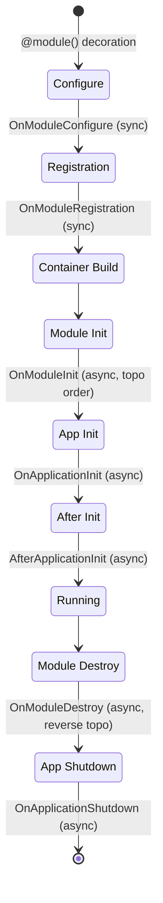

# Extension System

waku's extension system provides hooks at every stage of the application lifecycle — from the
moment a module is decorated with `@module()` through initialization, runtime, and eventual
shutdown. Each hook is defined as a `@runtime_checkable` `Protocol`, so extensions are plain
classes that implement one or more of these protocols without needing to inherit from a shared
base class.

## Lifecycle

## Hook Reference

| Hook | Protocol | Sync/Async | Level | When |
|------|----------|------------|-------|------|
| Configure | [`OnModuleConfigure`](custom-extensions.md#onmoduleconfigure) | sync | module | During `@module()` decoration |
| Registration | [`OnModuleRegistration`](custom-extensions.md#onmoduleregistration) | sync | both | After all modules collected |
| Init | [`OnModuleInit`](custom-extensions.md#onmoduleinit) | async | module | After container built, topo order |
| App Init | [`OnApplicationInit`](custom-extensions.md#onapplicationinit) | async | app | Before app is fully ready |
| After Init | [`AfterApplicationInit`](custom-extensions.md#afterapplicationinit) | async | app | After app is fully ready |
| Destroy | [`OnModuleDestroy`](custom-extensions.md#onmoduledestroy) | async | module | During shutdown, reverse topo |
| Shutdown | [`OnApplicationShutdown`](custom-extensions.md#onapplicationshutdown) | async | app | Final cleanup |

## Phases

**Configure** — Synchronous, import-time. Receives mutable `ModuleMetadata` to add providers,
imports, or exports. Do not perform I/O here.

**Registration** — Synchronous, after all module metadata is collected. Receives the full
`ModuleMetadataRegistry` with cross-module visibility. The only hook usable at **both** module
and application level.

**Init** — Asynchronous, after the DI container is built. Modules initialize in topological order
(dependencies first).

**App Init** — Asynchronous, after all `OnModuleInit` hooks complete. The container is built but
the application is not yet fully ready.

**After Init** — Asynchronous, immediately after `OnApplicationInit`. The application is fully
initialized. The built-in `ValidationExtension` implements this hook.

**Destroy** — Asynchronous, during shutdown in reverse topological order (dependents first).

**Shutdown** — Asynchronous, after all `OnModuleDestroy` hooks complete. Final cleanup.

## Further reading

- **[Custom Extensions](custom-extensions.md)** — implementation guide with code examples for every hook
- **[Application](../../fundamentals/application.md)** — application lifecycle and lifespan functions
- **[Modules](../../fundamentals/modules.md)** — module system and the `@module()` decorator
