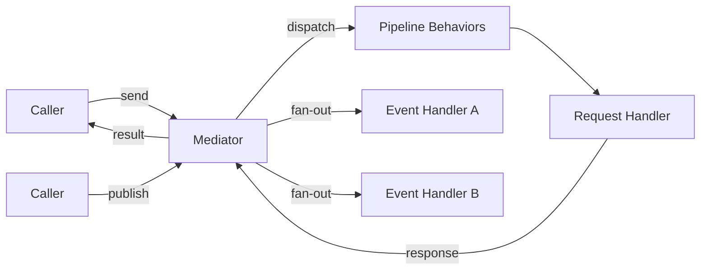
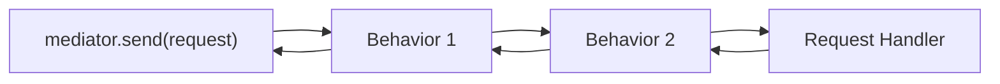

# Mediator (CQRS)

## Introduction

**CQRS** (Command Query Responsibility Segregation) separates read and write operations into
distinct models:

- **Commands** change state and optionally return a result.
- **Queries** read state without side effects.
- **Events** (notifications) broadcast that something happened — zero or more handlers react.

The **Mediator** pattern decouples the sender of a request from the handler that processes it.
Instead of calling a handler directly, you pass a request object to the mediator, which looks up
the correct handler and dispatches it through a pipeline of cross-cutting behaviors.



Waku's CQRS implementation is inspired by [MediatR](https://github.com/jbogard/MediatR) (.NET)
and integrates with the module system, dependency injection, and extension lifecycle.

---

## Setup

Import `MediatorModule` as a dynamic module in your root module:

```python linenums="1"
from waku import module
from waku.cqrs import MediatorConfig, MediatorModule

@module(
    imports=[
        MediatorModule.register(MediatorConfig()),
    ],
)
class AppModule:
    pass
```

### MediatorConfig

| Option | Type | Default | Description |
|--------|------|---------|-------------|
| `mediator_implementation_type` | `type[IMediator]` | `Mediator` | Concrete mediator class |
| `event_publisher` | `type[EventPublisher]` | `SequentialEventPublisher` | Strategy for dispatching events to handlers |
| `pipeline_behaviors` | `Sequence[type[IPipelineBehavior]]` | `()` | Global pipeline behaviors applied to every request |

Passing `None` (or no argument) to `MediatorModule.register()` uses the defaults:

```python linenums="1"
# These two are equivalent:
MediatorModule.register()
MediatorModule.register(MediatorConfig())
```

`MediatorModule` is registered as a **global module** — its providers (mediator, event publisher,
registry) are available to every module in the application without explicit imports.

---

## Requests (Commands and Queries)

A **request** is a frozen dataclass that describes an intent. Waku provides two ways to define one:

### Request base class

`Request[TResponse]` adds an auto-generated `request_id` (UUID):

```python linenums="1"
from dataclasses import dataclass

from waku.cqrs import Request, Response


@dataclass(frozen=True, kw_only=True)
class UserDTO(Response):
    user_id: str
    name: str


@dataclass(frozen=True, kw_only=True)
class GetUserQuery(Request[UserDTO]):
    user_id: str


@dataclass(frozen=True, kw_only=True)
class CreateUserCommand(Request[None]):
    name: str
    email: str
```

!!! tip
    Use `Request[None]` when a command does not return a value.

### IRequest protocol

`IRequest[TResponse]` is a marker protocol with no required attributes. Use it when you need
custom identification strategies or no ID at all:

```python linenums="1"
from dataclasses import dataclass

from waku.cqrs import IRequest


@dataclass(frozen=True)
class PingQuery(IRequest[str]):
    pass
```

### Response base class

`Response` is an optional frozen dataclass base for response objects. It has no required fields —
it exists for consistency and type clarity:

```python linenums="1"
from dataclasses import dataclass

from waku.cqrs import Response


@dataclass(frozen=True, kw_only=True)
class OrderConfirmation(Response):
    order_id: str
    status: str
```

---

## Request Handlers

Each request type maps to **exactly one** handler. Waku provides two styles:

### RequestHandler (ABC)

`RequestHandler[TRequest, TResponse]` is an abstract base class — use it for explicit inheritance
and type checking:

```python linenums="1"
from typing_extensions import override

from waku.cqrs import RequestHandler


class GetUserQueryHandler(RequestHandler[GetUserQuery, UserDTO]):
    def __init__(self, user_repo: UserRepository) -> None:
        self._user_repo = user_repo

    @override
    async def handle(self, request: GetUserQuery, /) -> UserDTO:
        user = await self._user_repo.get(request.user_id)
        return UserDTO(user_id=user.id, name=user.name)
```

### IRequestHandler (Protocol)

`IRequestHandler[TRequest, TResponse]` is a protocol — any class with a matching `handle` method
is compatible (structural subtyping):

```python linenums="1"
from waku.cqrs import IRequestHandler


class CreateUserCommandHandler(IRequestHandler[CreateUserCommand, None]):
    async def handle(self, request: CreateUserCommand, /) -> None:
        await self._user_repo.create(request.name, request.email)
```

### Registration

Bind a request to its handler via `MediatorExtension` in the module's `extensions` list:

```python linenums="1"
from waku import module
from waku.cqrs import MediatorExtension


@module(
    extensions=[
        MediatorExtension()
            .bind_request(GetUserQuery, GetUserQueryHandler)
            .bind_request(CreateUserCommand, CreateUserCommandHandler),
    ],
)
class UsersModule:
    pass
```

### Dispatching

Inject `IMediator` (or the narrower `ISender`) and call `send`:

```python linenums="1"
from waku.cqrs import IMediator


async def get_user(mediator: IMediator, user_id: str) -> UserDTO:
    query = GetUserQuery(user_id=user_id)
    return await mediator.send(query)
```

`send` returns the response type declared by the request's generic parameter. If the request
declares `Request[None]`, `send` returns `None`.

---

## Events

An **event** (notification) represents something that has already happened. Unlike requests,
events can have **zero or more** handlers — this is the fan-out pattern.

### Defining events

`Event` is a frozen dataclass with an auto-generated `event_id` (UUID):

```python linenums="1"
from dataclasses import dataclass

from waku.cqrs import Event


@dataclass(frozen=True, kw_only=True)
class OrderPlaced(Event):
    order_id: str
    customer_id: str


@dataclass(frozen=True, kw_only=True)
class OrderShipped(Event):
    order_id: str
    tracking_number: str
```

For custom identification, implement `INotification` directly:

```python linenums="1"
from dataclasses import dataclass

from waku.cqrs import INotification


@dataclass(frozen=True)
class LegacyEvent(INotification):
    correlation_id: str
```

### Event handlers

`EventHandler[TEvent]` is an ABC with a `handle` method that returns `None`:

```python linenums="1"
from typing_extensions import override

from waku.cqrs import EventHandler


class SendConfirmationEmail(EventHandler[OrderPlaced]):
    def __init__(self, email_service: EmailService) -> None:
        self._email_service = email_service

    @override
    async def handle(self, event: OrderPlaced, /) -> None:
        await self._email_service.send_order_confirmation(
            order_id=event.order_id,
            customer_id=event.customer_id,
        )


class UpdateOrderStats(EventHandler[OrderPlaced]):
    def __init__(self, stats_repo: StatsRepository) -> None:
        self._stats_repo = stats_repo

    @override
    async def handle(self, event: OrderPlaced, /) -> None:
        await self._stats_repo.increment_orders()
```

`INotificationHandler[TEvent]` is the protocol equivalent for structural subtyping.

### Registration

Bind an event type to a **list** of handler types:

```python linenums="1"
from waku import module
from waku.cqrs import MediatorExtension


@module(
    extensions=[
        MediatorExtension().bind_event(OrderPlaced, [SendConfirmationEmail, UpdateOrderStats]),
    ],
)
class OrdersModule:
    pass
```

!!! note "Handlers across modules"
    Multiple modules can bind handlers for the same event type. Waku's `MediatorRegistryAggregator`
    merges all registrations at application startup:

    ```python linenums="1"
    @module(
        extensions=[MediatorExtension().bind_event(OrderPlaced, [SendConfirmationEmail])],
    )
    class NotificationModule:
        pass


    @module(
        extensions=[MediatorExtension().bind_event(OrderPlaced, [UpdateOrderStats])],
    )
    class AnalyticsModule:
        pass
    ```

    Both handlers will fire when `OrderPlaced` is published.

### Publishing

Inject `IMediator` (or the narrower `IPublisher`) and call `publish`:

```python linenums="1"
from waku.cqrs import IMediator


async def place_order(mediator: IMediator, order_id: str, customer_id: str) -> None:
    # ... create the order ...
    await mediator.publish(OrderPlaced(order_id=order_id, customer_id=customer_id))
```

If no handlers are registered for an event type, `publish` is a no-op — it does not raise.

---

## Pipeline Behaviors

Pipeline behaviors are cross-cutting middleware that wrap request handling. They form a chain
similar to HTTP middleware: each behavior can run logic before and after the next handler, modify
the request, short-circuit the pipeline, or handle exceptions.



### Defining a behavior

Implement `IPipelineBehavior[RequestT, ResponseT]`:

```python linenums="1"
import logging

from typing import Any

from typing_extensions import override

from waku.cqrs import IPipelineBehavior, IRequest
from waku.cqrs.contracts.pipeline import NextHandlerType

logger = logging.getLogger(__name__)


class LoggingBehavior(IPipelineBehavior[IRequest[Any], Any]):
    @override
    async def handle(
        self,
        request: IRequest[Any],
        /,
        next_handler: NextHandlerType[IRequest[Any], Any],
    ) -> Any:
        request_name = type(request).__name__
        logger.info('Handling %s', request_name)
        response = await next_handler(request)
        logger.info('Handled %s', request_name)
        return response
```

!!! warning
    Every behavior **must** call `await next_handler(request)` to continue the pipeline. Omitting
    this call short-circuits the chain — the actual handler never executes.

### Global behaviors

Register behaviors that apply to **every** request via `MediatorConfig`:

```python linenums="1"
from waku.cqrs import MediatorConfig, MediatorModule

MediatorModule.register(
    MediatorConfig(
        pipeline_behaviors=[LoggingBehavior, ValidationBehavior],
    ),
)
```

Global behaviors execute in the order they are listed.

### Per-request behaviors

Attach behaviors to a specific request type via `bind_request`:

```python linenums="1"
from waku import module
from waku.cqrs import MediatorExtension


@module(
    extensions=[
        MediatorExtension().bind_request(
            CreateUserCommand,
            CreateUserCommandHandler,
            behaviors=[UniqueEmailCheckBehavior],
        ),
    ],
)
class UsersModule:
    pass
```

### Execution order

When a request is dispatched, behaviors execute in this order:

1. **Global behaviors** (from `MediatorConfig.pipeline_behaviors`, in order)
2. **Per-request behaviors** (from `bind_request(..., behaviors=[...])`, in order)
3. **Request handler**

The response then unwinds back through the chain in reverse order.

---

## Event Publishers

The event publisher strategy controls **how** event handlers are invoked when you call
`mediator.publish()`.

| Publisher | Behavior |
|-----------|----------|
| `SequentialEventPublisher` | Handlers execute one after another. If a handler raises, subsequent handlers do **not** run. This is the default. |
| `GroupEventPublisher` | Handlers execute concurrently via `anyio.create_task_group()`. If any handler raises, the task group cancels remaining handlers and propagates the exception. |

Configure the publisher in `MediatorConfig`:

```python linenums="1"
from waku.cqrs import MediatorConfig, MediatorModule
from waku.cqrs.events import GroupEventPublisher

MediatorModule.register(
    MediatorConfig(event_publisher=GroupEventPublisher),
)
```

!!! tip
    Use `SequentialEventPublisher` when handler ordering matters or when handlers share
    transactional context. Use `GroupEventPublisher` for independent handlers that benefit
    from concurrent execution.

---

## Interfaces

Waku provides three mediator interfaces at different levels of access. Inject only the interface
you need to enforce the principle of least privilege:

| Interface | Methods | Use when |
|-----------|---------|----------|
| `IMediator` | `send()` + `publish()` | The component both sends requests and publishes events |
| `ISender` | `send()` | The component only dispatches commands/queries |
| `IPublisher` | `publish()` | The component only broadcasts events |

`IMediator` extends both `ISender` and `IPublisher`:

```python linenums="1"
from waku.cqrs import IMediator, IPublisher, ISender


# Full access
async def handle_order(mediator: IMediator) -> None:
    result = await mediator.send(ProcessOrder(order_id='ORD-1'))
    await mediator.publish(OrderPlaced(order_id='ORD-1', customer_id='CUST-1'))


# Send-only: cannot publish events
async def query_user(sender: ISender) -> UserDTO:
    return await sender.send(GetUserQuery(user_id='USR-1'))


# Publish-only: cannot send requests
async def broadcast_event(publisher: IPublisher) -> None:
    await publisher.publish(OrderShipped(order_id='ORD-1', tracking_number='TRK-123'))
```

All three interfaces are automatically registered in the DI container by `MediatorModule`.
Dishka resolves `ISender` and `IPublisher` to the same `Mediator` instance as `IMediator`.

---

## Module Wiring

Here is a complete example showing how all the pieces fit together:

```python linenums="1"
from dataclasses import dataclass

from typing_extensions import override

from waku import WakuFactory, module
from waku.cqrs import (
    Event,
    EventHandler,
    IMediator,
    MediatorConfig,
    MediatorExtension,
    MediatorModule,
    Request,
    RequestHandler,
    Response,
)


# --- Domain ---

@dataclass(frozen=True, kw_only=True)
class OrderConfirmation(Response):
    order_id: str
    status: str


@dataclass(frozen=True, kw_only=True)
class PlaceOrder(Request[OrderConfirmation]):
    customer_id: str
    product_id: str


@dataclass(frozen=True, kw_only=True)
class OrderPlaced(Event):
    order_id: str
    customer_id: str


# --- Handlers ---

class PlaceOrderHandler(RequestHandler[PlaceOrder, OrderConfirmation]):
    @override
    async def handle(self, request: PlaceOrder, /) -> OrderConfirmation:
        order_id = f'ORD-{request.customer_id}-{request.product_id}'
        return OrderConfirmation(order_id=order_id, status='placed')


class SendConfirmationEmail(EventHandler[OrderPlaced]):
    @override
    async def handle(self, event: OrderPlaced, /) -> None:
        print(f'Email sent for order {event.order_id}')


class UpdateAnalytics(EventHandler[OrderPlaced]):
    @override
    async def handle(self, event: OrderPlaced, /) -> None:
        print(f'Analytics updated for order {event.order_id}')


# --- Modules ---

@module(
    extensions=[
        MediatorExtension()
            .bind_request(PlaceOrder, PlaceOrderHandler)
            .bind_event(OrderPlaced, [SendConfirmationEmail, UpdateAnalytics]),
    ],
)
class OrdersModule:
    pass


@module(
    imports=[
        MediatorModule.register(MediatorConfig()),
        OrdersModule,
    ],
)
class AppModule:
    pass


# --- Main ---

async def main() -> None:
    app = WakuFactory(AppModule).create()

    async with app, app.container() as container:
        mediator = await container.get(IMediator)

        confirmation = await mediator.send(
            PlaceOrder(customer_id='CUST-1', product_id='PROD-42'),
        )
        print(f'Order {confirmation.order_id}: {confirmation.status}')

        await mediator.publish(
            OrderPlaced(order_id=confirmation.order_id, customer_id='CUST-1'),
        )
```

!!! note "Fluent chaining"
    `MediatorExtension().bind_request(...)` and `.bind_event(...)` return `Self`, so you can
    chain multiple bindings in a single expression.

---

## Exceptions

| Exception | Raised when |
|-----------|-------------|
| `RequestHandlerNotFound` | `mediator.send()` is called for a request type with no registered handler |
| `RequestHandlerAlreadyRegistered` | A second handler is bound to a request type that already has one |
| `EventHandlerAlreadyRegistered` | The same handler class is bound to the same event type twice |
| `PipelineBehaviorAlreadyRegistered` | The same behavior class is bound to the same request type twice |

All exceptions inherit from `MediatorError`, which inherits from `WakuError`.

```python linenums="1"
from waku.cqrs.exceptions import (
    EventHandlerAlreadyRegistered,
    MediatorError,
    PipelineBehaviorAlreadyRegistered,
    RequestHandlerAlreadyRegistered,
    RequestHandlerNotFound,
)
```
