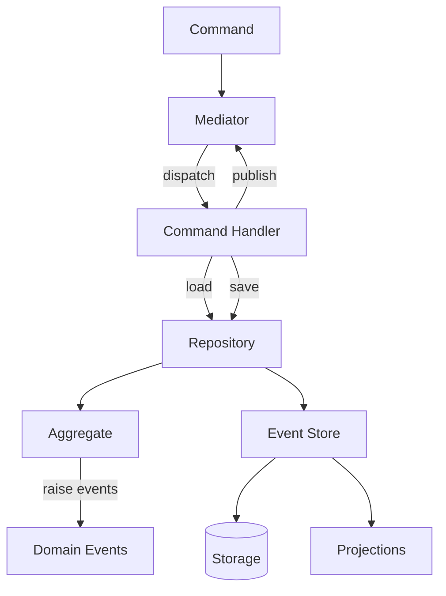

# Event Sourcing

## Introduction

Traditional systems store only the current state — each update overwrites what came before.
Event sourcing takes a different approach: every state change is captured as an immutable
**domain event** in an append-only log. The current state is derived by replaying these events:

```
state = fold(initial_state, events)
```

This gives you a complete audit trail, the ability to reconstruct state at any point in time,
and a natural integration point for reactive systems that respond to events as they occur.

### Core Concepts

- **Events are the source of truth.** The event log is the primary data store. State (read models,
  projections) is derived, not stored directly.
- **Aggregates guard invariants.** An aggregate receives a command, validates business rules against
  its current state, and produces new events. Waku supports both mutable OOP aggregates and
  immutable functional [deciders](aggregates.md#functional-deciders).
- **Optimistic concurrency** prevents conflicting writes. Each stream tracks a version number;
  concurrent updates to the same aggregate are detected and rejected.
- **Projections** transform events into read-optimized views — either inline (same transaction)
  or via catch-up (eventually consistent background processing).
- **Schema evolution** is handled through lazy upcasting on read — events are stored in their
  original form and transformed to the current schema at deserialization time.

### The Decider Pattern

Waku's functional aggregate style is based on the **Decider pattern** formalized by
[Jérémie Chassaing](https://thinkbeforecoding.com/post/2021/12/17/functional-event-sourcing-decider):

```
Decider[Command, State, Event]:
    decide(command, state) → list[Event]
    evolve(state, event) → State
    initial_state → State
```

Pure functions, no side effects, trivially testable. See [Aggregates](aggregates.md) for both
OOP and functional approaches.

### Inspiration

Waku's event sourcing draws from established frameworks across ecosystems:

- [Emmett](https://event-driven-io.github.io/emmett/) (TypeScript) — functional-first ES by Oskar Dudycz
- [Marten](https://martendb.io/events/) (.NET) — projection lifecycle taxonomy (inline / async / live)
- [Eventuous](https://eventuous.dev/) (.NET) — `IEventStore = IEventReader + IEventWriter` interface split
- [Axon Framework](https://www.axoniq.io/framework) (JVM) — aggregate testing fixtures (Given/When/Then)
- [Greg Young](https://www.eventstore.com/blog/what-is-event-sourcing) — ES + CQRS formalization

---

The `waku.eventsourcing` extension provides a complete event sourcing toolkit that integrates with
waku's module system and dependency injection.

## Installation

Install waku with the event sourcing extra:

```bash
uv add waku --extra eventsourcing
```

For PostgreSQL persistence, also install the SQLAlchemy adapter:

```bash
uv add waku --extra eventsourcing --extra eventsourcing-sqla
```

## Architecture



The extension follows the standard event sourcing architecture:

1. **Commands** enter through the mediator
2. **Command handlers** load aggregates from the repository
3. **Aggregates** validate business rules and raise domain events
4. The **repository** persists events to the event store
5. **Projections** update read models as events are appended

## Quick Start

### 1. Define Domain Events

Events are frozen dataclasses implementing `INotification`:

```python linenums="1"
--8<-- "docs/code/eventsourcing/quickstart/events.py"
```

### 2. Define the Aggregate

An aggregate applies events to mutate its state:

```python linenums="1"
--8<-- "docs/code/eventsourcing/quickstart/aggregate.py"
```

### 3. Define the Repository

The repository handles loading from and saving to the event store:

```python linenums="1"
--8<-- "docs/code/eventsourcing/quickstart/repository.py"
```

### 4. Define Commands and Handlers

Command handlers coordinate the aggregate lifecycle:

```python linenums="1"
--8<-- "docs/code/eventsourcing/quickstart/commands.py"
```

### 5. Wire the Modules

Register aggregates, event types, and command handlers with the module system:

```python linenums="1"
--8<-- "docs/code/eventsourcing/quickstart/modules.py"
```

### 6. Run

```python linenums="1"
--8<-- "docs/code/eventsourcing/quickstart/main.py"
```

!!! tip
    The default `EventSourcingConfig()` uses an in-memory event store — perfect for
    prototyping. See [Event Store](event-store.md) for PostgreSQL setup.

## Next steps

| Topic | Description |
|-------|-------------|
| [Aggregates](aggregates.md) | OOP aggregates vs functional deciders |
| [Event Store](event-store.md) | In-memory and PostgreSQL persistence |
| [Projections](projections.md) | Build read models from event streams |
| [Snapshots](snapshots.md) | Optimize loading for long-lived aggregates |
| [Schema Evolution](schema-evolution.md) | Upcasting and event type registries |
| [Testing](testing.md) | Given/When/Then DSL for decider testing |
