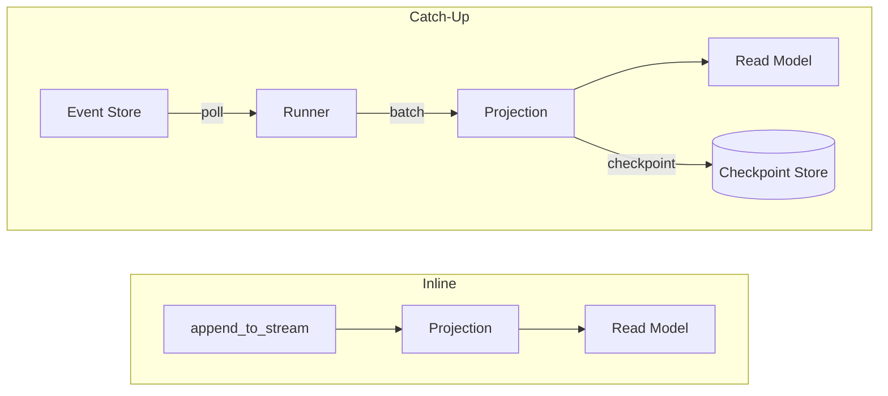

# Projections

Projections build read models from event streams. Waku provides two types:

- **Inline projections** run synchronously during `append_to_stream`, guaranteeing immediate consistency between writes and reads.
- **Catch-up projections** process events asynchronously in a background loop, eventually catching up with the event store.



## Inline Projections

Implement `IProjection` to create an inline projection. It runs inside the same scope as
`append_to_stream`, so the read model is always consistent with the write model.

Every projection must define a `projection_name` class attribute.

```python linenums="1"
--8<-- "docs/code/eventsourcing/projections/inline.py"
```

Register inline projections through `bind_aggregate()` (or `bind_decider()`):

```python
EventSourcingExtension().bind_aggregate(
    repository=BankAccountRepository,
    event_types=[AccountOpened, MoneyDeposited, MoneyWithdrawn],
    projections=[AccountBalanceProjection],
)
```

!!! warning
    Inline projections add latency to every write because they execute within the same
    operation. Keep them lightweight or use catch-up projections for expensive read model updates.

## Catch-Up Projections

Implement `ICatchUpProjection` for projections that run asynchronously in a background process.
Catch-up projections poll the event store, process events in batches, and checkpoint their progress.

!!! warning
    Catch-up projections **must** be **idempotent** — reprocessing the same events (e.g., after
    a crash before commit) must produce the same result.

Each catch-up projection has an `error_policy` class attribute (defaults to `ErrorPolicy.RETRY`)
and an optional `teardown()` method called during rebuilds to clean up existing state.

```python linenums="1"
--8<-- "docs/code/eventsourcing/projections/catch_up.py"
```

Register catch-up projections via `bind_catch_up_projections()`:

```python
EventSourcingExtension()
    .bind_aggregate(
        repository=BankAccountRepository,
        event_types=[AccountOpened, MoneyDeposited, MoneyWithdrawn],
    )
    .bind_catch_up_projections([AccountSummaryProjection])
```

## Error Policies

| Policy | Behavior |
|--------|----------|
| `ErrorPolicy.RETRY` | Retry the failed batch with exponential backoff (default) |
| `ErrorPolicy.SKIP` | Skip the failed batch and continue from the next checkpoint |
| `ErrorPolicy.STOP` | Stop the projection permanently until manually restarted |

## CatchUpProjectionRunner

`CatchUpProjectionRunner` polls the event store and dispatches event batches to registered
catch-up projections. Each projection runs in its own concurrent task.

```python linenums="1"
--8<-- "docs/code/eventsourcing/projections/runner.py"
```

The runner listens for `SIGTERM` and `SIGINT` to shut down gracefully, finishing any
in-progress batch before exiting.

Use `rebuild(projection_name)` to reprocess all events from the beginning. This calls
`teardown()` on the projection, resets the checkpoint to zero, and replays every event
through the projection.

!!! tip
    Run the projection runner as a separate process (e.g., a dedicated worker or sidecar)
    so it does not block your main application.

## Configuration

`CatchUpProjectionConfig` controls the runner's polling and retry behavior:

| Field | Default | Description |
|-------|---------|-------------|
| `batch_size` | `100` | Maximum events per batch |
| `max_attempts` | `3` | Retry attempts before applying the error policy |
| `base_retry_delay_seconds` | `10.0` | Initial delay between retries |
| `max_retry_delay_seconds` | `300.0` | Maximum delay between retries |
| `poll_interval_min_seconds` | `0.5` | Minimum polling interval when events are available |
| `poll_interval_max_seconds` | `5.0` | Maximum polling interval when idle |
| `poll_interval_step_seconds` | `1.0` | Increment per idle cycle |
| `poll_interval_jitter_factor` | `0.1` | Random jitter factor applied to the interval |

## Distributed Locking

`IProjectionLock` ensures only one instance of each catch-up projection runs at a time
across multiple processes. This prevents duplicate processing and checkpoint conflicts.

- **`InMemoryProjectionLock`** — suitable for single-process deployments. Always acquires
  the lock immediately.
- **SQLAlchemy [lease-based lock](https://en.wikipedia.org/wiki/Lease_(computer_science))** — uses a database table with TTL-based leases for
  multi-process coordination. Configured via `LeaseConfig`:

    | Field | Default | Description |
    |-------|---------|-------------|
    | `ttl_seconds` | `30.0` | How long the lease is valid before expiring |
    | `renew_interval_factor` | `1/3` | Fraction of TTL at which the lease is renewed |

    !!! note "Consistency guarantees"
        The lease-based lock detects stolen leases via a background heartbeat and cancels the
        projection task, but there is no fencing token mechanism — a stalled holder (e.g., GC pause)
        can briefly overlap with a new holder until its next heartbeat fires.

        In practice this is safe because the runner resolves the projection, event reader, and
        checkpoint store from a single DI scope. When using `SqlAlchemyCheckpointStore` with a
        scoped `AsyncSession`, the projection writes and checkpoint save share the same transaction
        (the checkpoint store calls `flush()`, not `commit()`). This means either both succeed
        atomically or both roll back — duplicate processing from a brief overlap will not corrupt
        the read model.

- **SQLAlchemy [advisory lock](https://www.postgresql.org/docs/current/explicit-locking.html#ADVISORY-LOCKS)** — uses PostgreSQL advisory locks for lightweight
  multi-process coordination.

## Further reading

- **[Event Store](event-store.md)** — event persistence and metadata enrichment
- **[Schema Evolution](schema-evolution.md)** — handling evolved events in projections
- **[Snapshots](snapshots.md)** — aggregate snapshots and checkpoint strategies
- **[Testing](testing.md)** — in-memory stores for integration tests
