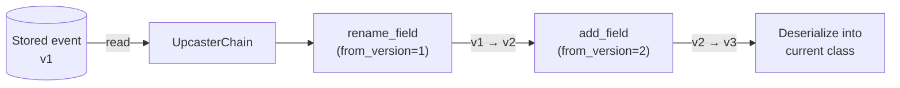

# Schema Evolution

As your domain evolves, event schemas change. Waku provides an event type registry for
serialization and an upcasting chain for migrating old events to current schemas.

## Event Serialization

`JsonEventSerializer` serializes and deserializes events using the [adaptix](https://adaptix.readthedocs.io/)
`Retort`. It requires an `EventTypeRegistry` to map type names back to Python classes during
deserialization.

Configure it through `EventSourcingConfig`:

```python
from waku.eventsourcing import EventSourcingConfig
from waku.eventsourcing.serialization import JsonEventSerializer

config = EventSourcingConfig(event_serializer=JsonEventSerializer)
```

!!! tip
    Serialization is only needed for persistent stores (e.g., PostgreSQL with SQLAlchemy).
    The in-memory store keeps Python objects directly, so no serializer is required.

## Event Type Registry

`EventTypeRegistry` maintains a bidirectional mapping between event classes and string names,
and tracks schema versions. The registry is built automatically from the `event_types` passed
to `bind_aggregate()` or `bind_decider()` — you do not create it manually.

**Simple usage** — pass event classes directly:

```python
es_ext = EventSourcingExtension()
es_ext.bind_aggregate(
    repository=AccountRepository,
    event_types=[AccountOpened, MoneyDeposited, MoneyWithdrawn],
)
```

Each class is registered under its `__name__` at version 1.

**Advanced usage** — wrap classes in `EventType` for custom names, versions, aliases, and upcasters:

```python
es_ext.bind_aggregate(
    repository=AccountRepository,
    event_types=[
        EventType(AccountOpened, name='AccountOpened', version=3, upcasters=[...]),
        MoneyDeposited,
    ],
)
```

## EventType

`EventType` controls how an event class is registered and how old versions are migrated.

| Field        | Type                       | Default                  | Description                                       |
|--------------|----------------------------|--------------------------|---------------------------------------------------|
| `event_type` | `type[INotification]`      | *(required, positional)* | The Python event class                            |
| `name`       | `str                       | None`                    | `None` (uses class name)                          | Custom serialization name |
| `aliases`    | `Sequence[str]`            | `()`                     | Alternative names accepted during deserialization |
| `version`    | `int`                      | `1`                      | Current schema version                            |
| `upcasters`  | `Sequence[IEventUpcaster]` | `()`                     | Upcasters for migrating old versions              |

## Type Aliases

When you rename an event class, old events stored under the previous name still need to
deserialize. Use `aliases` to register alternative names that map to the current class:

```python
EventType(
    AccountOpened,
    name='AccountOpened',
    aliases=['AccountCreated'],  # old events stored as "AccountCreated" still resolve
)
```

New events are always written under the primary `name`. Aliases are read-only —
they only affect deserialization lookup.

## Upcasting

Upcasters transform old event data (raw `dict` payloads) to match the current schema **before**
deserialization into the Python class. Each upcaster declares a `from_version` indicating which
version it upgrades.

When reading an event stored at version *N*, the `UpcasterChain` applies every upcaster whose
`from_version >= N` in order, producing data compatible with the current version.

### Built-in Helpers

| Helper         | Signature                                   | Description                                              |
|----------------|---------------------------------------------|----------------------------------------------------------|
| `rename_field` | `rename_field(from_version, old=, new=)`    | Rename a field                                           |
| `add_field`    | `add_field(from_version, field=, default=)` | Add a field with a default value                         |
| `remove_field` | `remove_field(from_version, field=)`        | Remove a field                                           |
| `noop`         | `noop(from_version)`                        | No-op placeholder for version bumps without data changes |
| `upcast`       | `upcast(from_version, fn)`                  | Custom function `(dict) -> dict`                         |

All helpers return an `IEventUpcaster` instance and are imported from `waku.eventsourcing`.

### Upcasting Pipeline



## Evolution Example

Consider an `AccountOpened` event that has gone through three versions:

1. **v1** — had an `owner` field
2. **v2** — renamed `owner` to `owner_name`
3. **v3** — added a `currency` field

```python linenums="1"
--8<-- "docs/code/eventsourcing/upcasting/evolution.py"
```

When the store reads a v1 event, the upcaster chain applies two transformations:

1. `rename_field(from_version=1)` — renames `owner` to `owner_name` (v1 -> v2)
2. `add_field(from_version=2)` — adds `currency` with default `'USD'` (v2 -> v3)

The resulting dict matches the current `AccountOpened` schema and deserializes cleanly.

!!! warning
    Every upcaster's `from_version` must be **less than** the event's current `version`.
    Waku validates this at startup and raises `UpcasterChainError` if the constraint is violated.

## Further reading

- **[Event Store](event-store.md)** — where upcasting happens during deserialization
- **[Aggregates](aggregates.md)** — aggregate patterns that produce versioned events
- **[Projections](projections.md)** — read models that consume upcasted events
- **[Testing](testing.md)** — testing upcasters and event evolution
