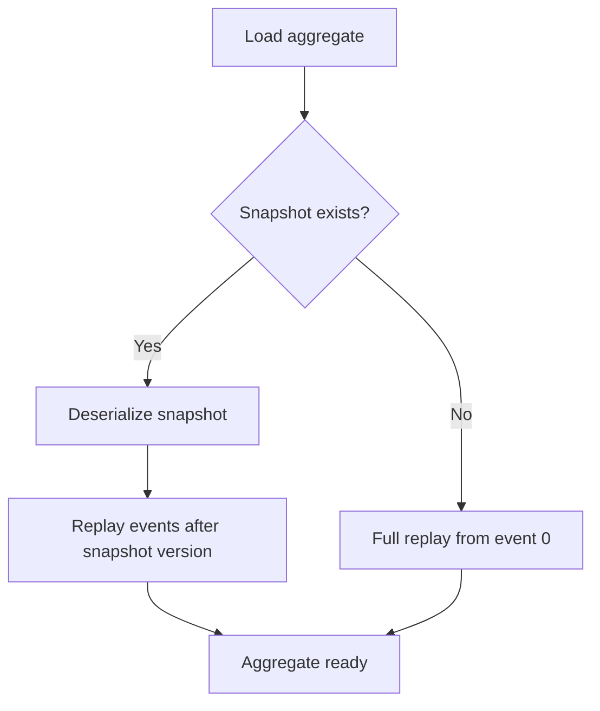

# Snapshots

Snapshots periodically capture aggregate state so that loading doesn't require replaying
every event from the beginning of the stream. Use them when aggregates accumulate many events
and replay time becomes noticeable.

## When to Use Snapshots

Snapshots add complexity — an extra store, serialization logic, and a strategy to decide when
to take them. Only introduce snapshots when event replay time becomes a measurable bottleneck.

!!! tip
    Profile first. Most aggregates don't need snapshots until they exceed hundreds of events.

## Snapshot Strategy

The `ISnapshotStrategy` interface defines when a snapshot should be taken:

```python
class ISnapshotStrategy(abc.ABC):
    @abc.abstractmethod
    def should_snapshot(self, version: int, events_since_snapshot: int) -> bool: ...
```

Waku ships with `EventCountStrategy(threshold=N)`, which triggers a snapshot every N events
since the last snapshot. The default threshold is `100`.

## Snapshot Repository

Both aggregate styles have a snapshot-aware repository variant:

| Style | Base Repository | Snapshot Repository |
|---|---|---|
| OOP | `EventSourcedRepository` | `SnapshotEventSourcedRepository` |
| Functional Decider | `DeciderRepository` | `SnapshotDeciderRepository` |

=== "OOP Aggregate"

    `SnapshotEventSourcedRepository` requires two additional methods for state serialization:

    ```python linenums="1"
    --8<-- "docs/code/eventsourcing/snapshots/oop_repository.py"
    ```

=== "Functional Decider"

    `SnapshotDeciderRepository` works the same way as `DeciderRepository` — state serialization
    is handled automatically since the state is already a dataclass:

    ```python linenums="1"
    --8<-- "docs/code/eventsourcing/snapshots/decider_repository.py"
    ```

When loading, the snapshot repository first checks for a stored snapshot. If one exists, it
deserializes the state from the snapshot and replays only the events recorded *after* the
snapshot version. If no snapshot is found, it falls back to full replay.



## Module Wiring

Pass `snapshot_strategy` to `bind_aggregate()` or `bind_decider()`:

=== "OOP Aggregate"

    ```python linenums="1"
    --8<-- "docs/code/eventsourcing/snapshots/oop_modules.py"
    ```

=== "Functional Decider"

    ```python linenums="1"
    --8<-- "docs/code/eventsourcing/snapshots/decider_modules.py"
    ```

The extension automatically registers the strategy in the DI container when `snapshot_strategy`
is provided.

!!! warning
    Snapshot support requires `ISnapshotStore` and `ISnapshotStateSerializer` to be registered
    in `EventSourcingConfig`. Without them, the snapshot repository will fail to resolve at runtime.

## Snapshot Store

`ISnapshotStore` defines persistence for snapshots:

```python
class ISnapshotStore(abc.ABC):
    async def load(self, stream_id: str, /) -> Snapshot | None: ...
    async def save(self, snapshot: Snapshot, /) -> None: ...
```

The `Snapshot` dataclass carries the serialized state:

| Field | Type | Description |
|---|---|---|
| `stream_id` | `str` | Stream identifier (e.g., `BankAccount-acc-1`) |
| `state` | `dict[str, Any]` | Serialized aggregate state |
| `version` | `int` | Stream version at snapshot time |
| `state_type` | `str` | State class name (for type safety on load) |

Built-in implementations:

- `InMemorySnapshotStore` — dictionary-backed, suitable for testing
- `SqlAlchemySnapshotStore` — PostgreSQL-backed via SQLAlchemy async session

## State Serialization

`ISnapshotStateSerializer` handles converting state objects to and from dictionaries:

```python
class ISnapshotStateSerializer(abc.ABC):
    def serialize(self, state: object, /) -> dict[str, Any]: ...
    def deserialize(self, data: dict[str, Any], state_type: type[StateT], /) -> StateT: ...
```

`JsonSnapshotStateSerializer` is the built-in implementation. It uses an adaptix `Retort`
under the hood and works with any dataclass state out of the box.

## Configuration

Register the snapshot store and serializer through `EventSourcingConfig`:

```python
EventSourcingConfig(
    snapshot_store=SqlAlchemySnapshotStore,  # or snapshot_store_factory=...
    snapshot_state_serializer=JsonSnapshotStateSerializer,
)
```

You can use `snapshot_store_factory` instead of `snapshot_store` when the store requires
additional constructor arguments (e.g., `make_sqlalchemy_snapshot_store(table)`).
