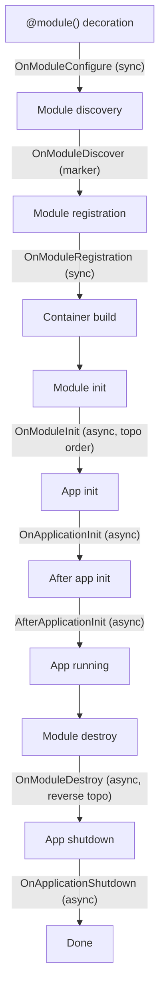

# Lifecycle Hooks

## Introduction

Waku's extension system provides hooks at every stage of the application lifecycle — from the
moment a module is decorated with `@module()` through initialization, runtime, and eventual
shutdown. Each hook is defined as a `@runtime_checkable` `Protocol`, so extensions are plain
classes that implement one or more of these protocols without needing to inherit from a shared
base class.

This page gives an overview of the full lifecycle, lists every available hook, and explains when
each one fires. For implementation details and code examples, see
[Custom Extensions](../advanced/custom-extensions.md).

## Full Lifecycle

The following diagram shows every phase of a Waku application and the hook that fires at each
transition:



## Hook Reference

| Hook | Protocol | Sync/Async | Level | When |
|------|----------|------------|-------|------|
| Configure | `OnModuleConfigure` | sync | module | During `@module()` decoration |
| Discover | `OnModuleDiscover` | marker | module | Discoverable via `find_extensions()` |
| Registration | `OnModuleRegistration` | sync | both | After all modules collected |
| Init | `OnModuleInit` | async | module | After container built, topo order |
| App Init | `OnApplicationInit` | async | app | Before app is fully ready |
| After Init | `AfterApplicationInit` | async | app | After app is fully ready |
| Destroy | `OnModuleDestroy` | async | module | During shutdown, reverse topo |
| Shutdown | `OnApplicationShutdown` | async | app | Final cleanup |

## Phase Descriptions

### Configure (`OnModuleConfigure`)

Fires synchronously during `@module()` decoration (import time). The extension receives the
mutable `ModuleMetadata` and can add providers, imports, or exports. Because this runs at
import time, do not perform I/O here — use `OnModuleInit` for async setup.

```python
def on_module_configure(self, metadata: ModuleMetadata) -> None: ...
```

### Discover (`OnModuleDiscover`)

A marker protocol with no methods. Extensions that implement `OnModuleDiscover` can be found
across all modules via `ModuleMetadataRegistry.find_extensions()` during the registration
phase. This is the mechanism the CQRS module uses to aggregate handler registrations from
feature modules.

### Registration (`OnModuleRegistration`)

Fires synchronously after all module metadata has been collected but before `Module` objects
are created and the DI container is built. Unlike `OnModuleConfigure` (which sees only its
own module), `OnModuleRegistration` receives the full `ModuleMetadataRegistry` with cross-module
visibility. This hook can be used at both the module level and the application level.

```python
def on_module_registration(
    self,
    registry: ModuleMetadataRegistry,
    owning_module: ModuleType,
    context: Mapping[Any, Any] | None,
) -> None: ...
```

### Init (`OnModuleInit`)

Fires asynchronously after the DI container is built, during application initialization. Modules
are initialized in **topological order** (dependencies first), so a module can rely on its
imported modules already being initialized.

```python
async def on_module_init(self, module: Module) -> None: ...
```

### App Init (`OnApplicationInit`)

Fires asynchronously after all `OnModuleInit` hooks have completed. At this point the container
is built and all modules are initialized, but the application is not yet considered fully ready.

```python
async def on_app_init(self, app: WakuApplication) -> None: ...
```

### After Init (`AfterApplicationInit`)

Fires asynchronously immediately after `OnApplicationInit`. The application is now fully
initialized and the container is available. This is the right place for post-startup validation,
health checks, or logging. The built-in `ValidationExtension` implements this protocol.

```python
async def after_app_init(self, app: WakuApplication) -> None: ...
```

### Destroy (`OnModuleDestroy`)

Fires asynchronously during application shutdown in **reverse topological order** (dependents
first). A module's dependents are torn down before the module itself, so cleanup logic can
safely assume downstream modules are already shut down.

```python
async def on_module_destroy(self, module: Module) -> None: ...
```

### Shutdown (`OnApplicationShutdown`)

Fires asynchronously as the final extension hook, after all `OnModuleDestroy` hooks have
completed. Use this for application-wide cleanup like flushing metrics, closing shared
connections, or final logging.

```python
async def on_app_shutdown(self, app: WakuApplication) -> None: ...
```

## Registering Extensions

Extensions are registered in two places depending on their scope:

**Module extensions** are attached to a specific module via the `extensions` parameter:

```python linenums="1"
from waku import module

@module(extensions=[MyModuleExtension()])
class FeatureModule:
    pass
```

**Application extensions** are passed to `WakuFactory` and operate on the entire application:

```python linenums="1"
from waku import WakuFactory
from waku.extensions import DEFAULT_EXTENSIONS

app = WakuFactory(
    AppModule,
    extensions=[*DEFAULT_EXTENSIONS, MyAppExtension()],
).create()
```

!!! note
    `OnModuleRegistration` is the only protocol that can be used at **both** the module level
    and the application level. All other hooks belong to one scope or the other.

## `DEFAULT_EXTENSIONS`

When you do not pass `extensions=` to `WakuFactory`, Waku uses a default set of application
extensions automatically:

```python linenums="1"
from waku.validation import ValidationExtension
from waku.validation.rules import DependenciesAccessibleRule

DEFAULT_EXTENSIONS = (
    ValidationExtension(
        [DependenciesAccessibleRule()],
        strict=True,
    ),
)
```

The `ValidationExtension` implements `AfterApplicationInit` and runs module dependency graph
validation after the application is fully initialized.

!!! warning
    Providing custom `extensions=` to `WakuFactory` **replaces** the defaults entirely. To keep
    the built-in validation, spread `DEFAULT_EXTENSIONS` into your list:

    ```python
    extensions=[*DEFAULT_EXTENSIONS, MyExtension()]
    ```

## What's Next

For implementation details, code examples, and advanced patterns like combining multiple hooks
in a single class, see [Custom Extensions](../advanced/custom-extensions.md).
