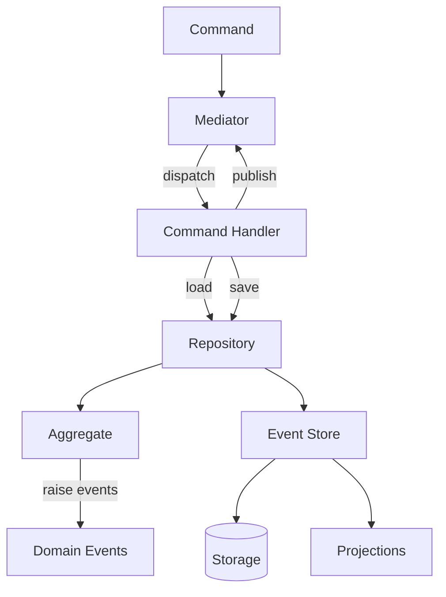

# Event Sourcing

## Introduction

Traditional systems store only the current state — each update overwrites what came before.
Event sourcing takes a different approach: every state change is captured as an immutable
**domain event** in an append-only log. The current state is derived by replaying these events:

```python
state = fold(initial_state, events)
```

This gives you a complete audit trail, the ability to reconstruct state at any point in time,
and a natural integration point for reactive systems that respond to events as they occur.

### Core Concepts

- **Events are the source of truth.** The event log is the primary data store. State (read models,
  projections) is derived, not stored directly.
- **Aggregates guard invariants.** An aggregate receives a command, validates business rules against
  its current state, and produces new events. waku supports both mutable OOP aggregates and
  immutable functional [deciders](aggregates.md#functional-deciders).
- **Optimistic concurrency** prevents conflicting writes. Each stream tracks a version number;
  concurrent updates to the same aggregate are detected and rejected.
- **Projections** transform events into read-optimized views — either inline (same transaction)
  or via catch-up (eventually consistent background processing).
- **Schema evolution** is handled through lazy upcasting on read — events are stored in their
  original form and transformed to the current schema at deserialization time.

### The Decider Pattern

waku's functional aggregate style is based on the **Decider pattern** formalized by
[Jérémie Chassaing](https://thinkbeforecoding.com/post/2021/12/17/functional-event-sourcing-decider):

```python
Decider[Command, State, Event]:
    decide(command, state) → list[Event]
    evolve(state, event) → State
    initial_state → State
```

Pure functions, no side effects, trivially testable. See [Aggregates](aggregates.md) for both
OOP and functional approaches.

### Inspiration

waku's event sourcing draws from established frameworks across ecosystems:

- [Emmett](https://event-driven-io.github.io/emmett/) (TypeScript) — functional-first ES by Oskar Dudycz
- [Marten](https://martendb.io/events/) (.NET) — projection lifecycle taxonomy (inline / async / live)
- [Eventuous](https://eventuous.dev/) (.NET) — `IEventStore = IEventReader + IEventWriter` interface split
- [Axon Framework](https://www.axoniq.io/framework) (JVM) — aggregate testing fixtures (Given/When/Then)
- [Greg Young](https://www.eventstore.com/blog/what-is-event-sourcing) — ES + CQRS formalization

### Why waku

- **Two aggregate styles, one infrastructure.** Choose mutable OOP aggregates for simple domains
  or immutable functional [deciders](aggregates.md) for complex business rules — both share the same
  event store, projections, and module wiring.
- **Given/When/Then testing DSL.** [DeciderSpec](testing.md) makes decider tests read like specifications:

    ```python
    DeciderSpec.for_(decider).given([AccountOpened(...)]).when(Deposit(...)).then([MoneyDeposited(...)])
    ```

- **Lazy schema evolution.** Events are stored in their original form — [upcasters](schema-evolution.md)
  transform old schemas on read, so you never run batch migrations.
- **Full DI integration.** Projections, enrichers, stores, and serializers are all resolved through
  Dishka — swap implementations without touching business logic.

---

## Installation

Install waku with the event sourcing extra:

```bash
uv add waku --extra eventsourcing
```

For PostgreSQL persistence, also install the SQLAlchemy adapter:

```bash
uv add waku --extra eventsourcing --extra eventsourcing-sqla
```

## Architecture



The extension builds on waku's [CQRS module](../cqrs/index.md) — commands, handlers, and the
mediator are all part of the CQRS layer. Event sourcing adds aggregates, an event store, and
projections on top:

1. **Commands** enter through the [mediator](../cqrs/index.md)
2. **Command handlers** load aggregates from the repository
3. **Aggregates** validate business rules and raise domain events
4. The **repository** persists events to the event store
5. **Projections** update read models as events are appended

!!! tip "Get started"
    See [Aggregates](aggregates.md) for a complete walkthrough — from defining events
    to wiring modules — for both OOP and functional decider styles.

## Next steps

| Topic | Description |
|-------|-------------|
| [Aggregates](aggregates.md) | OOP aggregates vs functional deciders |
| [Event Store](event-store.md) | In-memory and PostgreSQL persistence |
| [Projections](projections.md) | Build read models from event streams |
| [Snapshots](snapshots.md) | Optimize loading for long-lived aggregates |
| [Schema Evolution](schema-evolution.md) | Upcasting and event type registries |
| [Testing](testing.md) | Given/When/Then DSL for decider testing |
