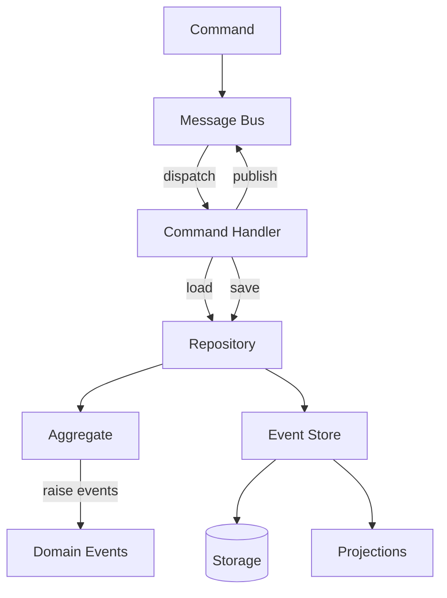

# Event Sourcing

waku's event sourcing stores every state change as an immutable domain event and derives current
state by replaying the log. It builds on the [message bus](../messaging/index.md) and integrates with
dependency injection and the extension lifecycle. New to the paradigm? Start with
[Why event sourcing](concepts.md).

## Installation

Install waku:

```bash
uv add waku
```

For PostgreSQL persistence, also install the SQLAlchemy extra:

```bash
uv add waku --extra sqla
```

## Architecture


```mermaid
graph TD
    CMD[Command] --> Bus[Message Bus]
    Bus -->|dispatch| Handler[Command Handler]
    Handler -->|load| Repo[Repository]
    Repo --> Agg[Aggregate]
    Agg -->|raise events| Events[Domain Events]
    Handler -->|save| Repo
    Repo --> Store[Event Store]
    Store --> DB[(Storage)]
    Store --> Proj[Projections]
    Handler -->|publish| Bus
```

The extension builds on waku's [CQRS module](../messaging/index.md) — commands, handlers, and the
message bus are all part of the CQRS layer. Event sourcing adds aggregates, an event store, and
projections on top:

1. **Commands** enter through the [message bus](../messaging/index.md)
2. **Command handlers** load aggregates from the repository
3. **Aggregates** validate business rules and raise domain events
4. The **repository** persists events to the event store
5. **Projections** update read models as events are appended

!!! tip "Get started"
    See [Aggregates](aggregates.md) for a complete walkthrough — from defining events
    to wiring modules — for both OOP and functional decider styles.

## Next steps

| Topic | Description |
|-------|-------------|
| [Why event sourcing](concepts.md) | The paradigm, core concepts, and the decider pattern |
| [Aggregates](aggregates.md) | OOP aggregates vs functional deciders |
| [Event Store](event-store.md) | In-memory and PostgreSQL persistence |
| [Projections](projections.md) | Build read models from event streams |
| [Snapshots](snapshots.md) | Optimize loading for long-lived aggregates |
| [Schema Evolution](schema-evolution.md) | Upcasting and event type registries |
| [Event Forwarding](forwarding.md) | Forward appended events onto the message bus |
| [Testing](testing.md) | Given/When/Then DSL for decider testing |
