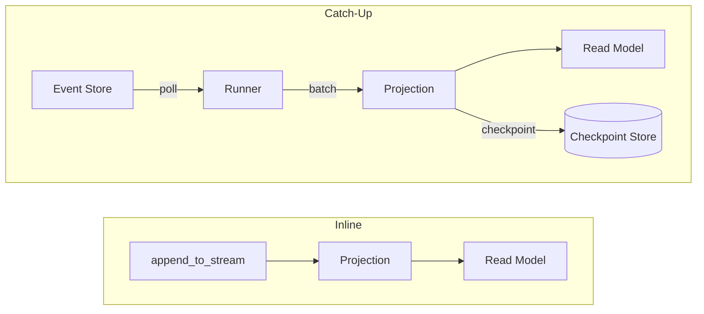
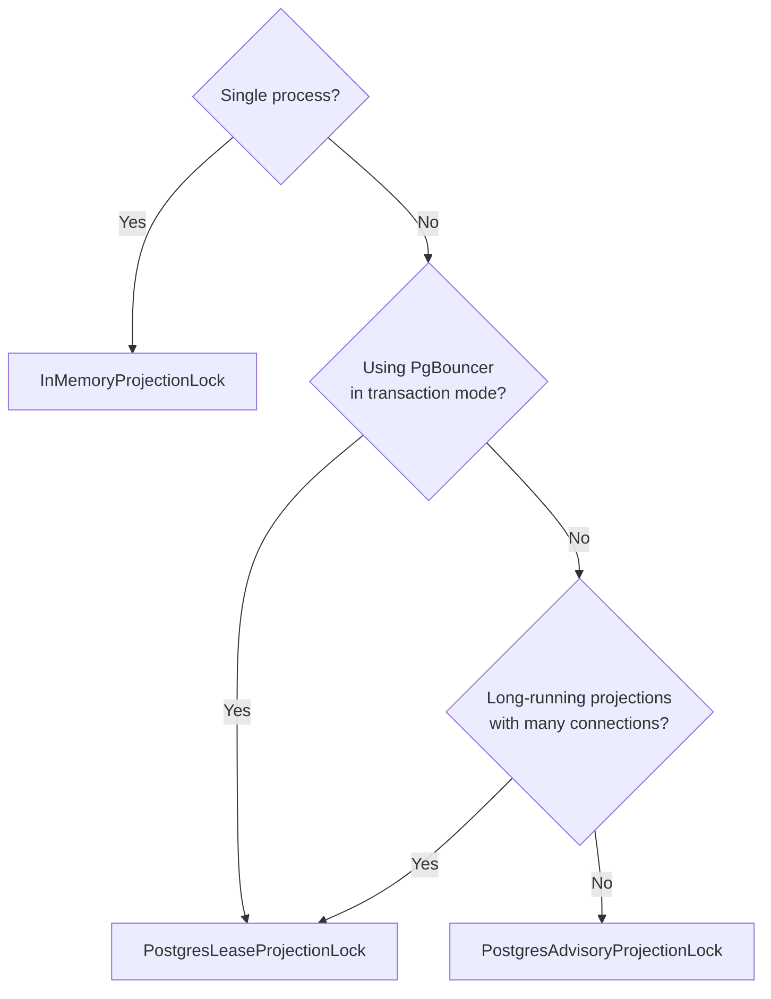

# Projections

Projections build read models from event streams. waku provides two types:

- **Inline projections** run synchronously during `append_to_stream`, guaranteeing immediate consistency between writes and reads.
- **Catch-up projections** process events asynchronously in a background loop, eventually catching up with the event store.



## Inline Projections

Implement `IProjection` to create an inline projection. It runs inside the same scope as
`append_to_stream`, so the read model is always consistent with the write model.

Every projection must define a `projection_name` class attribute.

```python linenums="1"
--8<-- "docs/code/eventsourcing/projections/inline.py"
```

Register inline projections through `bind_aggregate()` (or `bind_decider()`):

```python
EventSourcingExtension().bind_aggregate(
    repository=BankAccountRepository,
    event_types=[AccountOpened, MoneyDeposited, MoneyWithdrawn],
    projections=[AccountBalanceProjection],
)
```

!!! warning
    Inline projections add latency to every write because they execute within the same
    operation. Keep them lightweight or use catch-up projections for expensive read model updates.

## Catch-Up Projections

Implement `ICatchUpProjection` for projections that run asynchronously in a background process.
Catch-up projections poll the event store, process events in batches, and checkpoint their progress.

!!! warning "At-least-once delivery"
    The checkpoint is saved *after* `project()` processes a batch. If the process crashes
    between projection and checkpoint save, the same batch will be re-delivered on restart.

    `project()` **must** be idempotent.

Error handling is configured per-projection via `CatchUpProjectionBinding` (defaults to
`ErrorPolicy.STOP` with no retries — see [Error Policies](#error-policies)). Each catch-up
projection also has an optional `teardown()` method called during rebuilds to clean up existing
state, and an optional `on_skip(events, error)` hook called when a batch is skipped.

```python linenums="1"
--8<-- "docs/code/eventsourcing/projections/catch_up.py"
```

Register catch-up projections via `bind_catch_up_projections()`:

```python
from waku.eventsourcing.modules import CatchUpProjectionBinding
from waku.eventsourcing.projection.interfaces import ErrorPolicy

(
    EventSourcingExtension()
    .bind_aggregate(
        repository=BankAccountRepository,
        event_types=[AccountOpened, MoneyDeposited, MoneyWithdrawn],
    )
    .bind_catch_up_projections([
        CatchUpProjectionBinding(
            projection=AccountSummaryProjection,
            error_policy=ErrorPolicy.SKIP,
            max_retry_attempts=3,
        ),
    ])
)
```

## Error Policies

| Policy | Behavior |
|--------|----------|
| `ErrorPolicy.STOP` | Stop the projection (default) |
| `ErrorPolicy.SKIP` | Skip failed batch and continue; calls `on_skip()` hook before advancing |

Both policies retry first when `max_retry_attempts > 0`. The policy only applies after
retries are exhausted.

!!! info "Fail-fast by default"
    The default is `STOP` with zero retries — projection failures surface immediately
    rather than silently losing events. Opt into retries or `SKIP` explicitly when your
    projection can tolerate partial gaps or transient errors.

## CatchUpProjectionRunner

`CatchUpProjectionRunner` polls the event store and dispatches event batches to registered
catch-up projections. Each projection runs in its own concurrent task.

```python linenums="1"
--8<-- "docs/code/eventsourcing/projections/runner.py"
```

The runner listens for `SIGTERM` and `SIGINT` to shut down gracefully, finishing any
in-progress batch before exiting.

Use `rebuild(projection_name)` to reprocess all events from the beginning. This calls
`teardown()` on the projection, resets the checkpoint to zero, and replays every event
through the projection.

!!! tip
    Run the projection runner as a separate process (e.g., a dedicated worker or sidecar)
    so it does not block your main application.

## Configuration

All per-projection behavior — batch size, error handling, and retry — is configured through
`CatchUpProjectionBinding`:

| Field | Default | Description |
|-------|---------|-------------|
| `projection` | *(required)* | The `ICatchUpProjection` class |
| `error_policy` | `ErrorPolicy.STOP` | What to do after retries are exhausted |
| `max_retry_attempts` | `0` | Retry count before applying the error policy |
| `base_retry_delay_seconds` | `10.0` | Initial delay between retries (exponential backoff) |
| `max_retry_delay_seconds` | `300.0` | Maximum delay cap for retries |
| `batch_size` | `100` | Maximum events per batch |

The runner's polling interval is configured globally via `PollingConfig` (passed to the runner
constructor, defaults to sensible values if omitted):

| Field | Default | Description |
|-------|---------|-------------|
| `poll_interval_min_seconds` | `0.5` | Minimum polling interval when events are available |
| `poll_interval_max_seconds` | `5.0` | Maximum polling interval when idle |
| `poll_interval_step_seconds` | `1.0` | Increment per idle cycle |
| `poll_interval_jitter_factor` | `0.1` | Random jitter factor applied to the interval |

## Distributed Locking

`IProjectionLock` ensures only one instance of each catch-up projection runs at a time
across multiple processes. This prevents duplicate processing and checkpoint conflicts.

```python
class IProjectionLock(abc.ABC):
    @contextlib.asynccontextmanager
    async def acquire(self, projection_name: str) -> AsyncIterator[bool]:
        """Yields True if the lock was acquired, False if held by another instance."""
```

### Choosing a Lock



| | `InMemoryProjectionLock` | `PostgresLeaseProjectionLock` | `PostgresAdvisoryProjectionLock` |
|---|---|---|---|
| **Use case** | Single process, testing | Multi-process production | Multi-process, simple setups |
| **Connection held** | None | Only during heartbeats | Entire lock duration |
| **PgBouncer compatible** | N/A | Yes | No (session-bound) |
| **Extra table required** | No | Yes (`es_projection_leases`) | No |
| **Lock granularity** | Per process | Per lease TTL | Per DB session |
| **Failure detection** | Instant | Heartbeat interval | Connection drop |

### InMemoryProjectionLock

Always acquires the lock immediately. Tracks held lock names for testing. Use this for
single-process deployments and in tests.

### PostgresLeaseProjectionLock

Uses a database table with TTL-based leases for multi-process coordination. A background
heartbeat task renews the lease periodically. If the heartbeat detects the lease was stolen
(e.g., by another instance after TTL expiry), it cancels the projection task.

Configured via `LeaseConfig`:

| Field | Default | Description |
|-------|---------|-------------|
| `ttl_seconds` | `30.0` | How long the lease is valid before expiring |
| `renew_interval_factor` | `1/3` | Fraction of TTL at which the lease is renewed |
| `renew_interval_seconds` | *(derived)* | `ttl_seconds * renew_interval_factor` — read-only property |

With the defaults, the lease renews every 10 seconds and expires after 30 seconds of silence.

!!! note "Consistency guarantees"
    There is no fencing token mechanism — a stalled holder (e.g., GC pause) can briefly overlap
    with a new holder until its next heartbeat fires.

    In practice this is safe because the runner resolves the projection, event reader, and
    checkpoint store from a single DI scope. When using `SqlAlchemyCheckpointStore` with a
    scoped `AsyncSession`, the projection writes and checkpoint save share the same transaction
    (the checkpoint store calls `flush()`, not `commit()`). This means either both succeed
    atomically or both roll back — duplicate processing from a brief overlap will not corrupt
    the read model.

### PostgresAdvisoryProjectionLock

Uses PostgreSQL [advisory locks](https://www.postgresql.org/docs/current/explicit-locking.html#ADVISORY-LOCKS)
via `pg_try_advisory_lock(hashtext(name))`. The lock is session-bound — it holds a database
connection for the entire duration.

!!! warning
    Advisory locks are **not compatible** with PgBouncer in transaction-pooling mode because
    the lock is tied to the database session, not the transaction. Releasing the connection
    back to the pool releases the lock. Use `PostgresLeaseProjectionLock` instead.

## Checkpoint Store

`ICheckpointStore` tracks each catch-up projection's last processed position so it resumes
from where it left off after restarts.

```python
class ICheckpointStore(abc.ABC):
    async def load(self, projection_name: str, /) -> Checkpoint | None: ...
    async def save(self, checkpoint: Checkpoint, /) -> None: ...
```

The `Checkpoint` dataclass carries the projection name, last processed global position, and timestamp.

Built-in implementations:

- `InMemoryCheckpointStore` — dictionary-backed, suitable for single-process deployments and testing
- `SqlAlchemyCheckpointStore` — PostgreSQL-backed via SQLAlchemy async session

Configure the checkpoint store through `EventSourcingConfig`:

```python
from waku.eventsourcing import EventSourcingConfig
from waku.eventsourcing.projection.sqlalchemy import make_sqlalchemy_checkpoint_store

es_config = EventSourcingConfig(
    checkpoint_store=make_sqlalchemy_checkpoint_store(checkpoints_table),
)
```

`make_sqlalchemy_checkpoint_store()` works the same way as `make_sqlalchemy_event_store()` — it
returns a factory that Dishka uses to construct the store with its `AsyncSession` dependency
injected automatically.

## Table Schema Reference

### `es_checkpoints`

| Column | Type | Constraints | Description |
|--------|------|------------|-------------|
| `projection_name` | `Text` | **PK** | Unique projection identifier |
| `position` | `BigInteger` | NOT NULL | Last processed global position |
| `updated_at` | `TIMESTAMP WITH TIME ZONE` | NOT NULL | Last checkpoint update time |
| `created_at` | `TIMESTAMP WITH TIME ZONE` | default `now()` | First checkpoint time |

Bind with `bind_checkpoint_tables(metadata)` from `waku.eventsourcing.projection.sqlalchemy`.

### `es_projection_leases`

Only required when using `PostgresLeaseProjectionLock`.

| Column | Type | Constraints | Description |
|--------|------|------------|-------------|
| `projection_name` | `Text` | **PK** | Projection being locked |
| `holder_id` | `Text` | NOT NULL | UUID of the lock holder instance |
| `acquired_at` | `TIMESTAMP WITH TIME ZONE` | default `now()` | When the lease was first acquired |
| `renewed_at` | `TIMESTAMP WITH TIME ZONE` | default `now()` | Last heartbeat renewal time |
| `expires_at` | `TIMESTAMP WITH TIME ZONE` | NOT NULL | When the lease expires if not renewed |

Bind with `bind_lease_tables(metadata)` from `waku.eventsourcing.projection.lock.sqlalchemy`.

## The Event Store as Outbox

In event sourcing, the event store is already a durable, ordered log of everything that
happened — it naturally serves as a [transactional outbox](https://microservices.io/patterns/data/transactional-outbox.html).

The `publisher.publish()` call in command handlers is an **in-process convenience** — it
dispatches mediator notifications to other handlers within the same process. It is not
a reliability mechanism. If the process crashes after saving events but before publishing,
the in-process notifications are lost.

For reliable cross-service messaging (e.g., publishing domain events to Kafka, RabbitMQ,
or another service), write a **catch-up projection** that reads from the event store and
publishes to your message broker:

```python
from collections.abc import Sequence

from waku.eventsourcing.contracts.event import StoredEvent
from waku.eventsourcing.projection.interfaces import ICatchUpProjection


class OrderEventPublisher(ICatchUpProjection):
    projection_name = 'order_event_publisher'

    def __init__(self, broker: MessageBroker) -> None:
        self._broker = broker

    async def project(self, events: Sequence[StoredEvent], /) -> None:
        for event in events:
            await self._broker.publish(
                topic='orders',
                key=str(event.stream_id),
                value=event.data,
            )
```

The same [at-least-once semantics](#catch-up-projections) apply.

## Further reading

- **[Event Store](event-store.md)** — event persistence and metadata enrichment
- **[Schema Evolution](schema-evolution.md)** — handling evolved events in projections
- **[Snapshots](snapshots.md)** — aggregate snapshots and checkpoint strategies
- **[Testing](testing.md)** — in-memory stores for integration tests
