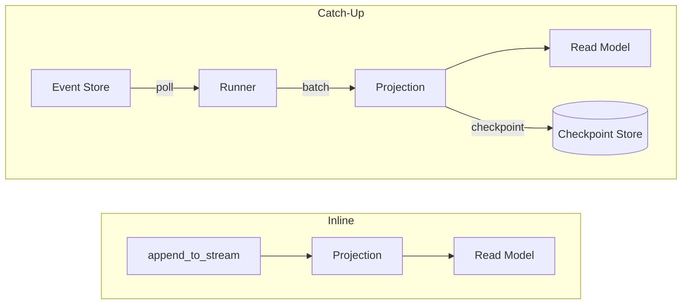

# Projections

Projections build read models from event streams. waku provides two types:

- **Inline projections** run synchronously during `append_to_stream`, guaranteeing immediate consistency between writes and reads.
- **Catch-up projections** process events asynchronously in a background loop, eventually catching up with the event store.


```mermaid
graph LR
    subgraph Inline
        direction LR
        W[append_to_stream] --> P1[Projection]
        P1 --> RM1[Read Model]
    end
    subgraph Catch-Up
        direction LR
        ES[Event Store] -->|poll| R[Runner]
        R -->|batch| P2[Projection]
        P2 --> RM2[Read Model]
        P2 -->|checkpoint| CP[(Checkpoint Store)]
    end
```

## Inline Projections

Implement `IProjection` to create an inline projection. It runs inside the same scope as
`append_to_stream`, so the read model is always consistent with the write model.

Every projection must define a `projection_name` class attribute.

```python linenums="1"
--8<-- "docs/code/eventsourcing/projections/inline.py"
```

Register inline projections through `bind_aggregate()` (or `bind_decider()`):

```python
EventSourcingExtension().bind_aggregate(
    repository=BankAccountRepository,
    event_types=[AccountOpened, MoneyDeposited, MoneyWithdrawn],
    projections=[AccountBalanceProjection],
)
```

!!! warning
    Inline projections add latency to every write because they execute within the same
    operation. Keep them lightweight or use catch-up projections for expensive read model updates.

!!! note "Error handling"
    Inline projection failures propagate to the caller — if a projection raises, the
    `append_to_stream` call fails. When using a scoped `AsyncSession`, this means the
    entire transaction (events + projection) rolls back together, guaranteeing consistency.

    If you need fire-and-forget semantics, use a catch-up projection instead.

## Catch-Up Projections

Implement `ICatchUpProjection` for projections that run asynchronously in a background process.
Catch-up projections poll the event store, process events in batches, and checkpoint their progress.

!!! warning "At-least-once delivery"
    The checkpoint is saved *after* `project()` processes a batch. If the process crashes
    between projection and checkpoint save, the same batch will be re-delivered on restart.

    `project()` **must** be idempotent.

Error handling is configured per-projection via `bind_catch_up_projection()` (defaults to
`ProjectionErrorPolicy.STOP` with no retries — see [Error Policies](#error-policies)).

Each catch-up projection also has two optional hooks:

- `teardown()` — called during rebuilds to clean up existing state
- `on_skip(events, error)` — called when a batch is skipped due to errors

```python linenums="1"
--8<-- "docs/code/eventsourcing/projections/catch_up.py"
```

Register catch-up projections via `bind_catch_up_projection()`:

```python linenums="1"
from waku.eventsourcing.projection.interfaces import ProjectionErrorPolicy

(
    EventSourcingExtension()
    .bind_aggregate(
        repository=BankAccountRepository,
        event_types=[AccountOpened, MoneyDeposited, MoneyWithdrawn],
    )
    .bind_catch_up_projection(
        AccountSummaryProjection,
        error_policy=ProjectionErrorPolicy.SKIP,
        max_retry_attempts=3,
    )
)
```

### Event Type Filtering

Catch-up projections can declare which event types they handle via the `event_types` class
variable. When set, the projection only receives events of those types — the event store
filters at the query level, avoiding unnecessary reads.

```python hl_lines="3"
class OrderSummaryProjection(ICatchUpProjection):
    projection_name = 'order_summary'
    event_types = [OrderPlaced, OrderShipped]
    ...
```

When `event_types` is `None` (the default), all events are delivered.

!!! tip
    Always set `event_types` on projections that only care about a few event types.
    In systems with hundreds of event types, this avoids reading and discarding irrelevant
    events on every polling cycle.

### Cross-Aggregate Projections

Event type filtering works across aggregate boundaries. A single projection can consume
events from different aggregates to build a combined read model — the event store queries
the global event stream by type, ignoring stream boundaries, and returns matching events
in chronological order.

```python
class DashboardProjection(ICatchUpProjection):
    projection_name = 'dashboard'
    event_types = [OrderPlaced, PaymentReceived, ShipmentDispatched]

    async def project(self, events: Sequence[StoredEvent], /) -> None:
        for event in events:
            match event.data:
                case OrderPlaced():
                    await self._handle_order(event)
                case PaymentReceived():
                    await self._handle_payment(event)
                case ShipmentDispatched():
                    await self._handle_shipment(event)
```

All referenced event types must be registered somewhere via `bind_aggregate()` or
`bind_decider()` — they do not need to belong to the same aggregate. Registration is
validated at startup; unregistered types raise `EventSourcingConfigError`.

## Error Policies

| Policy | Behavior |
|--------|----------|
| `ProjectionErrorPolicy.STOP` | Stop the projection (default) |
| `ProjectionErrorPolicy.SKIP` | Skip failed batch and continue; calls `on_skip()` hook before advancing |

Both policies retry first when `max_retry_attempts > 0`. The policy only applies after
retries are exhausted.

!!! tip "Fail-fast by default"
    The default is `STOP` with zero retries — projection failures surface immediately
    rather than silently losing events. Opt into retries or `SKIP` explicitly when your
    projection can tolerate partial gaps or transient errors.

## CatchUpProjectionRunner

`CatchUpProjectionRunner` polls the event store and dispatches event batches to registered
catch-up projections. Each projection runs in its own concurrent task.

Use the `create()` classmethod to build a runner from a DI container:

```python
from waku.eventsourcing.projection.config import PollingConfig

runner = await CatchUpProjectionRunner.create(
    container,
    projections=[AccountSummaryProjection],  # optional filter; None = all registered
    polling=PollingConfig(),                 # optional; defaults to sensible values
)
await runner.run()
```

`create()` resolves the `CatchUpProjectionRegistry` from the container to discover bindings, and the
per-projection lease from the registered [durability backend](#distributed-locking). When
`projections` is provided, only those projection classes are included.

```python linenums="1"
--8<-- "docs/code/eventsourcing/projections/runner.py"
```

The runner listens for `SIGTERM` and `SIGINT` to shut down. Call `request_shutdown()` for
programmatic shutdown when running inside another async context.

Use `rebuild(projection_name)` to reprocess all events from the beginning. This calls
`teardown()` on the projection, resets the checkpoint to `-1` (nothing processed), and
replays every event through the projection.

!!! note "Gap detection during rebuild"
    `rebuild()` always runs with gap detection disabled, regardless of the projection's
    `gap_detection_enabled` setting. A gap in historical events is permanent, not a
    concurrent writer still committing — holding back the checkpoint for one would stall
    the rebuild forever, so it processes every committed event past the gap instead.

!!! tip
    Run the projection runner as a separate process (e.g., a dedicated worker or sidecar)
    so it does not block your main application.

## Configuration

All per-projection behavior — batch size, error handling, retry, and gap detection — is
configured through `bind_catch_up_projection()`:

| Parameter | Default | Description |
|-----------|---------|-------------|
| `projection` | *(required)* | The `ICatchUpProjection` class |
| `error_policy` | `ProjectionErrorPolicy.STOP` | What to do after retries are exhausted |
| `max_retry_attempts` | `0` | Retry count before applying the error policy |
| `base_retry_delay_seconds` | `10.0` | Initial delay between retries (exponential backoff) |
| `max_retry_delay_seconds` | `300.0` | Maximum delay cap for retries |
| `batch_size` | `100` | Maximum events per batch |
| `gap_detection_enabled` | `True` | Contiguity checks against concurrent-writer gaps (see [Gap Detection](#gap-detection)); disable for single-writer/single-partition deployments |
| `gap_timeout_seconds` | `10.0` | Seconds before a gap is considered permanent and skipped |

The runner's polling interval is configured globally via `PollingConfig` (passed to the runner
constructor, defaults to sensible values if omitted):

| Field | Default | Description |
|-------|---------|-------------|
| `poll_interval_min_seconds` | `0.5` | Minimum polling interval when events are available |
| `poll_interval_max_seconds` | `5.0` | Maximum polling interval when idle |
| `poll_interval_step_seconds` | `1.0` | Increment per idle cycle |
| `poll_interval_jitter_factor` | `0.1` | Random jitter factor applied to the interval |

## Gap Detection

When multiple writers append to the event store concurrently, a projection may read events
with non-contiguous global positions — a gap appears when a concurrent transaction has not
yet committed. Advancing the checkpoint past a gap would permanently skip that event.

Gap detection is on by default; tune the timeout via `bind_catch_up_projection()`:

```python
(
    EventSourcingExtension()
    .bind_aggregate(...)
    .bind_catch_up_projection(
        AccountSummaryProjection,
        gap_timeout_seconds=10.0,
    )
)
```

When active, the processor queries committed positions from the event store and only advances
the checkpoint to the last contiguous position. Gaps are tracked with a timeout — if a gap
persists beyond `gap_timeout_seconds`, it is assumed permanent (e.g., a rolled-back
transaction) and skipped.

!!! info "Single-writer deployments"
    If your event store has a single writer process (or a projection reads a single partition),
    gaps cannot occur and gap detection adds unnecessary overhead. Pass
    `gap_detection_enabled=False` to `bind_catch_up_projection()` to opt out.

## Distributed Locking

Each catch-up projection runs under a lease, so only one instance processes it at a time across a
multi-process deployment — preventing duplicate processing and checkpoint conflicts. The lease is
owned by the [durability backend](../../fundamentals/backends.md) registered in the container:
`create()` resolves it automatically, there is nothing to construct or pass.

| Backend | Lease | Coordination |
|---------|-------|-------------|
| `MemoryBackend` | in-process | Single process — examples, quickstarts, tests; no PostgreSQL required |
| `SqlAlchemyBackend` | `waku_leases` table with TTL heartbeats | Multi-process; requires `engine=` |

If no backend provides a lease, `CatchUpProjectionRunner.create()` fails loud and names the fix.

### PostgreSQL lease

The SQLAlchemy backend leases each projection through the `waku_leases` table. A background
heartbeat renews the lease; if it detects the lease was stolen (e.g., by another instance after TTL
expiry), it cancels that projection's task. The lease is valid for 30 seconds and renews every 10
(the `LeaseConfig` defaults).

!!! note "Consistency guarantees"
    There is no fencing token mechanism — a stalled holder (e.g., a GC pause) can briefly overlap
    with a new holder until its next heartbeat fires.

    In practice this is safe because the runner resolves the projection, event reader, and
    checkpoint store from a single DI scope. With `SqlAlchemyCheckpointStore` over a scoped
    `AsyncSession`, the projection writes and checkpoint save share the same transaction (the
    checkpoint store calls `flush()`, not `commit()`). Either both succeed atomically or both roll
    back — duplicate processing from a brief overlap will not corrupt the read model.

### Custom coordination

The lease is part of the backend boundary, not a user-facing knob. To coordinate differently — for
example a session-bound advisory lock for a PgBouncer transaction-mode deployment — compose your own
durability backend. See [durability backends](../../fundamentals/backends.md).

## Checkpoint Store

`ICheckpointStore` tracks each catch-up projection's last processed position so it resumes
from where it left off after restarts.

```python
class ICheckpointStore(abc.ABC):
    async def load(self, projection_name: str, /) -> Checkpoint | None: ...
    async def save(self, checkpoint: Checkpoint, /) -> None: ...
```

The `Checkpoint` dataclass carries the projection name, last processed global position, and timestamp.

Built-in implementations:

- `InMemoryCheckpointStore` — dictionary-backed, suitable for single-process deployments and testing
- `SqlAlchemyCheckpointStore` — PostgreSQL-backed via SQLAlchemy async session (requires `waku[sqla]`)

The checkpoint store comes from the imported
[durability backend](../../fundamentals/backends.md): the memory backend provides
`InMemoryCheckpointStore`, the SQLAlchemy backend provides `SqlAlchemyCheckpointStore` over its
scoped `AsyncSession`. To substitute your own, register a provider for `ICheckpointStore` (from
`waku.eventsourcing.store`) — an explicit provider override.

## Table Schema Reference

### `es_checkpoints`

| Column | Type | Constraints | Description |
|--------|------|------------|-------------|
| `projection_name` | `Text` | **PK** | Unique projection identifier |
| `position` | `BigInteger` | NOT NULL | Last processed global position |
| `updated_at` | `TIMESTAMP WITH TIME ZONE` | NOT NULL | Last checkpoint update time |
| `created_at` | `TIMESTAMP WITH TIME ZONE` | default `now()` | First checkpoint time |

Bind with `bind_checkpoint_tables(metadata)` from `waku.backends.sqlalchemy`.

### `waku_leases`

Only required when using `PostgresLease`.

| Column | Type | Constraints | Description |
|--------|------|------------|-------------|
| `name` | `Text` | **PK** | Lease key — the projection name being locked |
| `holder_id` | `Text` | NOT NULL | UUID of the lease holder instance |
| `acquired_at` | `TIMESTAMP WITH TIME ZONE` | default `now()` | When the lease was first acquired |
| `renewed_at` | `TIMESTAMP WITH TIME ZONE` | default `now()` | Last heartbeat renewal time |
| `expires_at` | `TIMESTAMP WITH TIME ZONE` | NOT NULL | When the lease expires if not renewed |

The `waku:` name prefix is reserved for framework-owned lease roles; projection lease names are
user-chosen.

Bind with `bind_lease_tables(metadata)` from `waku.backends.sqlalchemy`.

## Live Projections

A live projection builds a read model on demand without checkpointing — useful for
debugging, ad-hoc queries, or one-off analysis. No dedicated API is needed; compose
existing primitives directly:

```python
# Single-stream: project all events from one aggregate
events = await event_reader.read_stream(stream_id)
await projection.project(events)

# Cross-stream: project specific event types from the global log
events = await event_reader.read_all(event_types=['OrderPlaced', 'PaymentReceived'])
await projection.project(events)
```

!!! warning
    Live projections read the entire stream or global log into memory. For large event
    stores, use `count` to limit the number of events or prefer a checkpointed catch-up
    projection.

## The Event Store as Outbox

In event sourcing, the event store is already a durable, ordered log of everything that
happened — it naturally serves as a [transactional outbox](https://microservices.io/patterns/data/transactional-outbox.html).

The `publisher.publish()` call in command handlers is an **in-process convenience** — it
dispatches events to other handlers within the same process. It is not
a reliability mechanism. If the process crashes after saving events but before publishing,
the in-process notifications are lost.

For reliable cross-service messaging (e.g., publishing domain events to Kafka, RabbitMQ,
or another service), write a **catch-up projection** that reads from the event store and
publishes to your message broker:

```python linenums="1"
from collections.abc import Sequence

from waku.eventsourcing.contracts.event import StoredEvent
from waku.eventsourcing.projection.interfaces import ICatchUpProjection


class OrderEventPublisher(ICatchUpProjection):
    projection_name = 'order_event_publisher'

    def __init__(self, broker: MessageBroker) -> None:
        self._broker = broker

    async def project(self, events: Sequence[StoredEvent], /) -> None:
        for event in events:
            await self._broker.publish(
                topic='orders',
                key=str(event.stream_id),
                value=event.data,
            )
```

The same [at-least-once semantics](#catch-up-projections) apply.

## Further reading

- **[Snapshots](snapshots.md)** — optimize loading for long-lived aggregates
- **[Schema Evolution](schema-evolution.md)** — handling evolved events in projections
- **[Testing](testing.md)** — in-memory stores and projection wait utilities
