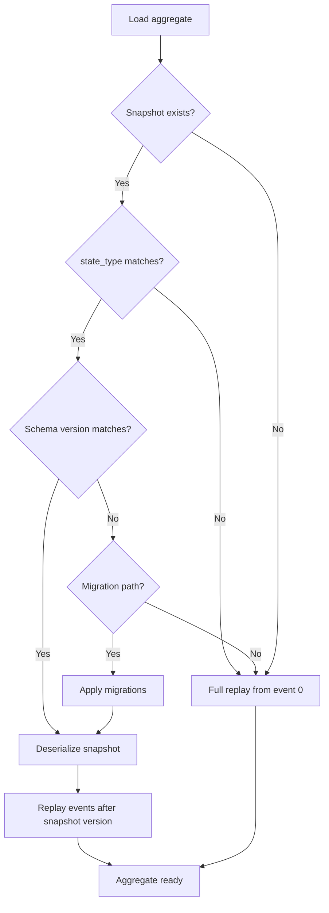
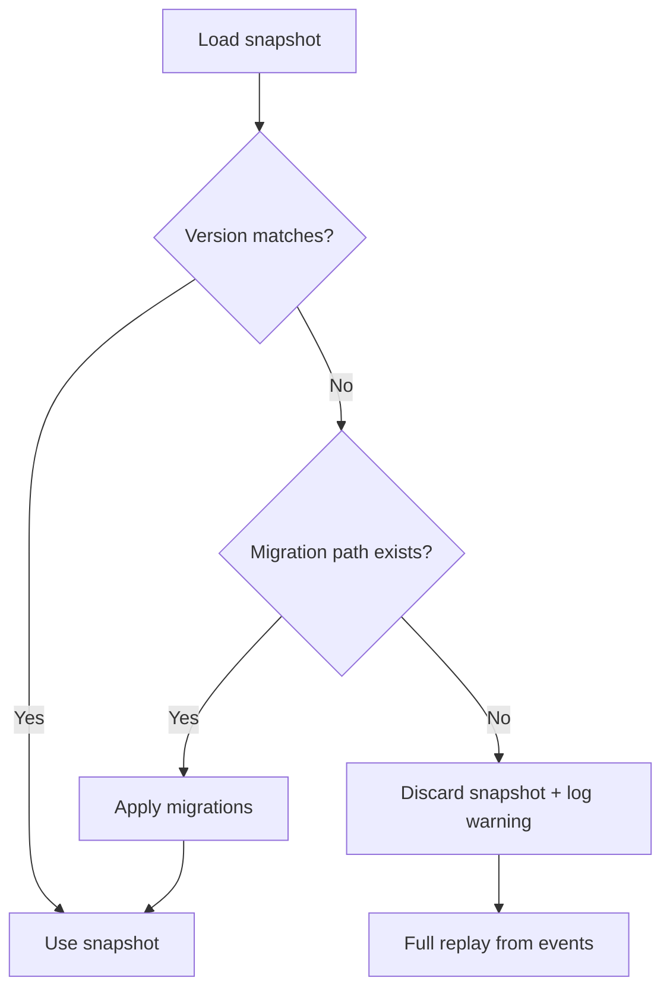

# Snapshots

Snapshots periodically capture aggregate state so that loading doesn't require replaying
every event from the beginning of the stream. Use them when aggregates accumulate many events
and replay time becomes noticeable.

## When to Use Snapshots

Snapshots add complexity — an extra store, serialization logic, and a strategy to decide when
to take them. Only introduce snapshots when event replay time becomes a measurable bottleneck.

!!! tip
    Profile first. Most aggregates don't need snapshots until they exceed hundreds of events.

## Snapshot Strategy

The `ISnapshotStrategy` interface defines when a snapshot should be taken:

```python
class ISnapshotStrategy(abc.ABC):
    @abc.abstractmethod
    def should_snapshot(self, version: int, events_since_snapshot: int) -> bool: ...
```

waku ships with `EventCountStrategy(threshold=N)`, which triggers a snapshot every N events
since the last snapshot. The default threshold is `100`.

## Snapshot Repository

Both aggregate styles have a snapshot-aware repository variant:

| Style | Base Repository | Snapshot Repository |
|---|---|---|
| OOP | `EventSourcedRepository` | `SnapshotEventSourcedRepository` |
| Functional Decider | `DeciderRepository` | `SnapshotDeciderRepository` |

=== "OOP Aggregate"

    `SnapshotEventSourcedRepository` requires two additional methods for state serialization:

    ```python linenums="1"
    --8<-- "docs/code/eventsourcing/snapshots/oop_repository.py"
    ```

=== "Functional Decider"

    `SnapshotDeciderRepository` works the same way as `DeciderRepository` — state serialization
    is handled automatically since the state is already a dataclass:

    ```python linenums="1"
    --8<-- "docs/code/eventsourcing/snapshots/decider_repository.py"
    ```

### Overriding `snapshot_state_type`

Each snapshot stores a `state_type` string as a type guard — if the stored value doesn't match
on load, `SnapshotTypeMismatchError` is raised. By default:

- **OOP**: `state_type` = `aggregate_name` (the aggregate class name)
- **Decider**: `state_type` = the state class name (e.g., `CounterState`)

If you rename a state or aggregate class, existing snapshots break. Override `snapshot_state_type`
to pin the stored name:

=== "OOP Aggregate"

    ```python
    class BankAccountSnapshotRepository(SnapshotEventSourcedRepository[BankAccount]):
        snapshot_state_type = 'BankAccount'  # pinned — survives class renames
        ...
    ```

=== "Functional Decider"

    ```python
    class BankAccountSnapshotRepository(SnapshotDeciderRepository[BankAccountState, BankCommand, INotification]):
        snapshot_state_type = 'BankAccountState'  # pinned — survives class renames
        ...
    ```

When loading, the snapshot repository first checks for a stored snapshot. If one exists, it
verifies the `state_type` and schema version — applying migrations if needed or falling back
to full replay if no migration path is available (see [Schema Versioning](#schema-versioning)).
It then deserializes the state and replays only the events recorded *after* the snapshot version.
If no snapshot is found, it falls back to full replay.



## Module Wiring

Pass `snapshot=SnapshotOptions(...)` to `bind_aggregate()` or `bind_decider()`:

=== "OOP Aggregate"

    ```python linenums="1"
    --8<-- "docs/code/eventsourcing/snapshots/oop_modules.py"
    ```

=== "Functional Decider"

    ```python linenums="1"
    --8<-- "docs/code/eventsourcing/snapshots/decider_modules.py"
    ```

The extension automatically registers the strategy in the DI container when `snapshot` is
provided.

!!! warning
    Snapshot support requires `ISnapshotStore` and `ISnapshotStateSerializer` to be registered
    in `EventSourcingConfig`. Without them, the snapshot repository will fail to resolve at runtime.

## Snapshot Store

`ISnapshotStore` defines persistence for snapshots:

```python
class ISnapshotStore(abc.ABC):
    async def load(self, stream_id: StreamId, /) -> Snapshot | None: ...
    async def save(self, snapshot: Snapshot, /) -> None: ...
```

The `Snapshot` dataclass carries the serialized state:

| Field | Type | Description |
|---|---|---|
| `stream_id` | `StreamId` | Stream identifier (e.g., `StreamId.for_aggregate('BankAccount', 'acc-1')`) |
| `state` | `dict[str, Any]` | Serialized aggregate state |
| `version` | `int` | Stream version at snapshot time |
| `state_type` | `str` | Type guard verified on load (see [`snapshot_state_type`](#overriding-snapshot_state_type)) |
| `schema_version` | `int` | Schema version (defaults to `1`) |

Built-in implementations:

- `InMemorySnapshotStore` — dictionary-backed, suitable for testing
- `SqlAlchemySnapshotStore` — PostgreSQL-backed via SQLAlchemy async session

## Schema Versioning

Aggregate state structures evolve over time — fields get added, renamed, or removed. Without
versioning, old snapshots become undeserializable. waku solves this with **snapshot schema
versioning** and a **migration chain** that transforms old snapshots to the current schema.

### Declaring Schema Versions

Set `schema_version` in the `SnapshotOptions` passed to `bind_aggregate()` or `bind_decider()`
to track the current state schema:

```python
from waku.eventsourcing import EventSourcingExtension, SnapshotOptions

EventSourcingExtension().bind_aggregate(
    repository=BankAccountSnapshotRepository,
    event_types=[AccountOpened, MoneyDeposited, MoneyWithdrawn],
    snapshot=SnapshotOptions(
        strategy=EventCountStrategy(threshold=50),
        schema_version=2,  # bump when state structure changes
    ),
)
```

All new snapshots are saved with this version. On load, the repository checks whether the
stored snapshot's `schema_version` matches the configured `schema_version` in `SnapshotOptions`.

### Writing Migrations

Implement `ISnapshotMigration` for each schema version transition:

```python linenums="1"
--8<-- "docs/code/eventsourcing/snapshots/migration.py"
```

Each migration specifies `from_version` and `to_version` and transforms the state dictionary.
The `SnapshotMigrationChain` applies them in sequence.

Pass migrations alongside the schema version in `SnapshotOptions`:

```python
from waku.eventsourcing import EventSourcingExtension, SnapshotOptions

EventSourcingExtension().bind_aggregate(
    repository=BankAccountSnapshotRepository,
    event_types=[AccountOpened, MoneyDeposited, MoneyWithdrawn],
    snapshot=SnapshotOptions(
        strategy=EventCountStrategy(threshold=50),
        schema_version=3,
        migrations=[AddEmailField(), RenameOwnerToName()],
    ),
)
```

### Migration Chain Validation

`SnapshotMigrationChain` validates migrations at construction time (during module
registration). It rejects:

- `from_version` less than 1
- `to_version` not greater than `from_version`
- Duplicate `from_version` values
- Gaps in the chain (e.g., v1→v2 followed by v3→v4 — missing v2→v3)

Validation failures raise `SnapshotMigrationChainError`.

### Graceful Degradation

When a stored snapshot has a different `schema_version` than the configured value:



Missing migrations **never crash the system**. The repository discards the outdated snapshot,
logs a warning, and falls back to full event replay. This trades performance for correctness
— the aggregate loads correctly, just without the snapshot optimization.

## State Serialization

`ISnapshotStateSerializer` handles converting state objects to and from dictionaries:

```python
class ISnapshotStateSerializer(abc.ABC):
    def serialize(self, state: object, /) -> dict[str, Any]: ...
    def deserialize(self, data: dict[str, Any], state_type: type[StateT], /) -> StateT: ...
```

`JsonSnapshotStateSerializer` is the built-in implementation. It uses an adaptix `Retort`
under the hood and works with any dataclass state out of the box. The same `default_retort`
and `.extend()` pattern used for [custom event serializers](schema-evolution.md#event-serialization)
applies here.

## Configuration

Register the snapshot store and serializer through `EventSourcingConfig`:

```python
EventSourcingConfig(
    snapshot_store=SqlAlchemySnapshotStore,  # class or factory callable
    snapshot_state_serializer=JsonSnapshotStateSerializer,
)
```

You can pass a factory callable instead of a class when the store requires
additional constructor arguments (e.g., `snapshot_store=make_sqlalchemy_snapshot_store(table)`).

## Table Schema Reference

### `es_snapshots`

| Column | Type | Constraints | Description |
|--------|------|------------|-------------|
| `stream_id` | `Text` | **PK** | Stream identifier (one snapshot per stream) |
| `state` | `JSONB` | NOT NULL | Serialized aggregate state |
| `version` | `Integer` | NOT NULL | Stream version at snapshot time |
| `state_type` | `Text` | NOT NULL | Type guard checked on load; controlled by `snapshot_state_type` |
| `schema_version` | `Integer` | NOT NULL, default `1` | Schema version for snapshot migrations |
| `created_at` | `TIMESTAMP WITH TIME ZONE` | default `now()` | First snapshot time |
| `updated_at` | `TIMESTAMP WITH TIME ZONE` | default `now()`, auto-update | Last snapshot update time |

Bind with `bind_snapshot_tables(metadata)` from `waku.eventsourcing.snapshot.sqlalchemy`.

## Further reading

- **[Event Store](event-store.md)** — event persistence and stream mechanics
- **[Schema Evolution](schema-evolution.md)** — handling state schema changes over time
- **[Aggregates](aggregates.md)** — OOP aggregates and functional deciders
- **[Testing](testing.md)** — in-memory stores for integration tests
