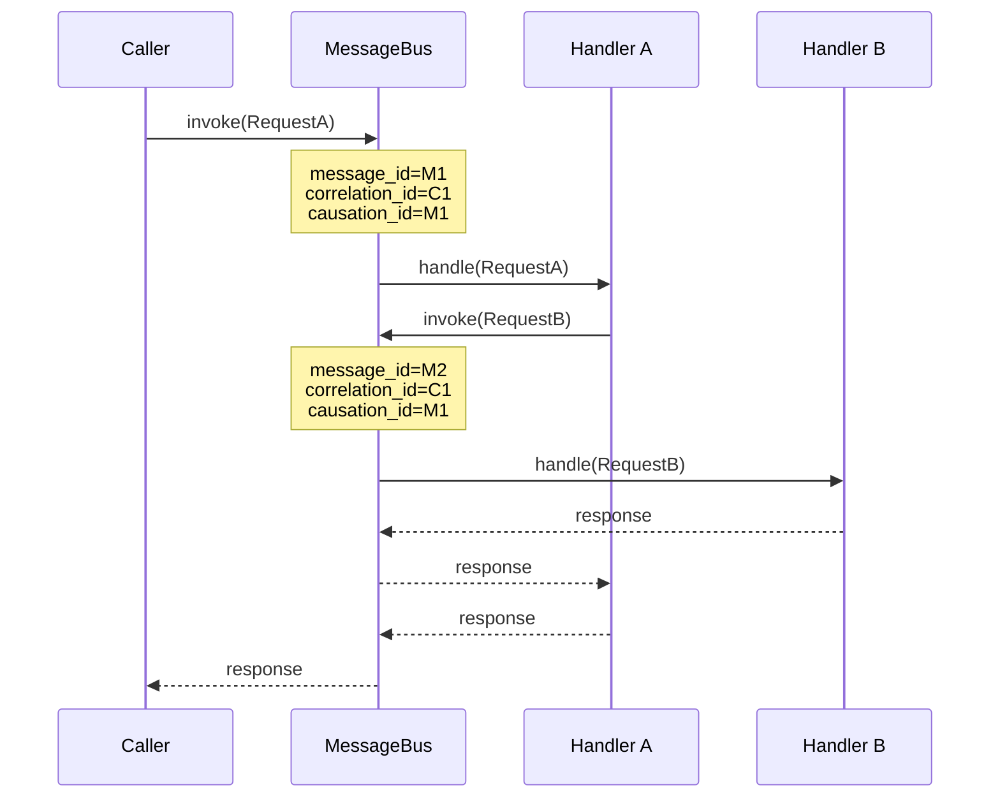

# Message Context

`MessageContext` provides correlation and causation tracking across message handling. When the bus
dispatches a message, it wraps it in a `MessageEnvelope` and sets a `ContextVar`-based
`MessageContext` available to handlers and pipeline behaviors. This enables tracing a chain of
related messages back to the original trigger — essential for logging, auditing, and debugging
distributed operations.

---

## Accessing Context in Handlers

Call `get_message_context()` to retrieve the current context inside any handler or behavior:

```python linenums="1"
import logging

from typing_extensions import override

from waku.messaging import EventHandler
from waku.messaging import get_message_context


logger = logging.getLogger(__name__)


class AuditHandler(EventHandler[OrderPlaced]):
    @override
    async def handle(self, event: OrderPlaced, /) -> None:
        ctx = get_message_context()
        logger.info(
            'Processing order',
            extra={
                'correlation_id': str(ctx.correlation_id),
                'causation_id': str(ctx.causation_id),
            },
        )
```

!!! warning
    `get_message_context()` raises `RuntimeError` if called outside a bus operation. Use
    `try_get_message_context()` when the call site may run outside message handling — see
    [Optional Access](#optional-access) below.

---

## Context Fields

| Field            | Type                | Description                                       |
|------------------|---------------------|---------------------------------------------------|
| `message_id`     | `UUID`              | Unique ID of the current message                  |
| `correlation_id` | `UUID`              | Shared across a chain of related messages         |
| `causation_id`   | `UUID`              | ID of the message that caused this one            |
| `headers`        | `Mapping[str, str]` | Arbitrary metadata attached to the message        |
| `group_id`       | `str \| None`       | Partition key of the current message              |
| `tenant_id`      | `str \| None`       | Tenant marker of the current message              |

For a top-level message (no outer context), `correlation_id` is a fresh UUID and `causation_id`
equals `message_id`. When a handler dispatches a nested message, the bus propagates the
correlation and sets the causation — see [Correlation Propagation](#correlation-propagation).

---

## Correlation Propagation

When a handler invokes another message (nested dispatch), the bus automatically:

1. **Preserves** the outer `correlation_id` on the inner message.
2. **Sets** the inner `causation_id` to the outer `message_id`.

This creates a traceable chain from the root message through every message it spawned.



Both messages share `correlation_id=C1`, so you can query all log entries for a single
end-to-end operation regardless of how many messages were involved.

!!! tip "Distributed tracing"
    Pass `correlation_id` to your structured logging context to trace a request across all
    handlers it triggers. Combined with the [outbox](outbox.md), correlation IDs propagate
    across service boundaries — making end-to-end tracing seamless.

---

## Optional Access

`try_get_message_context()` returns `None` when no bus operation is active instead of raising.
Use it in code that runs both inside and outside message handling:

```python linenums="1"
from waku.messaging import try_get_message_context


def get_correlation_id() -> str:
    ctx = try_get_message_context()
    if ctx is not None:
        return str(ctx.correlation_id)
    return 'no-correlation'
```

---

## DI Injection

`MessageContext` is registered as a `transient` provider by `MessagingModule`, resolved via
`get_message_context()`. You can inject it into pipeline behaviors where the context is already
active:

```python linenums="1"
import logging

from typing_extensions import override

from waku.messaging import CallNext, IPipelineBehavior, MessageT, ResponseT
from waku.messaging import MessageContext

logger = logging.getLogger(__name__)


class AuditBehavior(IPipelineBehavior[MessageT, ResponseT]):
    def __init__(self, ctx: MessageContext) -> None:
        self._ctx = ctx

    @override
    async def handle(self, message: MessageT, /, call_next: CallNext[ResponseT]) -> ResponseT:
        logger.info('Auditing', extra={'correlation_id': str(self._ctx.correlation_id)})
        return await call_next()
```

!!! warning
    Constructor injection works because `transient` resolves `get_message_context()` at injection
    time. For handlers, prefer calling `get_message_context()` directly inside `handle()` — this
    is always safe regardless of when the handler instance is created.

---

## Further reading

- **[Message Bus](index.md)** — setup, interfaces, and dispatch methods
- **[Requests](requests.md)** — commands, queries, and request handlers
- **[Pipeline Behaviors](pipeline.md)** — cross-cutting middleware for request handling
- **[Delivery Options & Scheduling](delivery-options.md)** — override correlation/causation ids per call
- **[Outbox](outbox.md)** — correlation IDs propagate through the outbox
