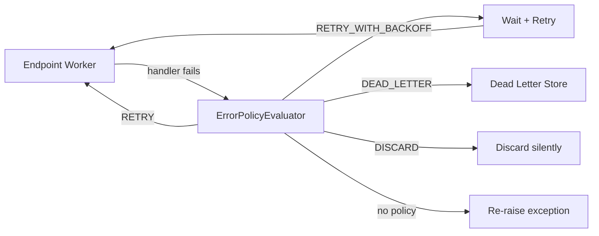

# Error Handling

When a message handler fails inside an [endpoint](routing.md) worker, waku's error policy
system decides what happens next: retry immediately, retry with backoff, move to a dead letter
store, or discard. This applies to `send()` and `publish()` dispatches — `invoke()` always
raises exceptions directly to the caller.



!!! info "Endpoint-level, not bus-level"
    Error policies operate at the **endpoint worker** level, following
    [Wolverine's error handling model](https://wolverine.netlify.app/guide/handlers/error-handling.html).
    They wrap handler execution inside `LocalQueueEndpoint` workers. The `MessageBus` itself is
    a thin routing facade — it does not catch or retry anything.

---

## Defining Policies

`RetryPolicy` uses a fluent builder API to declare how failures should be handled per message
type:

```python linenums="1"
from waku.messaging import MessagingConfig, MessagingModule
from waku.messaging.errors import RetryPolicy, RetryAction

config = MessagingConfig(
    error_policies=[
        RetryPolicy.for_message(PlaceOrder)                     # (1)!
            .on_any_exception()                                 # (2)!
            .retry_with_backoff(                                # (3)!
                max_attempts=5,
                base_delay=1.0,
                max_delay=60.0,
                fallback=RetryAction.DEAD_LETTER,               # (4)!
            ),
    ],
)
MessagingModule.register(config)
```

1. Target a specific message type.
2. Match any exception. Use `.on_exception(ValueError)` to match a specific type.
3. Choose a retry strategy — see [Actions](#actions) below.
4. When retries are exhausted, move to the dead letter store.

---

## Actions

The builder offers four terminal actions:

| Method                  | Behavior                                                |
|-------------------------|---------------------------------------------------------|
| `.retry()`              | Retry immediately, up to `max_attempts`                 |
| `.retry_with_backoff()` | Retry with exponential backoff and jitter               |
| `.discard()`            | Drop the message silently                               |
| `.move_to_dead_letter()`| Move to the dead letter store immediately (no retries)  |

### `.retry()`

Retries the handler up to `max_attempts` with no delay between attempts:

```python linenums="1"
RetryPolicy.for_message(SendEmail)
    .on_exception(ConnectionError)
    .retry(max_attempts=3, fallback=RetryAction.DEAD_LETTER)
```

### `.retry_with_backoff()`

Retries with exponential backoff and jitter. The delay between attempts grows exponentially
from `base_delay` up to `max_delay`:

```python linenums="1"
RetryPolicy.for_message(ProcessPayment)
    .on_any_exception()
    .retry_with_backoff(
        max_attempts=5,
        base_delay=1.0,      # first retry after ~1 second
        max_delay=60.0,      # never wait longer than 60 seconds
        fallback=RetryAction.DEAD_LETTER,
    )
```

### `.discard()`

Drops the message on first failure — no retries:

```python linenums="1"
RetryPolicy.for_message(UpdateAnalytics)
    .on_any_exception()
    .discard()
```

!!! warning
    Discarded messages are gone permanently. Use this only for messages where data loss is
    acceptable (e.g., analytics, non-critical notifications).

### `.move_to_dead_letter()`

Moves the message to the dead letter store on first failure — no retries:

```python linenums="1"
RetryPolicy.for_message(CriticalAlert)
    .on_any_exception()
    .move_to_dead_letter()
```

---

## Fallback Actions

When retries are exhausted, the `fallback` parameter determines the final action:

| Fallback                    | Effect                                        |
|-----------------------------|-----------------------------------------------|
| `RetryAction.DEAD_LETTER`  | Move to dead letter store after max attempts   |
| `RetryAction.DISCARD`      | Discard after max attempts (default)           |
| `None`                     | Same as `DISCARD`                              |

```python linenums="1"
# Retry 3 times, then dead-letter
RetryPolicy.for_message(PlaceOrder)
    .on_any_exception()
    .retry(max_attempts=3, fallback=RetryAction.DEAD_LETTER)

# Retry 3 times, then discard (default behavior)
RetryPolicy.for_message(SendNotification)
    .on_any_exception()
    .retry(max_attempts=3)
```

---

## Exception Matching

Policies can target specific exception types or match any exception:

```python linenums="1"
from waku.messaging.errors import RetryPolicy, RetryAction

policies = [
    # Specific exception — retries on connection errors only
    RetryPolicy.for_message(PlaceOrder)
        .on_exception(ConnectionError)
        .retry_with_backoff(max_attempts=5),

    # Wildcard — catches everything else
    RetryPolicy.for_message(PlaceOrder)
        .on_any_exception()
        .move_to_dead_letter(),
]
```

!!! tip "Resolution order"
    When a handler fails, waku walks the exception's MRO to find the most specific policy first.
    If no specific match is found, the wildcard policy (`on_any_exception()`) is used. If no
    policy matches at all, the exception is re-raised.

!!! warning "One policy per (message, exception) pair"
    Registering two policies for the same message type and exception type raises
    `DuplicateErrorPolicyError` at startup. This is a safety check — ambiguous policies indicate
    a configuration error.

---

## Dead Letter Store

The **dead letter store** captures messages that could not be processed. Each entry records the
original message payload, error details, and correlation context:

```python linenums="1"
from waku.messaging.errors import IDeadLetterStore, DeadLetterEntry
```

`IDeadLetterStore` is an ABC with five operations:

| Method                              | Returns                  | Description                              |
|-------------------------------------|--------------------------|------------------------------------------|
| `save(entry)`                       | `None`                   | Store a dead letter entry                |
| `fetch(batch_size=100)`             | `Sequence[DeadLetterEntry]` | Retrieve a batch of entries           |
| `fetch_one(entry_id)`               | `DeadLetterEntry`        | Retrieve a single entry by ID            |
| `delete(entry_id)`                  | `None`                   | Remove an entry                          |
| `purge(older_than: datetime)`       | `int`                    | Remove entries older than a datetime, return count |

### DeadLetterEntry Fields

| Field             | Type              | Description                              |
|-------------------|-------------------|------------------------------------------|
| `id`              | `UUID`            | Unique entry identifier                  |
| `message_type`    | `str`             | Fully-qualified message type name        |
| `payload`         | `dict[str, Any]`  | Serialized message data                  |
| `destination`     | `str`             | Endpoint URI the message was destined for|
| `correlation_id`  | `UUID`            | Correlation ID from the message envelope |
| `causation_id`    | `UUID`            | Causation ID from the message envelope   |
| `error_type`      | `str`             | Fully-qualified exception type name      |
| `error_message`   | `str`             | Exception message text                   |
| `retry_count`     | `int`             | Number of attempts before dead-lettering |
| `created_at`      | `datetime | None` | Timestamp when the entry was created     |

---

## Configuration

Provide the dead letter store implementation in `MessagingConfig`:

```python linenums="1"
from waku.messaging import MessagingConfig, MessagingModule
from waku.messaging.errors import RetryPolicy, RetryAction

MessagingModule.register(
    MessagingConfig(
        dead_letter_store=MyDeadLetterStore,    # (1)!
        error_policies=[
            RetryPolicy.for_message(PlaceOrder)
                .on_any_exception()
                .retry_with_backoff(
                    max_attempts=3,
                    fallback=RetryAction.DEAD_LETTER,
                ),
        ],
    ),
)
```

1. Any class implementing `IDeadLetterStore`. Can also be a factory callable.

!!! warning "Validation"
    waku validates at startup that any error policy using `DEAD_LETTER` action (either as
    primary action or fallback) has a corresponding `dead_letter_store` in `MessagingConfig`.
    Missing it raises `ImproperlyConfiguredError`.

---

## Custom Dead Letter Store

Implement `IDeadLetterStore` for your storage backend:

```python linenums="1"
from collections.abc import Sequence
from datetime import datetime
from uuid import UUID

from sqlalchemy import delete as delete_stmt, select
from sqlalchemy.dialects.postgresql import insert
from sqlalchemy.ext.asyncio import AsyncSession
from typing_extensions import override

from waku.messaging.errors import DeadLetterEntry, IDeadLetterStore


class PostgresDeadLetterStore(IDeadLetterStore):
    def __init__(self, session: AsyncSession) -> None:
        self._session = session

    @override
    async def save(self, entry: DeadLetterEntry) -> None:
        await self._session.execute(insert(dead_letter_table).values(...))

    @override
    async def fetch(self, batch_size: int = 100) -> Sequence[DeadLetterEntry]:
        result = await self._session.execute(
            select(dead_letter_table).limit(batch_size)
        )
        return [self._to_entry(row) for row in result]

    @override
    async def fetch_one(self, entry_id: UUID) -> DeadLetterEntry:
        row = await self._session.execute(
            select(dead_letter_table).where(dead_letter_table.c.id == entry_id)
        )
        return self._to_entry(row.one())

    @override
    async def delete(self, entry_id: UUID) -> None:
        await self._session.execute(
            delete_stmt(dead_letter_table).where(dead_letter_table.c.id == entry_id)
        )

    @override
    async def purge(self, older_than: datetime) -> int:
        result = await self._session.execute(
            delete_stmt(dead_letter_table).where(dead_letter_table.c.created_at < older_than)
        )
        return result.rowcount  # type: ignore[return-value]
```

---

## Messages Without Policies

When a handler fails and no error policy matches the message type + exception combination:

- **The exception is logged** and the endpoint worker continues to the next message.
- The failed message is **not retried** and **not dead-lettered**.
- No exception propagates — the worker loop is never interrupted by unmatched failures.

!!! tip "Start with sensible defaults"
    Define a wildcard policy for message types that are important enough to track failures:

    ```python linenums="1"
    RetryPolicy.for_message(ImportantCommand)
        .on_any_exception()
        .retry_with_backoff(max_attempts=3, fallback=RetryAction.DEAD_LETTER)
    ```

---

## Further reading

- **[Routing & Endpoints](routing.md)** — where error policies are applied (endpoint workers)
- **[Outbox & Transport](outbox.md)** — transactional outbox with its own retry semantics
- **[Transactions](transactions.md)** — unit of work and transactional pipeline behavior
- **[Message Bus](index.md)** — setup, interfaces, and dispatch methods
