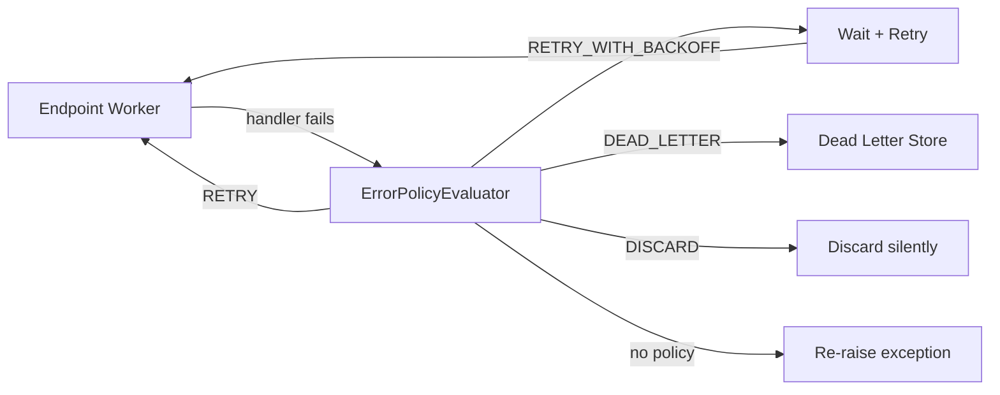

# Error Handling

When a message handler fails inside an [endpoint](routing.md) worker, waku's error policy
system decides what happens next: retry immediately, retry with backoff, move to a dead letter
store, or discard. This applies to `send()` and `publish()` dispatches — `invoke()` always
raises exceptions directly to the caller.



!!! info "Endpoint-level, not bus-level"
    Error policies operate at the **endpoint worker** level, following
    [Wolverine's error handling model](https://wolverine.netlify.app/guide/handlers/error-handling.html).
    They wrap handler execution inside `LocalQueueEndpoint` workers. The `MessageBus` itself is
    a thin routing facade — it does not catch or retry anything.

---

## Defining Policies

An error policy is an ordered escalation chain built with a fluent API. The primary path is a
per-handler `error_policies` ClassVar — each policy matches an exception type and declares how the
failure escalates:

```python linenums="1"
from collections.abc import Sequence
from typing import ClassVar

from waku.messaging import ErrorPolicy, RequestHandler


class PlaceOrderHandler(RequestHandler[PlaceOrder, None]):
    error_policies: ClassVar[Sequence[ErrorPolicy]] = (
        ErrorPolicy.on_exception(ValueError)
            .retry_with_backoff(max_attempts=5, base_delay=1.0, max_delay=60.0)
            .then_move_to_dead_letter(),
    )
```

`ErrorPolicy.on_exception(...)` (or `.on_any_exception()`) seeds the chain. An action method
(`.retry()`, `.retry_with_backoff()`, `.discard()`, `.move_to_dead_letter()`) sets the first stage,
and `.then_*(...)` appends further stages. The chain above retries with backoff up to five attempts,
then moves the message to the dead letter store.

---

## Actions

The builder offers four actions:

| Method                  | Behavior                                                |
|-------------------------|---------------------------------------------------------|
| `.retry()`              | Retry immediately, up to `max_attempts`                 |
| `.retry_with_backoff()` | Retry with exponential backoff and jitter               |
| `.discard()`            | Drop the message silently                               |
| `.move_to_dead_letter()`| Move to the dead letter store immediately (no retries)  |

### `.retry()`

Retries the handler up to `max_attempts` with no delay between attempts:

```python linenums="1"
ErrorPolicy.on_exception(ConnectionError)
    .retry(max_attempts=3)
    .then_move_to_dead_letter()
```

### `.retry_with_backoff()`

Retries with exponential backoff and jitter. The delay between attempts grows exponentially
from `base_delay` up to `max_delay`:

```python linenums="1"
ErrorPolicy.on_any_exception()
    .retry_with_backoff(
        max_attempts=5,
        base_delay=1.0,      # first retry after ~1 second
        max_delay=60.0,      # never wait longer than 60 seconds
    )
    .then_move_to_dead_letter()
```

### `.discard()`

Drops the message on first failure — no retries:

```python linenums="1"
ErrorPolicy.on_any_exception().discard()
```

!!! warning
    Discarded messages are gone permanently. Use this only for messages where data loss is
    acceptable (e.g., analytics, non-critical notifications).

### `.move_to_dead_letter()`

Moves the message to the dead letter store on first failure — no retries:

```python linenums="1"
ErrorPolicy.on_any_exception().move_to_dead_letter()
```

---

## Escalation stages

A policy is a chain of stages. A retry stage (`.retry()`, `.retry_with_backoff()`) consumes its
`max_attempts`, then hands off to the next stage. A terminal stage (`.then_discard()` or
`.then_move_to_dead_letter()`) fires once and ends the chain. There is no single fallback argument —
escalation is expressed by chaining `then_*` stages:

```python linenums="1"
# Retry 3 times, then dead-letter
ErrorPolicy.on_any_exception()
    .retry(max_attempts=3)
    .then_move_to_dead_letter()

# Retry 3 times, then discard
ErrorPolicy.on_any_exception()
    .retry(max_attempts=3)
    .then_discard()
```

When a handler policy ends in a retry stage with no terminal, an exhausted chain falls back to an
implicit discard.

---

## Exception Matching

A policy targets a specific exception type or matches any exception. Add a `when=` predicate for
conditional matching:

```python linenums="1"
from waku.messaging import ErrorPolicy

policies = (
    # Specific exception — retries connection errors only
    ErrorPolicy.on_exception(ConnectionError)
        .retry_with_backoff(max_attempts=5)
        .then_move_to_dead_letter(),

    # Conditional — match ValueError only when the predicate holds
    ErrorPolicy.on_exception(ValueError, when=lambda exc: 'retriable' in str(exc))
        .retry(max_attempts=3)
        .then_discard(),

    # Wildcard — catches everything else
    ErrorPolicy.on_any_exception()
        .move_to_dead_letter(),
)
```

!!! tip "Resolution order"
    When a handler fails, waku selects the most specific matching policy: a `when=` predicate
    outscores a bare exception type, which outscores `on_any_exception()`. If no policy matches,
    the exception is re-raised.

!!! warning "One policy per (handler, exception) pair"
    Registering two policies for the same handler and exception type raises
    `DuplicateErrorPolicyError` at startup. This is a safety check — ambiguous policies indicate
    a configuration error.

---

## Dead Letter Store

The **dead letter store** captures messages that could not be processed. Each entry records the
original message payload, error details, and correlation context:

```python linenums="1"
from waku.messaging.errors import DeadLetterEntry, IDeadLetterStore
```

`IDeadLetterStore` is an ABC. Its core operations:

| Method                              | Returns                  | Description                              |
|-------------------------------------|--------------------------|------------------------------------------|
| `save(entry)`                       | `None`                   | Store a dead letter entry                |
| `fetch(batch_size=100)`             | `Sequence[DeadLetterEntry]` | Retrieve a batch of entries           |
| `fetch_one(entry_id)`               | `DeadLetterEntry`        | Retrieve a single entry by ID            |
| `delete(entry_id)`                  | `None`                   | Remove an entry                          |
| `purge(older_than: datetime)`       | `int`                    | Remove entries older than a datetime, return count |

### DeadLetterEntry Fields

| Field             | Type                | Description                              |
|-------------------|---------------------|------------------------------------------|
| `id`              | `UUID`              | Unique entry identifier                  |
| `message_type`    | `str`               | Wire name of the message type            |
| `payload`         | `dict[str, Any]`    | Serialized message envelope              |
| `destination`     | `str`               | Where the message was destined (see note)|
| `correlation_id`  | `str`               | Correlation ID from the message envelope |
| `causation_id`    | `str`               | Causation ID from the message envelope   |
| `error_type`      | `str`               | Fully-qualified exception type name      |
| `error_message`   | `str`               | Exception message text                   |
| `retry_count`     | `int`               | Number of attempts before dead-lettering |
| `status`          | `DeadLetterStatus`  | Replay lifecycle: `PENDING` / `REPLAYED` / `REPLAY_FAILED` |
| `replay_count`    | `int`               | Number of auto-replay attempts           |
| `created_at`      | `datetime \| None`  | Timestamp when the entry was created     |

`destination` carries the **endpoint URI** for executor-path dead letters; for inbox poison-path
entries it carries the **handler FQN** instead.

---

## Configuration

Set process-wide default policies with `endpoint_defaults.error_policies`, and provide the dead
letter store via `dead_letter`:

```python linenums="1"
from waku.messaging import (
    DeadLetterConfig,
    EndpointDefaults,
    ErrorPolicy,
    MessagingConfig,
    MessagingModule,
)

MessagingModule.register(
    MessagingConfig(
        endpoint_defaults=EndpointDefaults(
            error_policies=(
                ErrorPolicy.on_any_exception()
                    .retry_with_backoff(max_attempts=3)
                    .then_move_to_dead_letter(),
            ),
        ),
        dead_letter=DeadLetterConfig(store=MyDeadLetterStore),    # (1)!
    ),
)
```

1. `DeadLetterConfig.store` is any class implementing `IDeadLetterStore`, or a factory callable.

A handler's own `error_policies` shadow `endpoint_defaults.error_policies` per exception.

!!! warning "Validation"
    waku validates at startup that when any error policy escalates to the `DEAD_LETTER` action, a
    `dead_letter` config is present. Missing it raises `ImproperlyConfiguredError`:
    *error policies with DEAD_LETTER action require dead_letter in MessagingConfig*.

---

## Custom Dead Letter Store

Implement `IDeadLetterStore` for your storage backend:

```python linenums="1"
from collections.abc import Sequence
from datetime import datetime
from uuid import UUID

from sqlalchemy import delete as delete_stmt, select
from sqlalchemy.dialects.postgresql import insert
from sqlalchemy.ext.asyncio import AsyncSession
from typing_extensions import override

from waku.messaging.errors import DeadLetterEntry, IDeadLetterStore


class PostgresDeadLetterStore(IDeadLetterStore):
    def __init__(self, session: AsyncSession) -> None:
        self._session = session

    @override
    async def save(self, entry: DeadLetterEntry) -> None:
        await self._session.execute(insert(dead_letter_table).values(...))

    @override
    async def fetch(self, batch_size: int = 100) -> Sequence[DeadLetterEntry]:
        result = await self._session.execute(
            select(dead_letter_table).limit(batch_size)
        )
        return [self._to_entry(row) for row in result]

    @override
    async def fetch_one(self, entry_id: UUID) -> DeadLetterEntry:
        row = await self._session.execute(
            select(dead_letter_table).where(dead_letter_table.c.id == entry_id)
        )
        return self._to_entry(row.one())

    @override
    async def delete(self, entry_id: UUID) -> None:
        await self._session.execute(
            delete_stmt(dead_letter_table).where(dead_letter_table.c.id == entry_id)
        )

    @override
    async def purge(self, older_than: datetime) -> int:
        result = await self._session.execute(
            delete_stmt(dead_letter_table).where(dead_letter_table.c.created_at < older_than)
        )
        return result.rowcount  # type: ignore[return-value]
```

---

## Dead Letter Replay

A dead-lettered message is not the end of the line — it can be re-injected into the pipeline once
the underlying fault is fixed. Replay rebuilds the stored envelope and re-dispatches it to its
original destination.

### Manual replay

Resolve `ReplayExecutor` and replay a single entry by id. It re-dispatches the rebuilt envelope and
**never commits** — the caller owns the transaction boundary:

```python linenums="1"
from uuid import UUID

from waku.messaging.errors import ReplayExecutor
from waku.uow import IUnitOfWork


async def replay_one(container, entry_id: UUID) -> None:
    async with container() as scope:
        replayer = await scope.get(ReplayExecutor)
        uow = await scope.get(IUnitOfWork)
        replayed = await replayer.replay_by_id(entry_id)  # or replay(entry) with a fetched entry
        await uow.commit()
        if not replayed:
            ...  # no endpoint for the destination, or re-injection failed → entry marked REPLAY_FAILED
```

`ReplayExecutor` is registered automatically when `dead_letter` is configured. Re-injection is
at-least-once: the message re-enters the normal pipeline, so idempotency leans on the durable inbox
`(message_id, destination)` dedup. The rebuilt `message_id` is the original envelope's, stored on the
entry, so it is stable across repeated replays of the same entry.

### Auto-replay

Opt in to a background worker that replays entries on a schedule:

```python linenums="1"
from datetime import timedelta

from waku.messaging import DeadLetterConfig

DeadLetterConfig(
    store=MyDeadLetterStore,
    auto_replay_enabled=True,   # off by default — manual replay only
    max_replay_count=3,         # re-injection attempts before an entry is left REPLAY_FAILED
    retention=timedelta(days=7),
)
```

With `auto_replay_enabled=True`, a single-per-datacenter worker claims replayable rows
(`FOR UPDATE SKIP LOCKED`) and re-injects them. `max_replay_count` bounds how many times an entry is
re-injected before it is left terminally `REPLAY_FAILED`. The worker never commits inside the
executor or the store — it owns the transaction scope for the whole batch.

### Retention

When `retention` is set, the same worker periodically purges entries older than the cutoff, at the
`cleanup_interval` cadence. Leave `retention=None` (the default) to keep entries forever.

!!! note "Replay status lifecycle"
    An entry's `status` moves `PENDING → REPLAYED` on a successful re-injection, or
    `PENDING → REPLAY_FAILED` when re-dispatch fails (and back to `REPLAY_FAILED` after each further
    auto-replay attempt up to `max_replay_count`). These are the same `status` / `replay_count`
    fields listed in the [DeadLetterEntry table](#deadletterentry-fields) above.

For scaling replay across pods and the one-worker-per-datacenter model, see
[Dedicated Consumer](dedicated-consumer.md); for pausing a failing listener rather than dead-lettering
each message, see [Resilience](resilience.md).

---

## Messages Without Policies

When a handler fails and no error policy matches the message type + exception combination:

- **The exception is logged** and the endpoint worker continues to the next message.
- The failed message is **not retried** and **not dead-lettered**.
- No exception propagates — the worker loop is never interrupted by unmatched failures.

!!! tip "Start with sensible defaults"
    Define a wildcard policy for message types important enough to track failures:

    ```python linenums="1"
    ErrorPolicy.on_any_exception()
        .retry_with_backoff(max_attempts=3)
        .then_move_to_dead_letter()
    ```

---

## Further reading

- **[Routing & Endpoints](routing.md)** — where error policies are applied (endpoint workers)
- **[Resilience](resilience.md)** — circuit breaker and backpressure for failing or overwhelmed listeners
- **[Outbox & Transport](outbox.md)** — transactional outbox with its own retry semantics
- **[Transactions](transactions.md)** — unit of work and transactional pipeline behavior
- **[Message Bus](index.md)** — setup, interfaces, and dispatch methods
