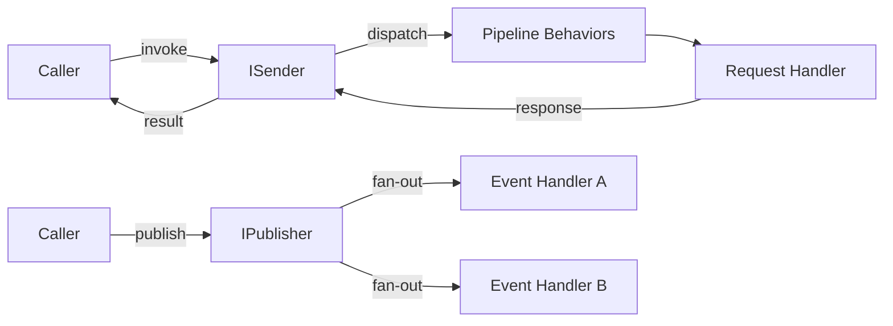

# Message Bus (CQRS)

## Introduction

**CQRS** (Command Query Responsibility Segregation) separates read and write operations into
distinct models:

- **Commands** change state and optionally return a result.
- **Queries** read state without side effects.
- **Events** (notifications) broadcast that something happened — zero or more handlers react.

The **Message Bus** decouples the sender of a request from the handler that processes it.
Instead of calling a handler directly, you pass a request object to the message bus, which looks up
the correct handler and dispatches it through a pipeline of cross-cutting behaviors.



!!! tip
    `ISender`, `IPublisher`, and `IMessageBus` all resolve to the same message bus instance.
    Inject only the interface you need — see [Interfaces](#interfaces) below.

waku's CQRS implementation is inspired by [MediatR](https://github.com/jbogard/MediatR) (.NET)
and integrates with the module system, dependency injection, and extension lifecycle.

---

## Setup

Import `MessagingModule` as a dynamic module in your root module:

```python linenums="1"
from waku import module
from waku.messaging import MessagingConfig, MessagingModule

@module(
    imports=[
        MessagingModule.register(MessagingConfig()),
    ],
)
class AppModule:
    pass
```

### MessagingConfig

| Option                            | Type                                | Default                    | Description                                              |
|-----------------------------------|-------------------------------------|----------------------------|----------------------------------------------------------|
| `message_bus_implementation_type` | `type[IMessageBus]`                 | `MessageBus`               | Concrete message bus class for request/event dispatching |
| `event_publisher`                 | `type[EventPublisher]`              | `SequentialEventPublisher` | Strategy for dispatching events to handlers              |
| `pipeline_behaviors`              | `Sequence[type[IPipelineBehavior]]` | `()`                       | Global pipeline behaviors applied to every request       |

Passing `None` (or no argument) to `MessagingModule.register()` uses the defaults:

```python linenums="1"
# These two are equivalent:
MessagingModule.register()
MessagingModule.register(MessagingConfig())
```

`MessagingModule` is registered as a **global module** — its providers (message bus, event publisher,
registry) are available to every module in the application without explicit imports.

---

## Interfaces

waku provides three message bus interfaces at different levels of access. Inject only the interface
you need to enforce the principle of least privilege:

| Interface     | Methods                  | Use when                                               |
|---------------|--------------------------|--------------------------------------------------------|
| `IMessageBus` | `invoke()` + `publish()` | The component both sends requests and publishes events |
| `ISender`     | `invoke()`               | The component only dispatches commands/queries         |
| `IPublisher`  | `publish()`              | The component only broadcasts events                   |

`IMessageBus` extends both `ISender` and `IPublisher`:

```python linenums="1"
from waku.messaging import IMessageBus, IPublisher, ISender


# Full access
async def handle_order(bus: IMessageBus) -> None:
    result = await bus.invoke(ProcessOrder(order_id='ORD-1'))
    await bus.publish(OrderPlaced(order_id='ORD-1', customer_id='CUST-1'))


# Send-only: cannot publish events
async def query_user(sender: ISender) -> UserDTO:
    return await sender.invoke(GetUserQuery(user_id='USR-1'))


# Publish-only: cannot send requests
async def broadcast_event(publisher: IPublisher) -> None:
    await publisher.publish(OrderShipped(order_id='ORD-1', tracking_number='TRK-123'))
```

All three interfaces are automatically registered in the DI container by `MessagingModule`.
dishka resolves `ISender` and `IPublisher` to the same `MessageBus` instance as `IMessageBus`.

---

## Complete Example

An order placement flow with a command handler and two event handlers:

```python linenums="1"
from dataclasses import dataclass

from typing_extensions import override

from waku import WakuFactory, module
from waku.messaging import (
    EventHandler,
    IEvent,
    IMessageBus,
    IRequest,
    MessagingConfig,
    MessagingExtension,
    MessagingModule,
    RequestHandler,
)


# --- Domain ---

@dataclass(frozen=True, kw_only=True)
class OrderConfirmation:
    order_id: str
    status: str


@dataclass(frozen=True, kw_only=True)
class PlaceOrder(IRequest[OrderConfirmation]):
    customer_id: str
    product_id: str


@dataclass(frozen=True, kw_only=True)
class OrderPlaced(IEvent):
    order_id: str
    customer_id: str


# --- Handlers ---

class PlaceOrderHandler(RequestHandler[PlaceOrder, OrderConfirmation]):
    def __init__(self, order_repo: OrderRepository) -> None:
        self._order_repo = order_repo

    @override
    async def handle(self, request: PlaceOrder, /) -> OrderConfirmation:
        order_id = f'ORD-{request.customer_id}-{request.product_id}'
        await self._order_repo.save(order_id)
        return OrderConfirmation(order_id=order_id, status='placed')


class SendConfirmationEmail(EventHandler[OrderPlaced]):
    def __init__(self, email_service: EmailService) -> None:
        self._email_service = email_service

    @override
    async def handle(self, event: OrderPlaced, /) -> None:
        await self._email_service.send_order_confirmation(event.order_id)


class UpdateAnalytics(EventHandler[OrderPlaced]):
    @override
    async def handle(self, event: OrderPlaced, /) -> None:
        print(f'Analytics updated for order {event.order_id}')


# --- Modules ---

@module(
    extensions=[
        MessagingExtension()
            .bind_request(PlaceOrder, PlaceOrderHandler)
            .bind_event(OrderPlaced, [SendConfirmationEmail, UpdateAnalytics]),
    ],
)
class OrdersModule:
    pass


@module(
    imports=[
        MessagingModule.register(MessagingConfig()),
        OrdersModule,
    ],
)
class AppModule:
    pass


# --- Main ---

async def main() -> None:
    app = WakuFactory(AppModule).create()

    async with app, app.container() as container:
        bus = await container.get(IMessageBus)

        confirmation = await bus.invoke(
            PlaceOrder(customer_id='CUST-1', product_id='PROD-42'),
        )
        print(f'Order {confirmation.order_id}: {confirmation.status}')

        await bus.publish(
            OrderPlaced(order_id=confirmation.order_id, customer_id='CUST-1'),
        )
```

!!! note "Fluent chaining"
    `MessagingExtension().bind_request(...)` and `.bind_event(...)` return `Self`, so you can
    chain multiple bindings in a single expression.

---

## Exceptions

| Exception                           | Raised when                                                            |
|-------------------------------------|------------------------------------------------------------------------|
| `RequestHandlerNotFound`            | `bus.invoke()` is called for a request type with no registered handler |
| `RequestHandlerAlreadyRegistered`   | A second handler is bound to a request type that already has one       |
| `EventHandlerAlreadyRegistered`     | The same handler class is bound to the same event type twice           |
| `PipelineBehaviorAlreadyRegistered` | The same behavior class is bound to the same request type twice        |

## Next steps

| Topic                             | Description                                   |
|-----------------------------------|-----------------------------------------------|
| [Requests](requests.md)           | Commands, queries, and request handlers       |
| [Events](events.md)               | Event definitions, handlers, and publishers   |
| [Pipeline Behaviors](pipeline.md) | Cross-cutting middleware for request handling |

## Further reading

- **[Event Sourcing](../eventsourcing/index.md)** — event-sourced aggregates, deciders, and projections
- **[Extension System](../../advanced/extensions/index.md)** — lifecycle hooks for application and module lifecycle
- **[Validation](../validation.md)** — startup validation and custom rules
- **[Testing](../../fundamentals/testing.md)** — test utilities and provider overrides
