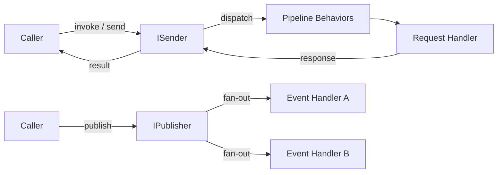

# Messaging

## Introduction

The **message bus** decouples the sender of a message from the handler that processes it.
Instead of calling a handler directly, you pass a message object to the bus, which looks up
the correct handler and dispatches it through a pipeline of cross-cutting behaviors.

- **Requests** (commands/queries) are dispatched to exactly one handler.
- **Events** (notifications) are broadcast to zero or more handlers (fan-out).

!!! info "Relationship to CQRS"
    CQRS (Command Query Responsibility Segregation) is an architectural pattern that separates
    read and write models. The message bus provides the infrastructure for CQRS — combined with
    [Event Sourcing](../eventsourcing/index.md), it enables full CQRS+ES architectures.


```mermaid
graph LR
    Caller -->|invoke / send| ISender
    ISender -->|dispatch| Pipeline[Pipeline Behaviors]
    Pipeline --> Handler[Request Handler]
    Handler -->|response| ISender
    ISender -->|result| Caller

    Caller2[Caller] -->|publish| IPublisher
    IPublisher -->|fan-out| H1[Event Handler A]
    IPublisher -->|fan-out| H2[Event Handler B]
```

waku's messaging subsystem is inspired by [Wolverine](https://wolverine.netlify.app/) (.NET)
and integrates with the module system, dependency injection, and extension lifecycle. The
method semantics (`invoke` / `send` / `publish`), endpoint model, and error policy system all
follow Wolverine's architecture — with deliberate adaptations for Python's ecosystem.

!!! tip "The Critter Stack for Python"
    In .NET, [Wolverine](https://wolverine.netlify.app/) (messaging) and
    [Marten](https://martendb.io/) (event sourcing) form the
    **[Critter Stack](https://jeremydmiller.com/critter-stack/)** for building event-driven
    systems. waku brings this pairing to Python: the messaging and
    [event sourcing](../eventsourcing/index.md) modules are built to work together as one stack.

### Differences from Wolverine

Wolverine leverages .NET conventions and compile-time safety — assembly scanning discovers
handlers by method name, attributes configure middleware, and routing is inferred from types.

waku takes the opposite approach: **explicit over implicit**. Python has no compiler to catch
misconfigured conventions, so waku makes everything visible in code:

- **Handlers** are class-based (`RequestHandler`, `EventHandler`) with explicit
  `MessagingExtension.bind()` registration — no naming conventions or classpath scanning.
- **Pipeline behaviors** are declared via `behaviors=[...]` in `bind()` or
  `MessagingConfig` — no attribute-based decoration.
- **Routing** uses explicit `route()` / `route_module()` declarations — the full
  topology is readable from the wiring module.

What you see in the module definition is the complete picture. No hidden magic, full IDE
support, and type checkers validate the wiring at development time.

---

## Installation

waku includes core messaging out of the box:

```bash
uv add waku
```

For database persistence (transactional outbox, unit of work, dead letter store):

```bash
uv add waku --extra sqla
```

For [FastStream](https://faststream.airt.ai/) transport integration:

```bash
uv add waku --extra faststream
```

---

## Quick start

For the smallest possible app — invoke a request, publish an event, no transports — see
[waku as in-process mediator](../../mediator.md). The message types are covered in
[Messages & contracts](contracts.md), and defining and binding handlers in
[Handlers & registration](handlers.md).

---

## Setup

Import `MessagingModule` as a dynamic module in your root module:

```python linenums="1"
from waku import module
from waku.messaging import MessagingConfig, MessagingModule

@module(
    imports=[
        MessagingModule.register(MessagingConfig()),
    ],
)
class AppModule:
    pass
```

`MessagingConfig` and its nested `EndpointDefaults` are documented field-by-field in the
[Configuration reference](../../reference/configuration.md).

Passing `None` (or no argument) to `MessagingModule.register()` uses the defaults:

```python linenums="1"
# These two are equivalent:
MessagingModule.register()
MessagingModule.register(MessagingConfig())
```

!!! info "Validation rules"
    waku validates configuration dependencies at startup:

    - `external_endpoint` in `endpoints` requires `outbox`
    - Error policies with `DEAD_LETTER` action require a `dead_letter` config

`MessagingModule` is registered as a **global module** — its providers (message bus, event publisher,
registry) are available to every module in the application without explicit imports.

---

## Interfaces

waku provides three message bus interfaces at different levels of access. Inject only the interface
you need to enforce the principle of least privilege:

| Interface     | Methods                              | Use when                                               |
|---------------|--------------------------------------|--------------------------------------------------------|
| `IMessageBus` | `invoke()` + `send()` + `publish()`  | The component needs full bus access                    |
| `ISender`     | `invoke()` + `send()`               | The component only dispatches commands/queries         |
| `IPublisher`  | `publish()`                          | The component only broadcasts events                   |

`IMessageBus` extends both `ISender` and `IPublisher`:

```python linenums="1"
from waku.messaging import IMessageBus, IPublisher, ISender


# Full access
async def handle_order(bus: IMessageBus) -> None:
    result = await bus.invoke(ProcessOrder(order_id='ORD-1'))
    await bus.send(ArchiveOrder(order_id='ORD-1'))
    await bus.publish(OrderPlaced(order_id='ORD-1', customer_id='CUST-1'))


# Send-only: cannot publish events
async def query_user(sender: ISender) -> UserDTO:
    return await sender.invoke(GetUserQuery(user_id='USR-1'))


# Fire-and-forget: no response, outbox-capable
async def enqueue_cleanup(sender: ISender) -> None:
    await sender.send(CleanupExpiredOrders())


# Publish-only: cannot send requests
async def broadcast_event(publisher: IPublisher) -> None:
    await publisher.publish(OrderShipped(order_id='ORD-1', tracking_number='TRK-123'))
```

All three interfaces are automatically registered in the DI container by `MessagingModule`.
dishka resolves `ISender` and `IPublisher` to the same `MessageBus` instance as `IMessageBus`.

---

## Dispatch Methods

The bus offers three dispatch methods with distinct semantics:

| Method      | Returns    | Handlers  | Description                                                    |
|-------------|------------|-----------|----------------------------------------------------------------|
| `invoke()`  | `TResponse` | Exactly 1 | In-process request/response. Always inline.                   |
| `send()`    | `None`     | Any       | Fire-and-forget via [endpoint](routing.md). Raises `NoRouteError` if message type has no handlers. |
| `publish()` | `None`     | 0 or more | Fan-out via [endpoints](routing.md). Silent no-op if no subscribers. |

### `invoke()` — request/response

Use `invoke()` when you need the handler's result. The request travels through the pipeline
and returns a typed response:

```python linenums="1"
confirmation = await sender.invoke(
    PlaceOrder(customer_id='CUST-1', product_id='PROD-42'),
)
print(confirmation.order_id)
```

### `send()` — fire-and-forget

Use `send()` when you want to dispatch a message without waiting for a response. The message is
always dispatched through an [endpoint](routing.md) (the default local queue if no explicit route):

```python linenums="1"
await sender.send(ArchiveOrder(order_id='ORD-1'))
```

!!! tip "When to use `send()` vs `invoke()`"
    Prefer `send()` for side-effect-only commands where the caller does not need a result.
    Prefer `invoke()` when the caller depends on the handler's response.

### `publish()` — event fan-out

Use `publish()` to broadcast an event to all registered handlers. If no handlers are registered,
the call is a no-op:

```python linenums="1"
await publisher.publish(OrderPlaced(order_id='ORD-1', customer_id='CUST-1'))
```

See [Events](events.md) for details on event handlers and publisher strategies.

### Choosing a Dispatch Method

Not sure which method to use? Start here:

| Question | Answer | Method |
|----------|--------|--------|
| Do you need the handler's return value? | Yes | `invoke()` |
| Is this a fire-and-forget command? | Yes | `send()` |
| Should multiple handlers react independently? | Yes | `publish()` |

!!! tip "Start simple"
    If you're unsure, use `invoke()` — it runs inline, gives you a typed response, and raises
    immediately on failure. Graduate to `send()` and `publish()` when you need decoupling,
    background processing, or fan-out.

---

## Complete Example

An order placement flow with a command handler and two event handlers:

```python linenums="1"
from dataclasses import dataclass

from typing_extensions import override

from waku import WakuFactory, module
from waku.messages import IEvent
from waku.messaging import (
    EventHandler,
    IMessageBus,
    IRequest,
    MessagingConfig,
    MessagingExtension,
    MessagingModule,
    RequestHandler,
)


# --- Domain ---

@dataclass(frozen=True, kw_only=True)
class OrderConfirmation:
    order_id: str
    status: str


@dataclass(frozen=True, kw_only=True)
class PlaceOrder(IRequest[OrderConfirmation]):
    customer_id: str
    product_id: str


@dataclass(frozen=True, kw_only=True)
class OrderPlaced(IEvent):
    order_id: str
    customer_id: str


# --- Handlers ---

class PlaceOrderHandler(RequestHandler[PlaceOrder, OrderConfirmation]):
    def __init__(self, order_repo: OrderRepository) -> None:
        self._order_repo = order_repo

    @override
    async def handle(self, request: PlaceOrder, /) -> OrderConfirmation:
        order_id = f'ORD-{request.customer_id}-{request.product_id}'
        await self._order_repo.save(order_id)
        return OrderConfirmation(order_id=order_id, status='placed')


class SendConfirmationEmail(EventHandler[OrderPlaced]):
    def __init__(self, email_service: EmailService) -> None:
        self._email_service = email_service

    @override
    async def handle(self, event: OrderPlaced, /) -> None:
        await self._email_service.send_order_confirmation(event.order_id)


class UpdateAnalytics(EventHandler[OrderPlaced]):
    @override
    async def handle(self, event: OrderPlaced, /) -> None:
        print(f'Analytics updated for order {event.order_id}')


# --- Modules ---

@module(
    extensions=[
        MessagingExtension()
            .bind(PlaceOrder, PlaceOrderHandler)
            .bind(OrderPlaced, SendConfirmationEmail, UpdateAnalytics),
    ],
)
class OrdersModule:
    pass


@module(
    imports=[
        MessagingModule.register(MessagingConfig()),
        OrdersModule,
    ],
)
class AppModule:
    pass


# --- Main ---

async def main() -> None:
    app = WakuFactory(AppModule).create()

    async with app, app.container() as container:
        bus = await container.get(IMessageBus)

        confirmation = await bus.invoke(
            PlaceOrder(customer_id='CUST-1', product_id='PROD-42'),
        )
        print(f'Order {confirmation.order_id}: {confirmation.status}')

        await bus.publish(
            OrderPlaced(order_id=confirmation.order_id, customer_id='CUST-1'),
        )
```

!!! note "Fluent chaining"
    `MessagingExtension().bind(...)` returns `Self`, so you can chain multiple bindings in a
    single expression.

---

## Exceptions

| Exception                           | Raised when                                                            |
|-------------------------------------|------------------------------------------------------------------------|
| `HandlerNotFound`                   | `bus.invoke()` is called for a request type with no registered handler |
| `HandlerAlreadyRegistered`          | The same handler class is bound to the same message type twice         |
| `MultipleHandlersRegistered`        | Multiple handlers registered for an `IRequest` type                    |
| `NoRouteError`                      | `bus.send()` is called for a message type with no registered handlers  |
| `ImproperlyConfiguredError`         | Invalid `MessagingConfig` at startup (e.g., external endpoint without outbox) |
| `PipelineBehaviorAlreadyRegistered` | The same behavior class is bound to the same message type twice        |

## Next steps

| Topic                                  | Description                                          |
|----------------------------------------|------------------------------------------------------|
| [Messages & contracts](contracts.md)  | Message types, the envelope, and identity/versioning |
| [Handlers & registration](handlers.md) | The handler hierarchy, binding, and per-handler config |
| [Requests](requests.md)               | Commands, queries, and request handlers              |
| [Events](events.md)                   | Event definitions, handlers, and publishers          |
| [Pipeline Behaviors](pipeline.md)     | Cross-cutting middleware for request handling         |
| [Routing & Endpoints](routing.md)     | Route messages to local queues and external systems  |
| [Delivery Options & Scheduling](delivery-options.md) | Per-call metadata, scheduled send/publish, expiration |
| [Error Handling](error-handling.md)   | Retry policies, dead letter queues, failure recovery |
| [Resilience](resilience.md)           | Circuit breaker and backpressure for listeners       |
| [Outbox](outbox.md)                   | Transactional outbox, relay, and external transports |
| [Message Context](context.md)         | Correlation tracking across message chains           |
| [Transactions](transactions.md)       | Unit of work and transactional pipeline behavior     |

## Further reading

- **[Event Sourcing](../eventsourcing/index.md)** — event-sourced aggregates, deciders, and projections
- **[Extension System](../../advanced/extensions/index.md)** — lifecycle hooks for application and module lifecycle
- **[Validation](../validation.md)** — startup validation and custom rules
- **[Testing](../../fundamentals/testing.md)** — test utilities and provider overrides
