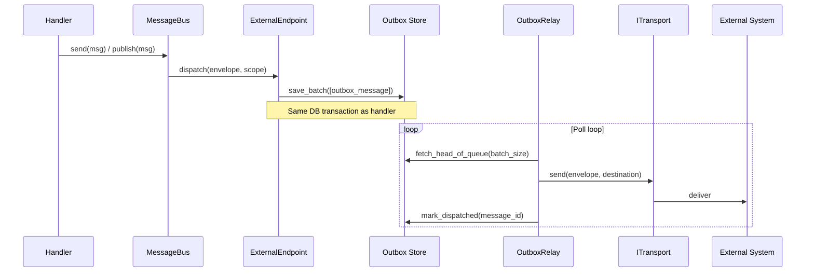
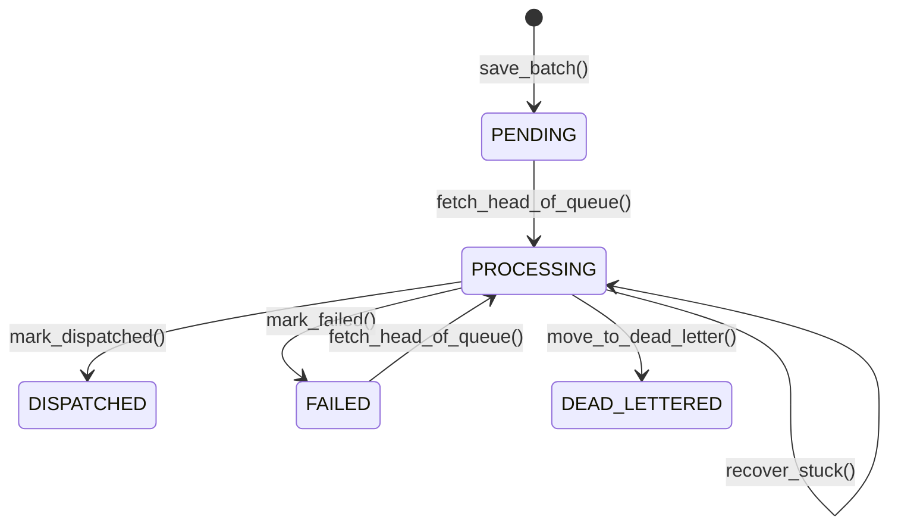

# Outbox & Transport

When messages need to leave your process — to a message broker, another microservice, or any
external system — you face the **dual-write problem**: if you commit a database transaction and
then publish a message, a crash between the two leaves your system in an inconsistent state.
The database says "order placed" but the message never reached the broker.

waku solves this with the **transactional outbox** pattern. Instead of publishing directly to an
external transport, messages are persisted to an outbox table within the same database
transaction as your business data. A background **relay** then picks them up and dispatches
them to the external transport. No crash window, no inconsistency.

This follows the same pattern used by
[Wolverine's durable outbox](https://wolverine.netlify.app/guide/durability/) and
[Marten's event subscriptions](https://martendb.io/events/subscriptions.html) — write-ahead
persistence with reliable background delivery.



!!! info "When you need the outbox"
    The outbox is required only for **external endpoints**. Local queue endpoints process
    messages in-memory and do not use the outbox. If your application only uses `invoke()` and
    local queues, you do not need any of the infrastructure on this page.

!!! info "Prerequisites"
    This page covers database persistence and external transports. Depending on your setup:

    - SQLAlchemy outbox store: `uv add waku --extra sqla`
    - FastStream transport: `uv add waku --extra faststream`

    See [Installation](index.md#installation) for details.

---

## How It Works

The outbox pattern in waku follows three stages:

1. **Write-ahead persistence.** When a message is routed to an external endpoint, the
   `ExternalEndpoint` serializes the envelope and writes it to the outbox store. This happens
   within the same DI scope (and therefore the same database transaction) as the handler.

2. **Relay dispatch.** The `OutboxRelay` runs as a background task. It polls the outbox store
   for pending messages, deserializes them, and sends each to the configured `ITransport`.
   Successful dispatches are marked as `DISPATCHED`.

3. **Failure handling.** If the transport rejects a message, the relay retries with exponential
   backoff. After `max_attempts`, the message is moved to the dead letter store (or marked as
   permanently failed if no dead letter store is configured).

---

## Setup

All outbox concerns are grouped in a single `OutboxConfig`:

```python linenums="1"
from waku.messaging import (
    MessagingConfig,
    MessagingModule,
    OutboxConfig,
    external_endpoint,
    route,
)

MessagingModule.register(
    MessagingConfig(
        endpoints=[external_endpoint('notifications')],     # (1)!
        routing=[route(OrderPlaced).to('notifications')],   # (2)!
        outbox=OutboxConfig(
            store=SqlAlchemyOutboxStore,                     # (3)!
            transport=FastStreamTransport,                   # (4)!
        ),
    ),
)
```

1. Declare an external endpoint with a logical URI.
2. Route a message type to that endpoint.
3. Outbox store implementation — persists messages to the database.
4. Transport implementation — delivers messages to the external system.

`OutboxConfig` requires both `store` and `transport` — they are always used together.
The relay is enabled by default with sensible settings (see [Relay Configuration](#relay-configuration)).

!!! warning "Validation"
    waku validates at startup that `external_endpoint` in `endpoints` has a corresponding
    `outbox` in `MessagingConfig`. Missing it raises `ImproperlyConfiguredError`.

!!! tip "Why a single config object?"
    `store`, `transport`, and `relay` are never useful independently — a store without a relay
    fills up forever, a relay without a transport can't dispatch. Grouping them makes
    misconfiguration structurally impossible.

---

## Outbox Store

`IOutboxStore` is the persistence interface for outbox messages:

| Method                                    | Description                                              |
|-------------------------------------------|----------------------------------------------------------|
| `save_batch(messages)`                    | Persist new outbox messages (called by `ExternalEndpoint`) |
| `fetch_head_of_queue(batch_size)`         | Claim pending messages in partition order (one head per `group_id`) and mark them `PROCESSING` |
| `mark_dispatched(message_id)`             | Mark a message as successfully dispatched                |
| `mark_failed(message_id, error, next_retry_at)` | Mark a message as failed, schedule next retry      |
| `move_to_dead_letter(message_id, entry)`  | Move an exhausted message to the dead letter store       |
| `recover_stuck(threshold: timedelta)`     | Reset messages stuck in `PROCESSING` beyond the threshold|
| `cleanup_dispatched(older_than: timedelta)` | Remove old dispatched messages (returns count)         |

### OutboxMessage Lifecycle



### SQLAlchemy Adapter

waku ships with a PostgreSQL-optimized SQLAlchemy adapter:

```python linenums="1"
from waku.messaging.outbox.sqla.store import SqlAlchemyOutboxStore
from waku.messaging.outbox.sqla.tables import OutboxTables, bind_outbox_tables
```

Bind the outbox tables to your metadata and use `SqlAlchemyOutboxStore` as the `outbox_store`:

```python linenums="1"
from sqlalchemy import MetaData
from waku.messaging.outbox.sqla.tables import bind_outbox_tables

metadata = MetaData()
outbox_tables = bind_outbox_tables(metadata)  # (1)!
```

1. Creates the `outbox_messages` table with appropriate indexes and constraints.

!!! tip "Database migration"
    Run your migration tool (Alembic, etc.) after binding the tables to generate the migration
    for the `outbox_messages` table. The table includes indexes on `(status, created_at)` and
    `(status, next_retry_at)` for efficient polling.

---

## Transport

`ITransport` is the interface for delivering messages to external systems. It receives a
deserialized `MessageEnvelope` and a destination string:

Implement this for your message broker or external service:

```python linenums="1"
from typing import Any

from typing_extensions import override

from waku.messaging.contracts.envelope import MessageEnvelope
from waku.messaging.transport import ITransport


class FastStreamTransport(ITransport):
    def __init__(self, broker: KafkaBroker) -> None:
        self._broker = broker

    @override
    async def send(self, envelope: MessageEnvelope[Any], *, destination: str) -> None:
        await self._broker.publish(
            message=envelope.payload,
            topic=destination,
            headers={
                'message-id': str(envelope.message_id),
                'correlation-id': str(envelope.correlation_id),
            },
        )
```

The `destination` parameter is the endpoint URI from the route declaration — use it to map to
topics, queues, or routing keys in your broker.

---

## Envelope Serialization

Messages are serialized before being stored in the outbox and deserialized by the relay before
transport dispatch. waku provides `JsonEnvelopeSerializer` as the default implementation:

```python linenums="1"
from waku.messaging.transport import IEnvelopeSerializer, JsonEnvelopeSerializer
```

### Auto-configured Serializer

When `envelope_serializer` is `None` in `MessagingConfig` (the default), waku auto-creates a
`JsonEnvelopeSerializer` using all registered message types as the type registry. This means
every message type bound via `MessagingExtension.bind()` is automatically serializable.

### Custom Serializer

Provide a custom serializer class or factory for special requirements (e.g., Protobuf, Avro):

```python linenums="1"
OutboxConfig(
    store=SqlAlchemyOutboxStore,
    transport=FastStreamTransport,
    envelope_serializer=MyProtobufSerializer,
)
```

### Message Type Resolution

`JsonEnvelopeSerializer` identifies message types by their fully-qualified Python name
(e.g., `myapp.orders.events.OrderPlaced`). The type registry maps these names to Python classes
for deserialization. If the relay encounters an unknown type, it raises `ValueError` with a
list of registered types.

!!! tip "Stable type names"
    Renaming or moving a message class changes its fully-qualified name, which breaks
    deserialization of in-flight outbox messages. Plan module structure carefully, or provide a
    custom `envelope_serializer` with explicit type name mapping.

---

## Outbox Relay

The `OutboxRelay` runs as a background task, started and stopped automatically during the
application lifecycle. It is **always enabled** when `outbox` is set — `OutboxConfig.relay`
defaults to `OutboxRelayConfig()` with sensible defaults.

To customize relay behavior, pass a configured `OutboxRelayConfig`:

```python linenums="1"
from waku.messaging.outbox.relay import OutboxRelayConfig

OutboxConfig(
    store=SqlAlchemyOutboxStore,
    transport=FastStreamTransport,
    relay=OutboxRelayConfig(
        batch_size=50,
        max_attempts=10,
    ),
)
```

### Relay Configuration

| Parameter            | Type        | Default                 | Description                                              |
|----------------------|-------------|-------------------------|----------------------------------------------------------|
| `batch_size`         | `int`       | `100`                   | Messages fetched per poll cycle                          |
| `poll_interval`      | `float`     | `1.0`                   | Minimum seconds between polls                            |
| `max_poll_interval`  | `float`     | `30.0`                  | Maximum seconds between polls (adaptive backoff)         |
| `poll_step`          | `float`     | `1.0`                   | Seconds added to interval on idle                        |
| `jitter_factor`      | `float`     | `0.1`                   | Random jitter factor for poll timing                     |
| `max_attempts`       | `int`       | `5`                     | Max relay dispatch attempts before dead-lettering        |
| `base_delay`         | `float`     | `1.0`                   | Base delay for exponential backoff on failure             |
| `max_delay`          | `float`     | `60.0`                  | Maximum backoff delay                                    |
| `stuck_threshold`    | `timedelta` | `5 minutes`             | Messages stuck in `PROCESSING` longer than this are recovered |
| `recovery_interval`  | `timedelta` | `1 minute`              | How often to check for stuck messages                    |
| `stop_timeout`       | `float`     | `10.0`                  | Seconds to wait for relay shutdown                       |

### Adaptive Polling

The relay uses **adaptive polling** — when there is work to process, it polls at the minimum
interval. When the outbox is empty, it gradually increases the interval up to `max_poll_interval`.
This reduces database load during quiet periods while maintaining low latency during bursts.

### Stuck Message Recovery

If the process crashes while a message is in `PROCESSING` state, it would remain stuck
indefinitely. The relay periodically scans for messages that have been in `PROCESSING` longer
than `stuck_threshold` and resets them to `PENDING` for reprocessing.

### Failure Handling

When transport dispatch fails:

1. The relay rolls back the current scope.
2. If attempts exhausted (`retry_count + 1 >= max_attempts`): moves the message to the dead
   letter store via `IOutboxStore.move_to_dead_letter()`.
3. Otherwise: marks the message as `FAILED` with `next_retry_at` calculated using exponential
   backoff.

!!! note "Relay retries vs error policies"
    The relay has its own retry logic (via `OutboxRelayConfig.max_attempts`) that is separate
    from the [error policies](error-handling.md) used by local queue endpoint workers. Error
    policies govern handler-level failures; relay retries govern transport-level failures.

---

## Complete Example

An end-to-end setup with an external endpoint, SQLAlchemy outbox, and a custom transport:

```python linenums="1"
from waku import module
from waku.di import scoped, singleton
from waku.uow import IUnitOfWork
from waku.messaging import (
    MessagingConfig,
    MessagingExtension,
    MessagingModule,
    OutboxConfig,
    external_endpoint,
    route,
)
from waku.messaging.outbox.relay import OutboxRelayConfig
from waku.messaging.outbox.sqla.store import SqlAlchemyOutboxStore
from waku.messaging.sqla.uow import SqlAlchemyUnitOfWork


@module(
    extensions=[
        MessagingExtension().bind(OrderPlaced, SendNotification),
    ],
)
class NotificationsModule:
    pass


@module(
    providers=[
        scoped(IUnitOfWork, SqlAlchemyUnitOfWork),
        singleton(KafkaBroker, create_broker),
    ],
)
class InfraModule:
    pass


@module(
    imports=[
        MessagingModule.register(
            MessagingConfig(
                endpoints=[external_endpoint('notifications')],
                routing=[route(OrderPlaced).to('notifications')],
                outbox=OutboxConfig(
                    store=SqlAlchemyOutboxStore,
                    transport=FastStreamTransport,
                    relay=OutboxRelayConfig(
                        batch_size=50,
                        max_attempts=3,
                    ),
                ),
            ),
        ),
        InfraModule,
        NotificationsModule,
    ],
)
class AppModule:
    pass
```

With this setup:

1. When `bus.publish(OrderPlaced(...))` is called, the message is serialized and written to the
   `outbox_messages` table within the handler's database transaction.
2. The outbox relay polls the table, picks up the message, and calls
   `FastStreamTransport.send()` to publish it to Kafka.
3. If Kafka is unavailable, the relay retries with backoff up to 3 times, then dead-letters.

---

## Further reading

- **[Routing & Endpoints](routing.md)** — external endpoint declarations and routing rules
- **[Error Handling](error-handling.md)** — retry policies and dead letter queues
- **[Transactions](transactions.md)** — unit of work and transactional pipeline behavior
- **[Message Bus](index.md)** — setup, interfaces, and dispatch methods
