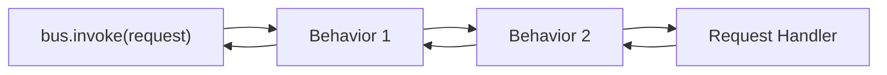

# Pipeline Behaviors

Pipeline behaviors are cross-cutting middleware that wrap request handling. They form a chain
similar to HTTP middleware: each behavior can run logic before and after the next handler, modify
the request, short-circuit the pipeline, or handle exceptions.



---

## Defining a Behavior

Implement `IPipelineBehavior[RequestT, ResponseT]`:

```python linenums="1"
import logging

from typing_extensions import override

from waku.messaging import IPipelineBehavior, NextHandlerType
from waku.messaging.contracts import RequestT, ResponseT

logger = logging.getLogger(__name__)


class LoggingBehavior(IPipelineBehavior[RequestT, ResponseT]):
    @override
    async def handle(
        self,
        request: RequestT,
        /,
        next_handler: NextHandlerType[RequestT, ResponseT],
    ) -> ResponseT:
        request_name = type(request).__name__
        logger.info('Handling %s', request_name)
        response = await next_handler(request)
        logger.info('Handled %s', request_name)
        return response
```

!!! warning
    Every behavior **must** call `await next_handler(request)` to continue the pipeline. Omitting
    this call short-circuits the chain — the actual handler never executes.

---

## Global Behaviors

Register behaviors that apply to **every** request via `MessagingConfig`:

```python linenums="1"
from waku.messaging import MessagingConfig, MessagingModule

MessagingModule.register(
    MessagingConfig(
        pipeline_behaviors=[LoggingBehavior, ValidationBehavior],
    ),
)
```

Global behaviors execute in the order they are listed.

---

## Per-request Behaviors

Attach behaviors to a specific request type via `bind_request`:

```python linenums="1"
from waku import module
from waku.messaging import MessagingExtension


@module(
    extensions=[
        MessagingExtension().bind_request(
            CreateUserCommand,
            CreateUserCommandHandler,
            behaviors=[UniqueEmailCheckBehavior],
        ),
    ],
)
class UsersModule:
    pass
```

---

## Execution Order

When a request is dispatched, behaviors execute in this order:

1. **Global behaviors** (from `MessagingConfig.pipeline_behaviors`, in order)
2. **Per-request behaviors** (from `bind_request(..., behaviors=[...])`, in order)
3. **Request handler**

The response then unwinds back through the chain in reverse order.

## Further reading

- **[Requests](requests.md)** — commands, queries, and request handlers
- **[Events](events.md)** — event definitions, handlers, and publishers
- **[Message Bus (CQRS)](index.md)** — setup, interfaces, and complete example
