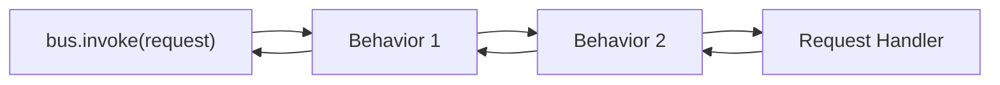

# Pipeline Behaviors

Pipeline behaviors are cross-cutting middleware that wrap message handling. They form a chain
similar to HTTP middleware: each behavior can run logic before and after the next handler,
short-circuit the pipeline, or handle exceptions.



---

## Defining a Behavior

Implement `IPipelineBehavior[MessageT, ResponseT]`:

```python linenums="1"
import logging

from typing_extensions import override

from waku.messaging import CallNext, IPipelineBehavior, MessageT, ResponseT

logger = logging.getLogger(__name__)


class LoggingBehavior(IPipelineBehavior[MessageT, ResponseT]):
    @override
    async def handle(
        self,
        message: MessageT,
        /,
        call_next: CallNext[ResponseT],
    ) -> ResponseT:
        name = type(message).__name__
        logger.info('Handling %s', name)
        response = await call_next()
        logger.info('Handled %s', name)
        return response
```

!!! warning
    Every behavior **must** call `await call_next()` to continue the pipeline. Omitting
    this call short-circuits the chain — the actual handler never executes.

---

## Global Behaviors

Register behaviors that apply to **every** message (requests and events) via `MessagingConfig`:

```python linenums="1"
from waku.messaging import MessagingConfig, MessagingModule

MessagingModule.register(
    MessagingConfig(
        pipeline_behaviors=[LoggingBehavior, ValidationBehavior],
    ),
)
```

Global behaviors execute in the order they are listed.

---

## Per-request Behaviors

Attach behaviors to a specific request type via `bind_request`:

```python linenums="1"
from waku import module
from waku.messaging import MessagingExtension


@module(
    extensions=[
        MessagingExtension().bind_request(
            CreateUserCommand,
            CreateUserCommandHandler,
            behaviors=[UniqueEmailCheckBehavior],
        ),
    ],
)
class UsersModule:
    pass
```

---

## Per-event Behaviors

Attach behaviors to a specific event type via `bind_event`:

```python linenums="1"
from waku import module
from waku.messaging import MessagingExtension


@module(
    extensions=[
        MessagingExtension().bind_event(
            OrderPlaced,
            [SendEmailHandler, UpdateStatsHandler],
            behaviors=[AuditBehavior],
        ),
    ],
)
class OrderModule:
    pass
```

Each event handler gets its own pipeline invocation — behaviors run independently per handler.

---

## Execution Order

Behaviors execute in this order:

1. **Global behaviors** (from `MessagingConfig.pipeline_behaviors`, in order)
2. **Per-message-type behaviors** (from `bind_request` or `bind_event` `behaviors=[...]`, in order)
3. **Handler**

The response then unwinds back through the chain in reverse order.

## Further reading

- **[Requests](requests.md)** — commands, queries, and request handlers
- **[Events](events.md)** — event definitions, handlers, and publishers
- **[Message Bus](index.md)** — setup, interfaces, and complete example
