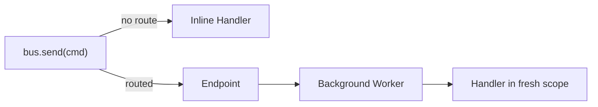
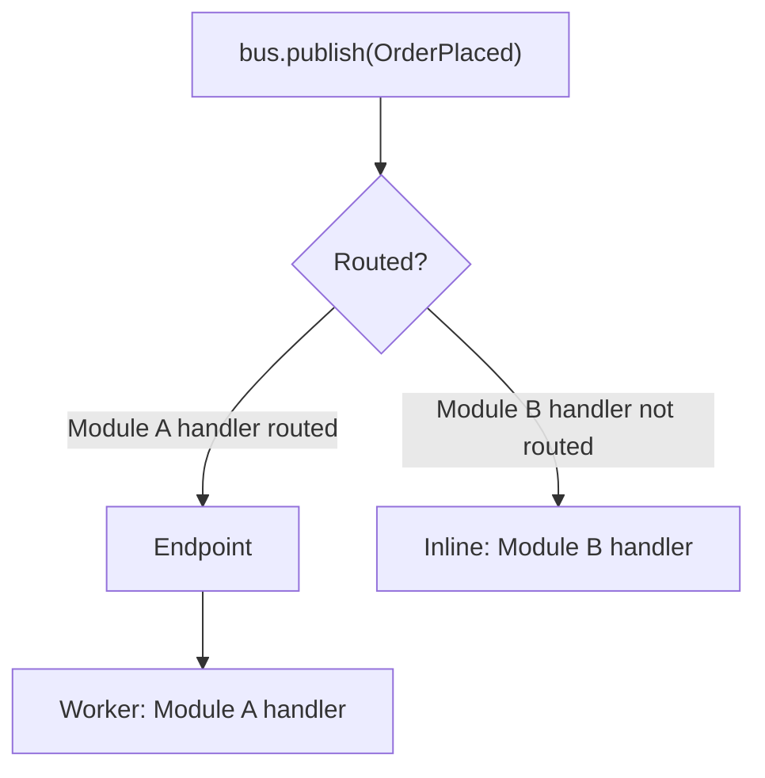

# Routing & Endpoints

By default, every message is processed inline — synchronously in the caller's context, within the
caller's DI scope. No endpoints, no background workers.

Routing lets you override this default. You declare which messages should be dispatched to
**endpoints** — background workers that process messages asynchronously in their own DI scope.
The caller enqueues the message and returns immediately.



---

## Default Behavior

Without routing configuration, all three dispatch methods execute inline:

```python linenums="1"
from waku.messaging import MessagingConfig, MessagingModule

# No endpoints, no routing — everything runs inline.
MessagingModule.register(MessagingConfig())
```

This is equivalent to calling `MessagingModule.register()` with no arguments. If your application
only needs synchronous, in-process message handling, you can skip the rest of this page.

---

## Local Queue Endpoints

A **local queue** is a buffered, in-process endpoint backed by an anyio memory stream. Messages
sent to a local queue are enqueued and return immediately. A background worker task drains the
queue and processes each message in a fresh DI scope.

`local_queue()` creates an endpoint descriptor that `MessagingModule` uses to construct a live
`LocalQueueEndpoint` during application initialization:

```python
from waku.messaging.endpoints.base import local_queue

entry = local_queue('domain-events')
```

The string argument is the endpoint **URI** — a logical name you reference in route declarations.

!!! tip "When to use local queues"
    Local queues are useful when you want fire-and-forget semantics without leaving the process.
    Common cases: sending emails, updating projections, recording analytics. They decouple the
    handler's execution time from the caller's response time.

---

## Per-Type Routing

Use `route(MessageType).to('endpoint-uri')` to route a specific message type to an endpoint:

```python linenums="1"
from waku.messaging import MessagingConfig, MessagingModule
from waku.messaging.endpoints.base import local_queue
from waku.messaging.router import route

config = MessagingConfig(
    endpoints=[local_queue('domain-events')],
    routing=[route(OrderPlaced).to('domain-events')],
)
MessagingModule.register(config)
```

When `bus.publish(OrderPlaced(...))` is called, handlers for `OrderPlaced` are dispatched to the
`domain-events` endpoint. For events, handlers in other modules that are not covered by the route
still run inline (see [Additive Routing](#additive-routing)).

---

## Module-Level Routing

Use `route_module(Module).events_to('endpoint-uri')` to route **all events** registered in a
module to an endpoint. This is more maintainable than per-type routing when a module owns many
event types:

```python linenums="1"
from waku.messaging import MessagingConfig, MessagingModule
from waku.messaging.endpoints.base import local_queue
from waku.messaging.router import route_module

config = MessagingConfig(
    endpoints=[local_queue('domain-events')],
    routing=[route_module(PaymentModule).events_to('domain-events')],
)
MessagingModule.register(config)
```

Every event type bound via `MessagingExtension().bind_event(...)` inside `PaymentModule` is
routed to the `domain-events` endpoint.

---

## Additive Routing

When an event has handlers in multiple modules and only some are routed, `publish()` does both:

1. Runs non-routed handlers **inline** (synchronously in the caller's scope).
2. Dispatches to **endpoints** for routed handlers (asynchronously).

This means routing is additive — it never silences inline handlers that were not routed.



Consider an example where `OrderPlaced` has handlers in two modules:

- **Module A** — handler is routed to a local queue endpoint.
- **Module B** — handler has no route, so it runs inline.

When you call `bus.publish(OrderPlaced(...))`, Module B's handler executes immediately in the
caller's scope, while Module A's handler is enqueued for background processing.

---

## Routing Precedence

Routes are evaluated in this order:

| Source                  | Example                                         |
|-------------------------|-------------------------------------------------|
| Per-type route          | `route(OrderPlaced).to('events')`               |
| Module-level route      | `route_module(OrdersModule).events_to('events')` |
| Inline (default)        | No route configured                              |

A **per-type route overrides** a module-level route for the same message type. If
`route(OrderPlaced).to('priority')` and `route_module(OrdersModule).events_to('events')` both
match `OrderPlaced`, only the per-type route applies. When no route matches, the message runs
inline.

---

## Endpoint Lifecycle

Endpoints are managed automatically by `EndpointLifecycleExtension`, which is registered
internally by `MessagingModule`. You do not need to start or stop endpoints manually.

| Phase              | Action                                              |
|--------------------|-----------------------------------------------------|
| After app init     | All endpoints are started (background workers spawn) |
| On app shutdown    | All endpoints are stopped (queues drain and close)   |

Endpoints start after all modules have been initialized and stop in reverse order during shutdown.

---

## Method Semantics with Routing

Each dispatch method interacts with routing differently:

| Method      | Routable | Behavior when routed                                              |
|-------------|----------|-------------------------------------------------------------------|
| `invoke()`  | No       | Always inline. Returns a typed response.                         |
| `send()`    | Yes      | No route = inline. Route = endpoint dispatch (fire-and-forget).  |
| `publish()` | Yes      | Additive: inline handlers run + routed handlers go to endpoints. |

!!! info "`invoke()` is never routed"
    `invoke()` always executes inline because it returns a typed response to the caller.
    Routing is inherently asynchronous — there is no way to return a response from a background
    worker. Use `send()` if you want a routable fire-and-forget command.

---

## Further reading

- **[Message Bus](index.md)** — setup, interfaces, and dispatch methods
- **[Message Context](context.md)** — correlation tracking across message chains
- **[Pipeline Behaviors](pipeline.md)** — cross-cutting middleware for request handling
- **[Events](events.md)** — event definitions, handlers, and publishers
