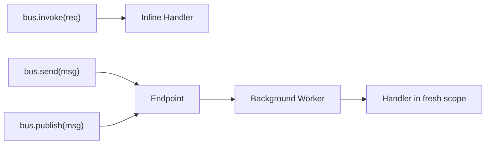
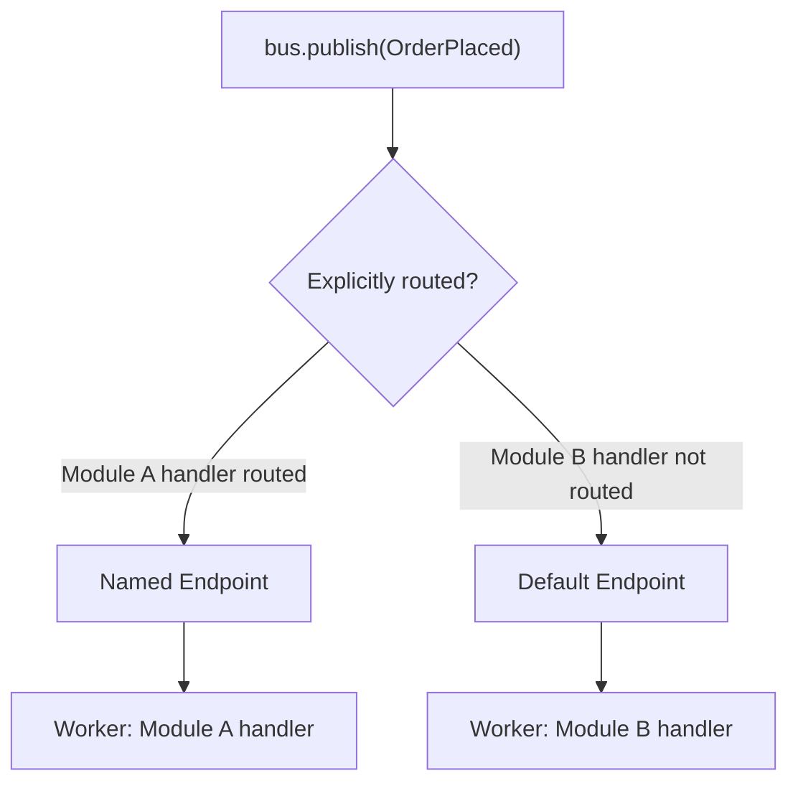

# Routing & Endpoints

Every `send()` and `publish()` call dispatches through an **endpoint**. When no explicit routing
is configured, waku auto-creates a default local queue endpoint and assigns all registered handlers
to it. Only `invoke()` is truly inline — it always executes in the caller's DI scope and returns
a typed response.

Routing lets you control **which** endpoint a message goes to. You declare endpoints (local queues
or external transports) and map message types or entire modules to them. This endpoint model
follows [Wolverine's architecture](https://wolverine.netlify.app/guide/messaging/transports/)
where endpoints are the core abstraction for message delivery.



---

## Default Behavior

Without routing configuration, `send()` and `publish()` dispatch through an auto-created
default local queue endpoint:

```python linenums="1"
from waku.messaging import MessagingConfig, MessagingModule

# No explicit endpoints — a default local queue is created automatically.
MessagingModule.register(MessagingConfig())
```

This is equivalent to calling `MessagingModule.register()` with no arguments. Handlers run
asynchronously in a background worker with a fresh DI scope. If your application only needs
synchronous, in-process handling, use `invoke()`.

---

## Endpoint Types

waku supports two endpoint types — **local queues** for in-process async processing and
**external endpoints** for cross-service delivery via the [transactional outbox](outbox.md).

### Local Queue Endpoints

A **local queue** is a buffered, in-process endpoint backed by an anyio memory stream. Messages
sent to a local queue are enqueued and return immediately. A background worker task drains the
queue and processes each message in a fresh DI scope.

`local_queue()` creates an endpoint descriptor that `MessagingModule` uses to construct a live
`LocalQueueEndpoint` during application initialization:

```python linenums="1"
from waku.messaging import local_queue

entry = local_queue('domain-events')
```

The string argument is the endpoint **URI** — a logical name you reference in route declarations.

| Parameter        | Type    | Default      | Description                             |
|------------------|---------|--------------|-----------------------------------------|
| `uri`            | `str`   | *(required)* | Logical name for route declarations     |
| `stop_timeout`   | `float` | `5.0`        | Seconds to wait for queue drain on stop |
| `max_buffer_size`| `float` | `math.inf`   | Maximum number of buffered messages     |

!!! tip "When to use local queues"
    Local queues are useful when you want fire-and-forget semantics without leaving the process.
    Common cases: sending emails, updating projections, recording analytics. They decouple the
    handler's execution time from the caller's response time.

### External Endpoints

An **external endpoint** routes messages through the [transactional outbox](outbox.md) for
delivery to external systems (message brokers, other services). Messages are first persisted
to the outbox store, then dispatched by the outbox relay via an `ITransport` implementation.

```python linenums="1"
from waku.messaging import external_endpoint

entry = external_endpoint('notifications')
```

!!! warning "Required infrastructure"
    External endpoints require `outbox` in `MessagingConfig`. waku validates this at startup
    and raises `ImproperlyConfiguredError` if missing. See [Outbox](outbox.md)
    for the full setup.

---

## Endpoint Modes

A local queue endpoint runs in one of three **modes**. The mode selects where the handler runs and
whether the message survives a crash:

| Mode       | Processing                                                                     | Survives crash |
|------------|--------------------------------------------------------------------------------|----------------|
| `INLINE`   | Runs in the caller's dispatch — no background worker, like a synchronous local handler | No     |
| `BUFFERED` | Enqueued to an in-memory anyio queue drained by a background worker (the default) | No           |
| `DURABLE`  | Persisted to the inbox before processing, then dispatched by a background worker | Yes           |

Set the mode per endpoint with `local_queue(mode=...)`, or set the fallback for every entry that
leaves `mode` unset with `endpoint_defaults.mode`. A per-endpoint `mode` overrides the default:

```python linenums="1"
from waku.messaging import EndpointDefaults, EndpointMode, MessagingConfig, local_queue

config = MessagingConfig(
    endpoint_defaults=EndpointDefaults(mode=EndpointMode.INLINE),  # fallback for unset entries
    endpoints=[
        local_queue('audit'),                               # inherits INLINE
        local_queue('emails', mode=EndpointMode.BUFFERED),  # overrides to BUFFERED
    ],
)
```

The default is `BUFFERED`. Modes apply only to `local_queue` endpoints — `listen(...)` and
`external_endpoint(...)` are broker endpoints and take no `mode`. Per-group FIFO via `partition_by`
is honored only on `DURABLE` local queues and broker endpoints; setting it on a `BUFFERED` or
`INLINE` local queue is a startup error.

!!! warning "DURABLE requires an inbox"
    A `DURABLE` local queue persists messages before processing, so it needs an `inbox` in
    `MessagingConfig`. Without one, `MessagingModule.register(...)` raises
    `ImproperlyConfiguredError`: *EndpointMode.DURABLE on a local_queue entry requires inbox in
    MessagingConfig*. See [Dedicated Consumer](dedicated-consumer.md) for inbox setup and
    [Transactions](transactions.md) for the unit of work the durable path commits through.

---

## Per-Type Routing

Use `route(MessageType).to('endpoint-uri')` to route a specific message type to an endpoint:

```python linenums="1"
from waku.messaging import MessagingConfig, MessagingModule, local_queue, route

config = MessagingConfig(
    endpoints=[local_queue('domain-events')],
    routing=[route(OrderPlaced).to('domain-events')],
)
MessagingModule.register(config)
```

When `bus.publish(OrderPlaced(...))` is called, handlers for `OrderPlaced` are dispatched to the
`domain-events` endpoint. Handlers in other modules that are not covered by the route are
dispatched to the default endpoint (see [Additive Routing](#additive-routing)).

---

## Module-Level Routing

Use `route_module(Module).to('endpoint-uri')` to route **all message types** registered in a
module to an endpoint. This is more maintainable than per-type routing when a module owns many
message types:

```python linenums="1"
from waku.messaging import MessagingConfig, MessagingModule, local_queue, route_module

config = MessagingConfig(
    endpoints=[local_queue('domain-events')],
    routing=[route_module(PaymentModule).to('domain-events')],
)
MessagingModule.register(config)
```

Every message type bound via `MessagingExtension().bind(...)` inside `PaymentModule` is
routed to the `domain-events` endpoint.

---

## Additive Routing

When a message has handlers in multiple modules and only some are explicitly routed, routing is
additive:

1. Explicitly routed handlers dispatch to the **specified endpoint**.
2. Remaining handlers dispatch to the **default endpoint**.



Consider an example where `OrderPlaced` has handlers in two modules:

- **Module A** — handler is routed to a named local queue endpoint.
- **Module B** — handler has no explicit route, so it goes to the default endpoint.

When you call `bus.publish(OrderPlaced(...))`, both handlers run asynchronously in their
respective endpoints.

---

## Routing Precedence

Routes are evaluated in this order:

| Source                  | Example                                         |
|-------------------------|-------------------------------------------------|
| Per-type route          | `route(OrderPlaced).to('events')`               |
| Module-level route      | `route_module(OrdersModule).to('events')`         |
| Default endpoint        | No explicit route configured                     |

A **per-type route overrides** a module-level route for the same message type. If
`route(OrderPlaced).to('priority')` and `route_module(OrdersModule).to('events')` both
match `OrderPlaced`, only the per-type route applies. Unrouted handlers go to the default
endpoint.

---

## Endpoint Lifecycle

Endpoints are managed automatically by `EndpointLifecycleExtension`, which is registered
internally by `MessagingModule`. You do not need to start or stop endpoints manually.

| Phase              | Action                                              |
|--------------------|-----------------------------------------------------|
| After app init     | All endpoints are started (background workers spawn) |
| On app shutdown    | All endpoints are stopped (queues drain and close)   |

Endpoints start after all modules have been initialized and stop in reverse order during shutdown.

---

## Method Semantics with Routing

Each dispatch method interacts with routing differently:

| Method      | Routable | Behavior                                                          |
|-------------|----------|-------------------------------------------------------------------|
| `invoke()`  | No       | Always inline. Returns a typed response.                         |
| `send()`    | Yes      | Always endpoint-dispatched. Raises `NoRouteError` if message type has no handlers. |
| `publish()` | Yes      | Always endpoint-dispatched. Silent no-op if no handlers registered. |

!!! info "`invoke()` is never routed"
    `invoke()` always executes inline because it returns a typed response to the caller.
    Routing is inherently asynchronous — there is no way to return a response from a background
    worker. Use `send()` if you want a routable fire-and-forget dispatch.

---

## Complete Example

A multi-module setup with named local queues and module-level routing:

```python linenums="1"
from waku import module
from waku.messaging import (
    MessagingConfig,
    MessagingExtension,
    MessagingModule,
    local_queue,
    route,
    route_module,
)


@module(
    extensions=[
        MessagingExtension()
            .bind(OrderPlaced, SendConfirmationEmail, UpdateAnalytics),
    ],
)
class OrdersModule:
    pass


@module(
    extensions=[
        MessagingExtension().bind(PaymentReceived, RecordPayment),
    ],
)
class PaymentsModule:
    pass


@module(
    imports=[
        MessagingModule.register(
            MessagingConfig(
                endpoints=[
                    local_queue('emails', stop_timeout=10.0),
                    local_queue('analytics'),
                ],
                routing=[
                    route(OrderPlaced).to('emails'),         # (1)!
                    route_module(PaymentsModule).to('analytics'),  # (2)!
                ],
            ),
        ),
        OrdersModule,
        PaymentsModule,
    ],
)
class AppModule:
    pass
```

1. Both `OrderPlaced` handlers are registered in `OrdersModule`. The per-type route sends
   them to the `emails` endpoint.
2. All handlers in `PaymentsModule` go to the `analytics` endpoint.

---

## Further reading

- **[Delivery Options & Scheduling](delivery-options.md)** — per-call delivery metadata and scheduling
- **[Error Handling](error-handling.md)** — retry policies and dead letter queues for endpoint workers
- **[Resilience](resilience.md)** — circuit breaker and backpressure for endpoints
- **[Outbox](outbox.md)** — transactional outbox and external transports
- **[Message Bus](index.md)** — setup, interfaces, and dispatch methods
- **[Message Context](context.md)** — correlation tracking across message chains
- **[Pipeline Behaviors](pipeline.md)** — cross-cutting middleware for request handling
- **[Events](events.md)** — event definitions, handlers, and publishers
