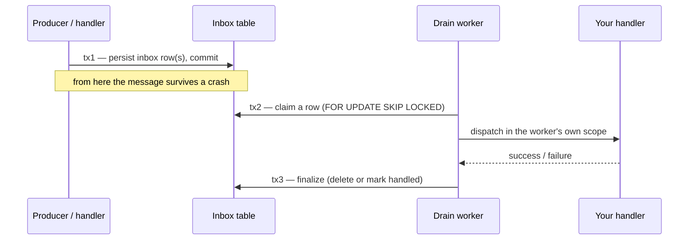

# Runtime & delivery semantics

Every message you dispatch runs through an **endpoint**. The endpoint decides *where* the handler
runs (the caller's task, a background worker, or a persisted-then-drained queue) and *what happens
on a crash*. This page explains those semantics once — the delivery guarantee each mode gives you,
why durable delivery is at-least-once, and how ordering and flow control behave. The how-to pages
([Routing & endpoints](routing.md), [Resilience](resilience.md), [Error handling](error-handling.md))
show the configuration; this page explains the model behind it.

---

## Endpoint execution model

A dispatched message is routed to an endpoint, and the endpoint runs in one of three modes:

`EndpointMode.INLINE`
:   The handler runs in the **caller's own task**, synchronously with the dispatch. Nothing is
    queued. `bus.invoke()` is always inline regardless of endpoint mode — request/response has
    to run in the caller's task to return a value.

`EndpointMode.BUFFERED`
:   The message is placed on an **in-memory queue** and a background worker drains it. Dispatch
    returns as soon as the message is enqueued; the handler runs later, off the caller's task.
    This is the default (`EndpointDefaults.mode` is `BUFFERED`).

`EndpointMode.DURABLE`
:   The message is **persisted to the inbox** before it is processed, then drained by a background
    worker. It survives a restart. DURABLE local queues require an `inbox` in
    [`MessagingConfig`](../../reference/configuration.md); configuring a DURABLE queue without one
    fails loudly at startup.

You set the mode as a fallback for every local queue via `endpoint_defaults`, or per entry:

```python linenums="1"
from waku.messaging import EndpointDefaults, EndpointMode, MessagingConfig, local_queue

config = MessagingConfig(
    # Fallback for every local_queue that leaves `mode` unset.
    endpoint_defaults=EndpointDefaults(mode=EndpointMode.BUFFERED),
    endpoints=[
        # This one opts into durability explicitly.
        local_queue('local://orders', mode=EndpointMode.DURABLE),
    ],
)
```

See [Routing & endpoints](routing.md#endpoint-modes) for the full endpoint configuration surface.

---

## Delivery guarantees

The mode is a delivery-guarantee choice:

| Mode | Where it runs | On a crash before the handler completes |
|---|---|---|
| INLINE | caller's task | the exception surfaces to the caller; nothing is retried independently |
| BUFFERED | in-memory worker | the buffered message is **lost** (at-most-once across a crash) |
| DURABLE | persisted, then worker | the message is **re-dispatched** after restart (at-least-once) |

INLINE gives you the strongest local feedback — the handler's exception propagates straight back to
the code that called `invoke`/`send`, and there is no independent redelivery. BUFFERED trades that
for throughput: the caller is not blocked on the handler, but a process that dies with messages still
sitting in memory loses them. DURABLE persists the message before running it, so a crash costs a
retry rather than a lost message.

---

## At-least-once and the handler idempotency contract

At-least-once means a durable handler can run **more than once** for the same message — a worker
that crashes after the handler commits but before the row is finalized will re-dispatch on restart,
and a competing consumer can pick up a row the original owner never finished. **Durable handlers
must therefore be idempotent**: applying the same message twice must have the same effect as applying
it once.

The framework deduplicates on the composite key `(message_id, handler_FQN)`, so a genuine
**redelivery of the same frame** is suppressed. This is a redelivery/competing-consumer safeguard —
not a substitute for business idempotency:

- Two independent `send`/`publish` calls of an equal payload mint **different** wire `message_id`s
  (a fresh `uuid4()` per envelope), and [`DeliveryOptions`](delivery-options.md) has no field to pin
  the id. Dedup does not collapse them — they are two distinct messages.
- Only re-processing of the *same persisted envelope* is deduped by the key.

Design handlers so that "apply this order twice" is safe (upsert by a business key, check-then-act
against your own state), and treat the dedup key as belt-and-suspenders.

---

## The durable transaction model

Durable delivery is three separate transactions, never one:



1. **Persist (tx1).** The message is written to the inbox and committed *before* it is enqueued.
   The persist runs in its **own** scope — not the caller's — so a cascading send inside a business
   handler does not prematurely commit that handler's transaction.
2. **Claim and dispatch (tx2).** A worker claims a pending row with `FOR UPDATE SKIP LOCKED` (so two
   workers, or two pods against one database, never grab the same row) and dispatches it. The
   executor opens a **fresh scope per attempt** — it never runs the handler inside the claim
   transaction, so a slow handler does not hold the claim lock.
3. **Finalize (tx3).** On success the row is deleted (or retained briefly for dedup); on failure it
   escalates through the error policy (see below).

A message persisted in tx1 but not finalized in tx3 — because the worker died in between — is
re-dispatched when processing resumes. That gap is exactly why the guarantee is at-least-once.

Transaction **nesting** is depth-aware: an inline `invoke(event)` fan-out inside a handler joins the
outer transaction rather than committing early. Only the outermost frame commits or rolls back, so a
handler and the events it invokes inline succeed or fail together. See
[Transactions & UoW](transactions.md).

---

## Per-group ordering

Ordering is **per group**, not global:

- A message carries a **group key** when you set `group_id` explicitly (via
  [`DeliveryOptions`](delivery-options.md)) or configure a `partition_by` extractor on the endpoint.
  Keyed messages are assigned a sequence number and drained **head-of-queue** — strict FIFO within
  that group.
- A message with **no** group key is processed in parallel with **no ordering guarantee**.

Sequence allocation goes through `ISequenceAllocator`
(`waku.messaging.sequence.ISequenceAllocator`), provided by your
[durability backend](../../fundamentals/backends.md) — it allocates the next number in the same
transaction as the row insert so the sequence is co-committed. Ordering therefore holds across pods
sharing one database, not just within a single process. The mechanics and configuration live on
[Durable inbox & ordering](inbox.md).

---

## Backpressure and circuit-breaker interaction

Two independent triggers can pause an inbound broker **listener**, and they compose through a single
gate:

- **Backpressure watermark.** `BufferingLimits(high=…, low=…)` stops the listener when the in-memory
  depth reaches `high` and resumes it when the depth falls back to `low`. It protects memory when the
  broker delivers faster than handlers drain.
- **Circuit breaker.** `CircuitBreakerConfig` pauses the listener when the failure rate over the
  tracking window crosses the threshold, then resumes after `pause_time` and re-samples.

Both act on the **listener**, through one refcounted gate over the subscription: the broker is
stopped on the first pause and only resumed once **every** trigger has released — neither the
watermark nor the breaker can lift the other's pause. In-flight **processing is never paused**; only
new inbound delivery is throttled. The configuration and tuning live on [Resilience](resilience.md).

---

## Retry and dead-letter escalation

When a durable attempt fails, the executor consults the message's error policy: it may retry (with
or without backoff), requeue, pause the listener, discard, or move the message to the dead-letter
store. The full escalation model — matching exceptions, retry budgets, execution timeout, requeue
budgets, and dead-letter replay — is documented once on [Error handling](error-handling.md); this
page does not repeat it.

---

## Further reading

- **[Routing & endpoints](routing.md)** — configure endpoints and choose a mode
- **[Durable inbox & ordering](inbox.md)** — the inbox model, sequencing, and `ISequenceAllocator`
- **[Resilience](resilience.md)** — circuit breaker and backpressure configuration
- **[Error handling](error-handling.md)** — retry policies, execution timeout, and dead lettering
- **[Transactions & UoW](transactions.md)** — unit-of-work boundaries and transaction nesting
- **[Observability](observability.md)** — logging and observers over the runtime
