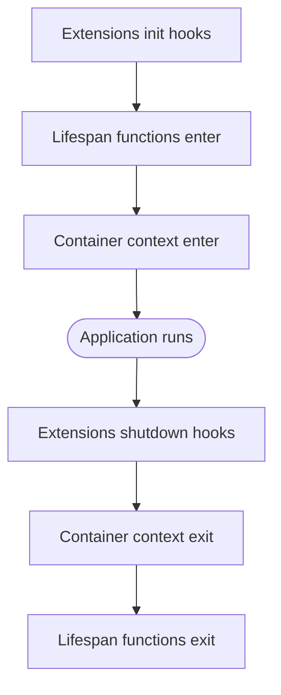

# Application

`WakuApplication` is the runtime object that holds the DI container, module registry, and extension registry.
It is created by `WakuFactory` from a [root module](modules.md) and used as an async context manager
to manage the full application lifecycle.

## WakuFactory

`WakuFactory` takes a root module and produces a `WakuApplication`. Under the hood it:

1. Builds a `ModuleRegistry` (topological sort of all imported modules)
2. Builds a [Dishka](https://github.com/reagento/dishka/) `AsyncContainer` from the collected providers
3. Builds an `ExtensionRegistry` from application and module extensions
4. Returns a ready-to-use `WakuApplication`

```python linenums="1"
from waku import WakuFactory, module


@module()
class AppModule:
    pass


app = WakuFactory(AppModule).create()
```

### Parameters

| Parameter          | Type                             | Description                                                                                       |
|--------------------|:---------------------------------|:--------------------------------------------------------------------------------------------------|
| `root_module_type` | `ModuleType`                     | The root module class (positional-only). Serves as the composition root of the application graph.  |
| `context`          | `dict[Any, Any]                  | None`         | APP-level context dict for [contextual providers](providers.md#contextual). See [Container Access](#container-access). |
| `lifespan`         | `Sequence[LifespanFunc]`         | [Lifespan](#lifespan) functions for setup/teardown of long-lived resources.                       |
| `extensions`       | `Sequence[ApplicationExtension]` | Application-level [extensions](../extensions/lifecycle.md). Defaults to `DEFAULT_EXTENSIONS`.     |
| `container_config` | `ContainerConfig                 | None`        | Container configuration (see below).                                                              |

### ContainerConfig

`ContainerConfig` controls the underlying Dishka container behavior:

| Field              | Default         | Description                                                    |
|--------------------|:----------------|:---------------------------------------------------------------|
| `lock_factory`     | `asyncio.Lock`  | Factory for the concurrency lock used by the container.        |
| `start_scope`      | `None`          | Starting scope for the container. `None` means the first one.  |
| `skip_validation`  | `False`         | Skip provider graph validation at startup.                     |

### Bootstrap Function

It is recommended to wrap `WakuFactory` in a dedicated **bootstrap function** rather than
calling the factory inline. This gives you a single entry point for application creation that
you then pass down to framework-specific factory methods (API server, CLI, message broker, etc.):

```python linenums="1" title="app/application.py"
from waku import WakuApplication, WakuFactory, module
from waku.cqrs import MediatorConfig, MediatorModule

from app.settings import Settings


@module(
    imports=[
        MediatorModule.register(
            MediatorConfig(pipeline_behaviors=[...]),
        ),
        SettingsModule,
        InfraModule,
        DomainModule,
    ],
)
class AppModule:
    pass


def bootstrap_application(settings: Settings) -> WakuApplication:
    return WakuFactory(
        AppModule,
        context=settings.as_context(),
    ).create()
```

Each entry point calls the bootstrap function and passes the resulting application to
its own framework bootstrap:

```python linenums="1" title="app/__main__.py"
from app.application import bootstrap_application
from app.settings import load_settings


def run_api(settings: Settings) -> None:
    app = bootstrap_application(settings)
    fastapi_app = bootstrap_fastapi(app, settings)  # (1)!
    uvicorn.run(fastapi_app, ...)


def run_worker(settings: Settings) -> None:
    app = bootstrap_application(settings)
    worker = bootstrap_worker(app, settings)
    worker.run()


settings = load_settings()
run_api(settings)
```

1. Framework-specific factory that wires the `WakuApplication` into FastAPI, Litestar, FastStream,
   etc. using the corresponding [Dishka integration](integrations.md).

This keeps module composition and factory configuration in one place. When you add a new module
import, change the context shape, or swap an extension, every runner picks up the change
automatically.

## Application Lifecycle

`WakuApplication` implements the async context manager protocol. Use `async with` to manage
the full startup/shutdown sequence:

```python linenums="1"
async def main() -> None:
    app = WakuFactory(AppModule).create()

    async with app, app.container() as container:
        svc = await container.get(MyService)
        await svc.run()
```



For details on extension hooks, see [Lifecycle Hooks](../extensions/lifecycle.md).

### Lifespan

Lifespan functions run setup and teardown logic **before** the DI container enters and **after** it exits.
Use them for work that must happen outside the container lifecycle — database migrations, service
discovery registration, signal handlers, or background schedulers.

!!! tip
    For long-lived resources like connection pools, HTTP clients, or cache connections, prefer
    [singleton providers](providers.md#singleton) instead. The container already manages their
    lifecycle — creating them on first request and finalizing them on shutdown.

Waku accepts two forms of lifespan function, unified under the `LifespanFunc` type alias:

1. **A callable that receives the application** and returns an async context manager:

    ```python
    Callable[[WakuApplication], AsyncContextManager[None]]
    ```

2. **A bare async context manager** (when you do not need access to the application instance):

    ```python
    AsyncContextManager[None]
    ```

Both forms are wrapped internally by `LifespanWrapper`, so you never need to instantiate it yourself.

Pass your lifespan functions to `WakuFactory` via the `lifespan` parameter:

```python linenums="1"
from collections.abc import AsyncIterator
from contextlib import asynccontextmanager

from waku import WakuApplication, WakuFactory, module


@asynccontextmanager
async def run_migrations(app: WakuApplication) -> AsyncIterator[None]:
    await apply_pending_migrations(dsn='postgresql://localhost/mydb')
    yield


@module()
class AppModule:
    pass


app = WakuFactory(
    AppModule,
    lifespan=[run_migrations],
).create()
```

### Execution order

**Startup (entering `async with app`):**

1. Extension init hooks run (`OnModuleInit`, `OnApplicationInit`, `AfterApplicationInit`)
2. Lifespan functions are entered in the order they were provided
3. The DI container context is entered

**Shutdown (exiting `async with app`):**

1. Extension shutdown hooks run (`OnModuleDestroy`, `OnApplicationShutdown`)
2. The DI container context is exited
3. Lifespan functions are exited in **reverse** order (LIFO)

When multiple lifespan functions are provided, they execute in order on startup and in reverse
order on shutdown. This mirrors the semantics of nested `async with` blocks — resources set up
earlier are torn down later.

## Container Access

The `container` property on `WakuApplication` returns the Dishka `AsyncContainer`.
Context values can be provided at two levels, corresponding to Dishka's scopes:

### APP-level context

Pass context to `WakuFactory` to make values available in `Scope.APP`.
Use this for application-wide data that is known at startup — configuration objects,
environment identifiers, or feature flags:

```python linenums="1"
from waku import WakuFactory, module
from waku.di import contextual, singleton, Scope


class AppConfig:
    def __init__(self, env: str) -> None:
        self.env = env


class StartupService:
    def __init__(self, config: AppConfig) -> None:
        self.config = config


@module(
    providers=[
        contextual(provided_type=AppConfig, scope=Scope.APP),
        singleton(StartupService),
    ],
)
class AppModule:
    pass


config = AppConfig(env='production')
app = WakuFactory(
    AppModule,
    context={AppConfig: config},
).create()
```

### REQUEST-level context

Call `app.container(context={...})` to create a child scope with `Scope.REQUEST` context.
Use this for per-request data — HTTP requests, user sessions, or message payloads:

```python linenums="1"
from waku import WakuFactory, module
from waku.di import contextual, scoped, Scope


class RequestId:
    def __init__(self, value: str) -> None:
        self.value = value


class RequestService:
    def __init__(self, request_id: RequestId) -> None:
        self.request_id = request_id


@module(
    providers=[
        contextual(provided_type=RequestId, scope=Scope.REQUEST),
        scoped(RequestService),
    ],
)
class AppModule:
    pass


async def handle_request(request_id: str) -> None:
    app = WakuFactory(AppModule).create()

    async with app, app.container(context={RequestId: RequestId(request_id)}) as container:
        svc = await container.get(RequestService)
        print(svc.request_id.value)
```

!!! tip
    For declaring contextual dependencies, see [Contextual providers](providers.md#contextual).
    For a deeper dive into Dishka scopes, see the
    [Dishka scopes documentation](https://dishka.readthedocs.io/en/stable/advanced/scopes.html).

## Further reading

- **[Lifecycle Hooks](../extensions/lifecycle.md)** — extension hooks that run during application startup and shutdown
- **[Modules](modules.md)** — module system and the `@module()` decorator
- **[Framework Integrations](integrations.md)** — connecting waku to FastAPI, Litestar, and other frameworks
- **[Testing](testing.md)** — test utilities and provider overrides
