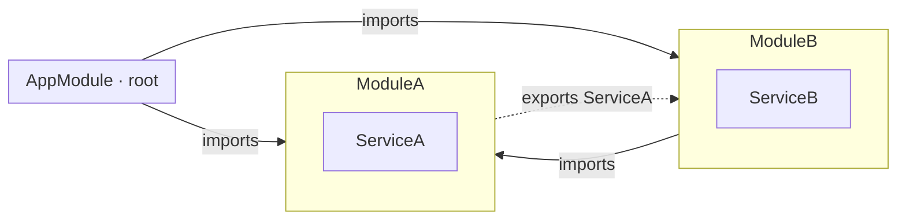
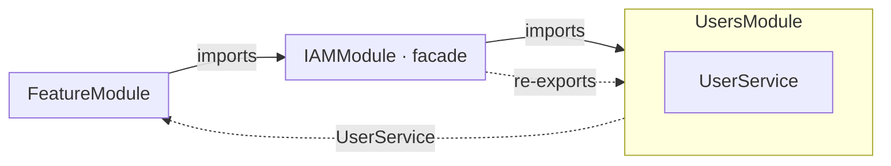
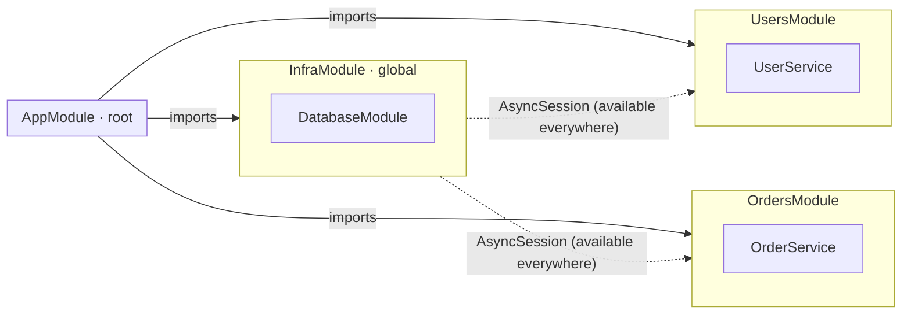
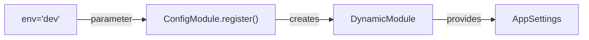

# Modules

In a typical Python project, any file can import from any other file. This works
fine at first, but as the codebase grows, hidden dependencies pile up: services
reach into each other's internals, circular imports appear, and nobody can tell
what depends on what without reading every file.

Modules solve this by giving your code **explicit boundaries**. Each module
declares what it provides (`providers`), what it needs from other modules
(`imports`), and what it exposes to the outside (`exports`). Everything else
stays private. waku enforces these boundaries at startup — if a module tries
to use something it didn't import, you get an error, not a silent bug.



## Module

A module is a class annotated with the `@module()` decorator. This decorator attaches metadata
to the class, which waku uses to construct the application graph.

Group related code into a module — a users module holds the user service and repository,
an orders module holds order processing logic. Each module is a self-contained unit with
a clear responsibility, making the codebase easier to navigate and reason about as it grows.

Every waku application has at least one module: the **root module**, also known as the
composition root. This module serves as the starting point for
[`WakuFactory`](application.md#wakufactory) to build the entire application graph.

| Parameter    | Description                                                        |
|--------------|:-------------------------------------------------------------------|
| `providers`  | List of [providers](providers.md) for dependency injection         |
| `imports`    | List of modules imported by this module                            |
| `exports`    | List of types or modules exported by this module                   |
| `extensions` | List of module [extensions](../advanced/extensions/index.md) for lifecycle hooks |
| `is_global`  | Whether this module is [global](#global-modules) or not            |

Modules encapsulate providers by default — you can only inject providers that are part of the
current module or explicitly exported from imported modules. This is the key difference from
plain Python imports: if you forget to export a provider, other modules simply can't use it.
The exported providers serve as the module's **public API**.

```python hl_lines="11-15" linenums="1"
from waku import module
from waku.di import scoped

from app.modules.config.module import ConfigModule


class UsersService:
    pass


@module(
    providers=[scoped(UsersService)],  # Register the service with a scoped lifetime
    imports=[ConfigModule],  # Import another module
    exports=[UsersService],  # Expose the service to other modules
)
class UsersModule:
    pass


@module(imports=[UsersModule])  # Root module importing UsersModule
class AppModule:
    pass

```

!!! note
    Encapsulation is enforced by [validators](../features/validation.md), which you can disable at runtime if needed.
    However, **disabling them entirely is not recommended**, as they help maintain modularity.

## Module Re-exporting

Sometimes you want to group several modules behind a single facade. Re-exporting lets
a module expose another module's providers to its own consumers — without duplicating
any registrations.

```python hl_lines="7 8" linenums="1"
from waku import module

from app.modules.users.module import UsersModule


@module(
    imports=[UsersModule],
    exports=[UsersModule],
)
class IAMModule:
    pass

```



!!! warning
    You can only re-export **modules**, not individual types imported from other modules.
    To expose an imported type, re-export the entire module that provides it.

## Global Modules

Some providers are needed everywhere — database connections, configuration, logging.
Adding `imports=[InfraModule]` to every feature module is tedious and adds noise
without adding information. For these cases, you can mark a module as **global**.

A global module's exported providers become available to every module in the application
without explicit imports. Set `is_global=True` in the `@module()` decorator and register
the module **once** in the root module:

```python hl_lines="21" linenums="1"
from waku import module
from waku.di import scoped, singleton

from app.db import AsyncEngine, AsyncSession


@module(
    providers=[
        singleton(AsyncEngine),
        scoped(AsyncSession),
    ],
    exports=[AsyncEngine, AsyncSession],
)
class DatabaseModule:
    pass


@module(
    imports=[DatabaseModule],
    exports=[DatabaseModule],
    is_global=True,
)
class InfraModule:
    pass

```



With `InfraModule` imported in the root module, any feature module can inject `AsyncSession`
without adding `DatabaseModule` to its own imports.

!!! note
    The root module is always global.

!!! question "When to use global modules?"
    Without `is_global`, every feature module that needs database access must
    explicitly `imports=[DatabaseModule]`. A global module's exports become
    available everywhere without explicit imports — like adding to Python's
    builtins, but for DI providers.

    !!! warning
        Global modules reduce boilerplate but weaken encapsulation. Reserve them
        for truly cross-cutting infrastructure — database connections, configuration,
        logging. Feature modules should use explicit imports to keep their dependency
        graph visible.

## Dynamic Module

Sometimes a module can't build its providers on its own — it needs a value from the
outside: an environment name, a connection string, a list of entities to register.
Dynamic modules solve this by accepting parameters at import time and turning them
into providers internally.

```python hl_lines="16-24" linenums="1"
from dataclasses import dataclass
from typing import Literal

from waku import DynamicModule, module
from waku.di import object_

Environment = Literal['dev', 'prod']


@dataclass(kw_only=True)
class AppSettings:
    environment: Environment
    debug: bool


@module(is_global=True)
class ConfigModule:
    @classmethod
    def register(cls, env: Environment) -> DynamicModule:
        settings = AppSettings(environment=env, debug=env == 'dev')
        return DynamicModule(
            parent_module=cls,
            providers=[object_(settings)],
        )

```



Then import the dynamic module by calling its `register()` method:

```python hl_lines="7" linenums="1"
from waku import module

from app.modules.config.module import ConfigModule


@module(
    imports=[ConfigModule.register(env='dev')],
)
class AppModule:
    pass

```

!!! question "Why `register()` instead of passing config directly?"
    Dynamic modules let you parameterize a module at import time.
    `ConfigModule.register(env='dev')` creates a module instance with that
    specific configuration baked in — think of it as a factory method for
    modules. The module controls how the config value becomes a provider,
    keeping construction logic encapsulated.

You can also make a [dynamic module](#dynamic-module) global by setting `is_global=True` in the `DynamicModule`
constructor.

!!! tip
    If you need to **swap implementations** based on a runtime condition (e.g., use Redis in
    production but in-memory in development), prefer
    [conditional providers](../advanced/di/conditional-providers.md) over dynamic modules.
    Dynamic modules are for **parameterized construction** — passing values into a module to
    build providers from them.

!!! note
    While you can use any method name instead of `register`, we recommend sticking with `register`
    for consistency. This mirrors the NestJS convention where `forRoot()` configures a module
    globally and `register()` configures it per consumer.

## Further reading

- **[Providers](providers.md)** — provider types and scopes for dependency injection
- **[Lifecycle Hooks](../advanced/extensions/index.md)** — module and application extension hooks
- **[Custom Extensions](../advanced/extensions/custom-extensions.md)** — writing your own module extensions
- **[Validation](../features/validation.md)** — encapsulation rules and how to configure them

!!! note
    The module system is inspired by [NestJS](https://github.com/nestjs/nest) and
    [Tramvai](https://tramvai.dev).
