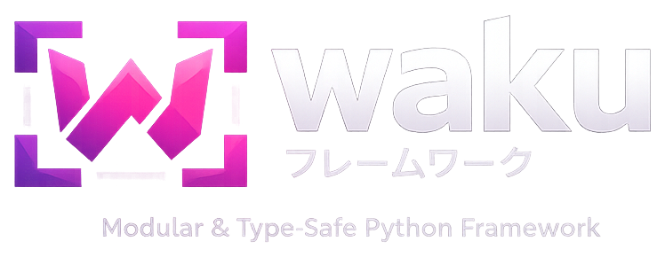

<style>
.md-content > h1:first-child { display: none; }
</style>

<p align="center" markdown>
  { width="480" .hero-logo }
</p>
<p class="hero-subtitle">枠 · structure for Python backends that grow</p>

---

<div align="center" markdown>

[](https://pypi.python.org/pypi/waku)
[](https://www.python.org/downloads/)
[](https://pepy.tech/projects/waku)
[](https://github.com/waku-py/waku/actions?query=event%3Apush+branch%3Amaster+workflow%3ACI/CD)
[](https://codecov.io/gh/waku-py/waku)
[](https://github.com/waku-py/waku/blob/master/LICENSE)
[](https://deepwiki.com/waku-py/waku)

</div>

---

**Python makes it easy to build a backend. waku makes it easy to keep growing one.**
waku gives you modules with explicit boundaries, type-safe DI
powered by [Dishka](https://github.com/reagento/dishka/), and integrated CQRS and event sourcing
— so your codebase stays manageable as it scales.

## Installation

=== "uv"

    ```sh
    uv add waku
    ```

=== "pip"

    ```sh
    pip install waku
    ```

## What you get

<div class="grid cards feature-cards" markdown>

-   :material-view-module: **Module Boundaries**

    ---

    Stop fighting circular imports. Group code into [modules](fundamentals/modules.md) with
    explicit imports and exports — each team owns their boundaries.

-   :material-needle: **Dependency Injection**

    ---

    Built on [Dishka](https://github.com/reagento/dishka/) with
    [singleton, scoped, and transient](fundamentals/providers.md) providers.
    Swap implementations without touching business logic.

-   :material-swap-horizontal: **CQRS & Mediator**

    ---

    Separate reads from writes. [Commands, queries, and events](extensions/cqrs.md)
    with pipeline behaviors for cross-cutting concerns — all in-process,
    no message broker required.

-   :material-history: **Event Sourcing**

    ---

    Full [event sourcing](extensions/eventsourcing/index.md) support — aggregates,
    projections, snapshots, upcasting, and the decider pattern with
    built-in SQLAlchemy adapters.

-   :material-puzzle: **Lifecycle & Extensions**

    ---

    Hook into startup, shutdown, and module initialization with
    [extensions](extensions/lifecycle.md). Add validation, logging, or custom
    behaviors — decoupled from your business logic.

-   :material-connection: **Framework Integrations**

    ---

    Works with FastAPI, Litestar, FastStream, Aiogram, and
    [more](fundamentals/integrations.md). waku provides structure —
    your framework provides the entrypoints.

</div>

## How it works

`@module()` declares providers and boundaries. `WakuFactory` wires the module tree
into a [Dishka](https://github.com/reagento/dishka/) container. Run the app as an
async context manager — done.

## Quick Example

=== "Basic"

    A service, a module, and a container — the minimal waku app:

    ```python title="app.py" linenums="1"
    import asyncio

    from waku import WakuFactory, module
    from waku.di import scoped


    class GreetingService:
        async def greet(self, name: str) -> str:
            return f'Hello, {name}!'


    @module(providers=[scoped(GreetingService)])
    class GreetingModule:
        pass


    @module(imports=[GreetingModule])
    class AppModule:
        pass


    async def main() -> None:
        app = WakuFactory(AppModule).create()

        async with app, app.container() as c:
            svc = await c.get(GreetingService)
            print(await svc.greet('waku'))


    if __name__ == '__main__':
        asyncio.run(main())
    ```

=== "With module boundaries"

    Modules control visibility. `InfrastructureModule` exports `ILogger` —
    `UserModule` imports it. Dependencies are explicit, not implicit.

    ```python title="app.py" linenums="1"
    import asyncio
    from typing import Protocol

    from waku import WakuFactory, module
    from waku.di import scoped, singleton


    class ILogger(Protocol):
        async def log(self, message: str) -> None: ...


    class ConsoleLogger(ILogger):
        async def log(self, message: str) -> None:
            print(f'[LOG] {message}')


    class UserService:
        def __init__(self, logger: ILogger) -> None:
            self.logger = logger

        async def create_user(self, username: str) -> str:
            user_id = f'user_{username}'
            await self.logger.log(f'Created user: {username}')
            return user_id


    @module(
        providers=[singleton(ILogger, ConsoleLogger)],
        exports=[ILogger],
    )
    class InfrastructureModule:
        pass


    @module(
        imports=[InfrastructureModule],
        providers=[scoped(UserService)],
    )
    class UserModule:
        pass


    @module(imports=[UserModule])
    class AppModule:
        pass


    async def main() -> None:
        app = WakuFactory(AppModule).create()

        async with app, app.container() as c:
            user_service = await c.get(UserService)
            user_id = await user_service.create_user('alice')
            print(f'Created user with ID: {user_id}')


    if __name__ == '__main__':
        asyncio.run(main())
    ```

## Next steps

<div class="grid cards" markdown>

-   :material-rocket-launch: **[Getting Started](getting-started.md)**

    ---

    Install waku, build a modular app, and connect it to your framework

-   :material-code-tags: **[Examples](https://github.com/waku-py/waku/tree/master/examples)**

    ---

    Working projects showing real usage patterns with FastAPI, Litestar, and more

-   :material-api: **[API Reference](reference.md)**

    ---

    Full module, class, and function reference

</div>
